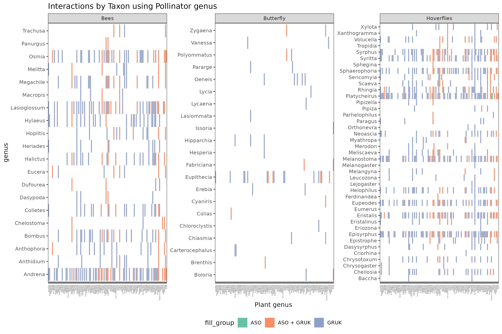
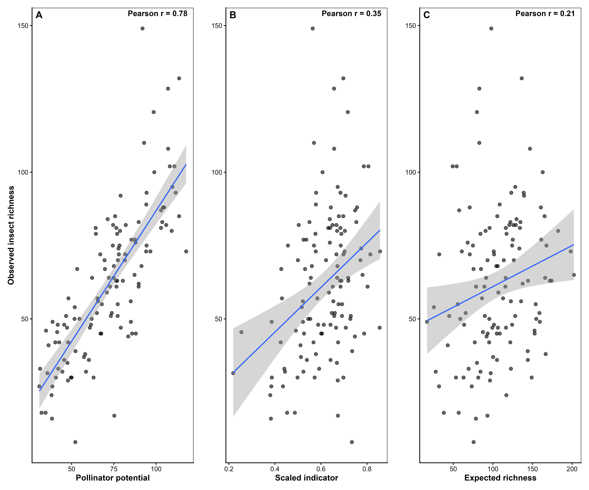
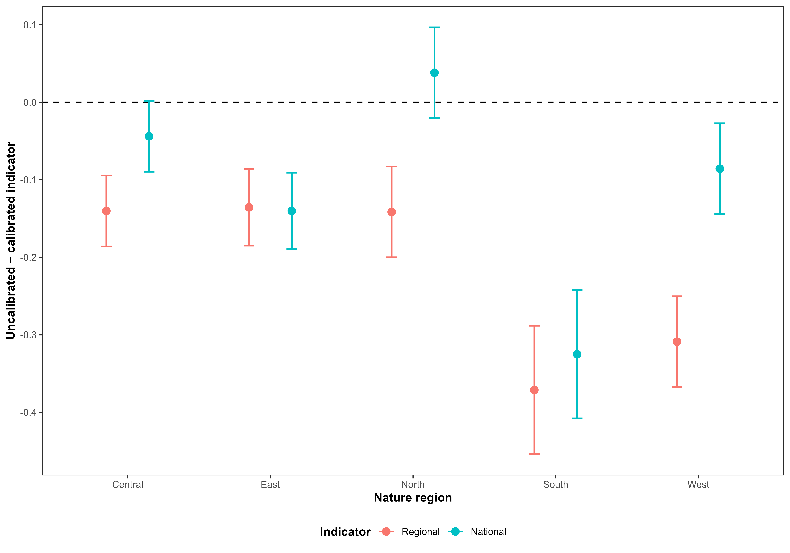

<!--# This is a template for how to document the indicator analyses. Make sure also to not change the order, or modify, the headers, unless you really need to. This is because it easier to read if all the indicators are presented using the same layout. If there is one header where you don't have anything to write, just leave the header as is, and don't write anything below it. If you are providing code, be careful to annotate and comment on every step in the analysis. Before starting it is recommended to fill in as much as you can in the metadata file. This file will populate the initial table in your output.-->

<!--# Load all you dependencies here -->

```{r setup}
#| include: false
#| cache: false
library(knitr)
library(tidyverse)
library(kableExtra)
library(here)
library(anybadger)
library(yaml)
library(tibble)
library(conflicted)
# weird workarounds for cache issues
conflicts_prefer(dplyr::filter)
conflicts_prefer(dplyr::lag)
conflicts_prefer(dplyr::select)
pull<-dplyr::pull

knitr::opts_chunk$set(echo = TRUE)
```

<!--# The following parts are autogenerated. Do not edit. -->


```{r source}
#| echo: false
#| cache: false
source(here::here("_common.R"))
```

```{r reviewers}
#| echo: false
#| results: asis

if (!is.null(yaml_data$codeReviewers)) {
  reviewers <- purrr::map_chr(yaml_data$codeReviewers, "name")
  
  htmltools::HTML(paste0(
    '<div id="title-block-header" class="quarto-title-block default">
       <div class="quarto-title-meta">
         <div>
           <div class="quarto-title-meta-heading">Reviewed by</div>
           <div class="quarto-title-meta-contents">',
    paste(reviewers, collapse = "; "),
    '</div>
         </div>
       </div>
     </div>',
    sep = ""
  ))
}
```

::: {layout-ncol="6"}

```{r statusBadge}
#| echo: false
status_badge(as.character(st))
```

```{r versionBadge}
#| echo: false
version_badge(my_version_number = as.character(version[[1]]))
```

```{r dataBadge}
#| echo: false
data_badge(as.character(badges[[1]]))
```

```{r codeBadge}
#| echo: false
code_badge(as.character(badges[[2]]))
```

```{r openScienceBadge}
#| echo: false
open_science_badge(as.character(badges[[3]]))
```

```{r licenseBadge}
#| echo: false
# The following inserts a badge specifying the GPL GNU version 3 license. ecRxiv recommends using this license, but you can decide to use another. Contact ecRxiv for help in insert a badge for a different license
license_badge()
```


::: 
 

> **Recommended citation**: `r paste(auth, " ", year, ". ", name, " (ID(s): ", folder_name, ") ", "v. ", version, ". ecRxiv: ", url, sep="")`


::: {.callout-tip collapse="true"}
## Metadata
```{r tbl-meta2}
#| tbl-cap: 'Indicator metadata'
#| echo: false
#| warning: false
meta |>
  dplyr::filter(Variable %in% c(
    "Indicator ID",
    "Indicator Name",
    "verbatimName",
    "Continent",
    "Country",
    "Ecosystem Condition Typology Class", 
    "Realm",
    "Biome",
    "Ecosystem",
    "verbatimEcosystem",
    "Year added", 
    "Last update",
    "Version",
    "Version comment",
    "Normalised",
    "Spatial aggregation pathway",
    "Precision")) |>   
  kable()

```
:::

::: {.callout-tip collapse="true"}

## Log

<!--# Update this logg with short messages for each update -->
- 18.08.2026 - Original PR
- 24.08.2026 - First draft of the indicator documentation completed
- 09.09.2026 - Revision of first draft with comments and validation 
- 16.09.2026 - Reviewer changes completed.
:::


<hr />

<!--# Document you work below.  -->

## 1. Summary

<!--# 
With a maximum of 300 words, describe the indicator in general terms as you would to a non-expert. Think of this as a kind of common language summary. Follow the four numbers sub-headers below. under point 2, it is possible under  include a bullet point list of the specific steps in the workflow. 
 -->

1. **Background and rationale**:
<!-- What does the metric represent? Why is this relevant for describing ecosystem condition in this ecosystem?
What are the main anthropogenic impact factors? -->

The pollinator potential indicator describes the potential for terrestrial open lowland areas to contain species rich insect pollinator communities for the reporting period 2024. In this context the indicator focuses on the three taxa: bees (*Apoidea*: *Anthophila*), Butterflies (*Lepidoptera*), and Hoverflies (*Diptera*: *Syrphidae*). These taxa were selected because they represent major groups of insect pollinators and are recognised as core taxa for monitoring pollinator status and trends in Europe [@potts2024refined]. Adults from all three taxa visit flowers for nectar. Bees additionally collect pollen for larval provisioning, hoverflies eat pollen as a protein source for egg production [@moquet2018conservation; @laubertie2012contribution], and butterflies also lay more eggs when there is access to high quality nectar. In addition to nectar-sources, butterflies often require specific host-plants for their larvae to develop on in order to reproduce within a habitat [@king2024fecundity; @mevi2003effects]. The indicator combines the predicted occurrence of pollinating insects with the availability of all the plant species they are known to interact with, thereby capturing an important ecological relationship underlying pollinator communities. The indicator is relevant because pollinators contribute to ecosystem functioning and depend on suitable plant resources [@kral2021meta; @orford2016modest; @loy2022effects]. 

2. **Methods**:
<!-- What kind of data is used? How is the data customized (modified, estimated, integrated) to fit its purpose as an indicator? -->

The indicator integrates spatial predictions of plant species known to interact with insects and pollinator (species) occurrence obtained from the Global Biodiversity Infrastructure Facility ([GBIF](https://www.gbif.org)) with information on plant–pollinator interactions (obtained from @rasmussen2021evaluating and @robinson2023hosts). The workflow consists of:

- Obtaining spatial predictions of plant hosts and pollinating insects (hereafter called "pollinators") occurrence probabilities,
- Linking pollinators to their interacting plant species using a plant–pollinator interaction matrix,
- Weighting pollinator occurrence probabilities by the occurrence probabilities of their interacting plants,
- Summing interaction-supported probabilities across pollinator species to estimate expected pollinator richness,
- Calibrating the expected pollinator richness with detected/observed richness from survey and monitoring data (referred to as pollinator potential), 
- Establishing reference values (minimum and maximum pollinator potential from reference locations) representing relatively stable ecosystem conditions, and
- Scaling the resulting indicator to a 0–1 range, using either region-specific or common reference values.


3. **Interpretation**:
<!-- Add a very short description of how the indicator values should be interpreted. Here's an example for a bumblebee indicator: An indicator value of 1 signifies an intact bumblebee community. Values decreasing toward zero reflect negative ecological change, specifically the decline of species expected to be present. This metric does not account for potentially positive changes, such as increases in species' abundance or the arrival of new species. Tip: Add text on the line directly following the subheader, and don't introduce blank lines. This way the whole paragraph renders as a block quote. -->

An indicator value of $1$ represents the upper reference level of pollinator potential (i.e. the optimal condition), whereas the  $0$-value indicates a lack of potential for pollinators. An indicator value of $0.6$ as the limit for good ecological condition indicates that the potential for pollinators is reduced to 60% of the maximum potential expected in a given grid cell under the reference condition. The maximum possible potential for pollinators, and thus the reference condition, varies across the country. The indicator thus reflects the realization of the expected potential occurrence of pollinators given the likelihood that plant resources are present rather than directly measuring population abundance or demographic performance.

4. **Results and development needs**:
<!-- Briefly, what does the indicator say about the ecosystem condition. What is the current status of  the metric (can it be used or is it still in development), and what immediate tasks remain to improve the indicator or to make the indicator operational -->

The pollinator potential indicator provides a spatial assessment of ecosystem condition based on predicted pollinator potential and plant–pollinator interactions. Indicator values vary modestly among regions, ranging from $0.5337$ in West to $0.5851$ in South, with a national mean of $0.5855$ and relatively low uncertainty around regional estimates. Nearly half of Norway's area ($47.1\%$) exceeds the threshold value of $0.6$, although this proportion varies considerably among regions. The indicator is sufficiently developed to support regional comparisons of ecosystem condition, but some limitations remain. Several interacting plant species and butterfly genera were not included (see @fig-grukPlusAso), meaning that the indicator is likely most representative of semi-natural meadows and may under- or overestimate pollinator potential in other open lowland habitats. Calibration substantially influences indicator estimates and is necessary to account for differences in regional reference conditions. The indicator is also correlated with plant-host richness, suggesting caution when interpreting it alongside other plant-host indicators. Future work should focus on propagating uncertainty from species distribution models and plant–pollinator interaction data into the final indicator estimates and on further evaluating overlap with related biodiversity indicators.

```{r fig-grukPlusAso}
#| fig-cap: 'Interactions between pollinator genus and their interracting plant species using data from both the ASO and GRUK datasets.'
#| out-width: 100%
#| echo: false
#| warning: false

```


## 2. About the underlying data {#sec-underlyingData}

<!--# Give a general introduction the datasets you have used, and provide more specific details in the sub-chapters.  -->

The pollinator potential indicator is based on modelled occurrence probabilities for pollinating insects and the plants with which they interact. We used pre-existing spatial probability surfaces rather than fitting new species-distribution models specifically for the indicator, as these surfaces provide broad spatial and taxonomic coverage across Norway. The probability surfaces were generated using an integrated species distribution modelling (iSDM) framework, as described by @perrin2026addressing, which combines heterogeneous occurrence data with environmental covariates to produce spatially explicit estimates of species occurrence probability at a 1 km × 1 km resolution. To retain fine-scale environmental heterogeneity when deriving the indicator, we subsequently incorporated elevation from the DTM 50 [@kartverket_dtm50_2007] and land-cover information from CLC 2018 at 100 m [@EEA2019CLC2018] and CLCplus Backbone 2023 at 100 m resolution [@eea2025_clcplus_backbone]. At 50 m resolution, elevation was represented by the difference between the 50 m DTM and its corresponding 1 km aggregated elevation, while land-cover heterogeneity was represented by the difference between the scaled CLCplus Backbone 2023 values and their 1 km aggregates, and between the scaled CLC 2018 values and their 1 km aggregates. These difference layers quantify sub-grid variation relative to the original 1 km prediction surfaces, allowing the final indicator to account for fine-scale variation in habitat and topography without refitting the underlying species distribution models.


### 2.1 Spatial and temporal resolution and extent

<!--# Describe the temporal and spatial resolution and extent of the data used -->

The underlying biodiversity data comprise spatially referenced species occurrence records from across Norway. Records from 2012 onwards were used in the models that generated the prefitted maps to ensure temporal consistency with the environmental covariates and the period used for indicator estimation [@perrin2026addressing]. Because these records originate from heterogeneous monitoring and observation programmes, sampling intensity and temporal coverage vary among species and locations. The spatial resolution of the occurrence data is determined by the geographic precision of individual observations, whereas the resolution of predicted occurrence probabilities is determined by the environmental covariates used in the species distribution models. Details of the environmental covariates and their spatial resolution are provided in @perrin2026addressing.

To capture environmental heterogeneity within the 1 km² prediction cells, the pre-fitted probability surfaces from @perrin2026addressing were subsequently calibrated using finer-scale environmental variables at 50 m × 50 m resolution (described in @sec-underlyingData). The resulting pollinator potential indicator is therefore reported at 50 m spatial resolution, providing a finer representation of the spatial distribution and configuration of open lowland habitats than the original 1 km² model predictions.

The assessment encompasses both natural and culturally influenced semi-natural habitats. Cultural habitats are ecosystems whose structure and ecological characteristics have been shaped and maintained through long-term traditional human land use and management. In open lowland landscapes, continued management is often required to maintain these habitats and prevent succession towards alternative vegetation states. The geographical domain of the indicator is defined using CLCplus Backbone land-cover classes 6 (permanently herbaceous) and 7 (periodically herbaceous) from @eea2025_clcplus_backbone, with mountain areas masked out using the [Norwegian mountain dataset](https://kartkatalog.miljodirektoratet.no/MapService/Details/fjell). 

### 2.2 Sampling design

<!-- How was the data sampled? Describe potential sampling biases -->

The underlying occurrence data used for the models by @perrin2026addressing were compiled from several biodiversity programs (including citizen science and structured surveys) rather than from a single standardized sampling design. Consequently, sampling intensity is spatially and taxonomically heterogeneous and may reflect differences in observer effort, accessibility, geographic coverage, and monitoring activity. These characteristics can introduce spatial and temporal sampling biases into the occurrence data. The sampling bias was accounted for in @perrin2026addressing by using a bias-corrected modelling framework that incorporates environmental covariates and spatially explicit sampling effort to generate more reliable occurrence predictions. The resulting modelled occurrence probabilities are therefore less sensitive to the underlying sampling biases than the raw occurrence data.

The validation data were all from structured surveys, including the Overvåking av semi-naturlig eng (ASO) survey [@asoDataset], Ano [@anoDataOccurrence], and the Norwegian Insect Monitoring Program [@norwegianInsectMonitoring]. These surveys were designed to provide representative coverage of open lowland habitats and were conducted using standardized sampling protocols. The validation data are therefore less affected by sampling biases than the underlying occurrence data used for model fitting.


### 2.3 Original units

<!--# What are the original units for the most relevant  variables in the data-->

The primary biological observations are species occurrence records, with geographic coordinates representing the observation locations. For insects, the response variable used to construct the indicator is species richness, expressed as the number of insect species estimated or observed at a location. The modelled richness values are subsequently transformed into a scaled indicator using regional reference levels to provide a standardized measure of ecological condition.

### 2.4 Instructions for citing, using and accessing data

<!--# Is the data openly available? If not, how can one access it? What are the key references to the datasets?   -->

The biodiversity occurrence data used in the analysis were obtained through GBIF. The relevant GBIF occurrence downloads should be cited using their download DOIs:

  - Insects: @hotspotInsectOccurrence
  - Plants: @hotspotPlantOccurrence

The data are therefore traceable through the corresponding GBIF download records. The hotspot maps and the modelling framework should additionally be cited according to the relevant underlying scientific publication or report.

### 2.5 Additional comments about the dataset

<!--# Optional. Text here -->

The insect indicator is derived from a modelling framework that relates insect occurrence and species richness to environmental conditions. Environmental covariates are used to generate spatially explicit predictions of insect richness, which are then scaled relative to the reference conditions for open lowland ecosystems defined by the [NaturIndeks](https://www.naturindeks.no/Ecosystems/aapent_lavland). Separate regional and national scaling approaches are applied to account for geographic variation in reference levels of insect richness.


## 3. Indicator properties

### 3.1 Ecosystem Condition Typology Class (ECT)

<!--# Describe the rationale for assigning the indicator to the ECT class. See https://oneecosystem.pensoft.net/article/58218/
This doesnt need to be very long. Maybe just a single sentence. -->

The indicator is assigned to the ECT class B1 'Compositional state characteristics'.

### 3.1.1 Other condition typologies

<!--# Optional: Add text about other standards or typologies, such as alternative national condition typologies, and how the indicator relates to these -->

None specified

### 3.2 Ecosystem condition characteristic

<!--# 

A short (one to three word) tag or name for the ecosystem condition characteristic represented in the indicator. See 10.3897/oneeco.6.e58218 for information on what these characteristics might be.

Examples: 'intact hydrology'; 'near-natural species composition'; 'soil stability'; sustainable trophic interactions'. 

The term 'characteristic' is used in a similar way  to the term 'criteria' in Multiple Criteria Decision Making.  

-->

The indicator relates to the ecosystem characteristic 'Functionally important species and biophysical structures' in the Norwegian framework for ecological condition.

### 3.3 Collinearities with other indicators

<!--# Describe known collinearities with other metrics (indicators or variables) that could become problematic if they were also included in the same Ecosystem Condition Assessment as the indicator described here. -->

The pollinator potential indicator is expected to be correlated with indicators based directly on pollinator species richness, plant species richness, habitat suitability, and land-cover or habitat extent, because these variables contribute to the underlying predicted occurrence probabilities. It may also be correlated with indicators based on plant–pollinator community composition. Care should therefore be taken when combining these metrics in a multivariate ecosystem condition assessment to avoid giving disproportionate weight to the same underlying biodiversity signal.

### 3.4 Impact factors

<!--# Describe the main natural and anthropogenic factors that affecst the metric -->

The indicator responds to interacting climatic, land-use, and habitat pressures that influence the condition and availability of open lowland habitats and their plant and pollinator communities.

Key anthropogenic pressures include land-use change, agricultural intensification, habitat loss and fragmentation, urbanisation, infrastructure development, and changes in vegetation management. These pressures can reduce habitat availability and quality, alter plant community composition, and reduce the availability of floral resources and host plants for pollinators. Pesticide exposure and other chemical pressures may additionally affect pollinator survival and reproduction.

Climate change, including changes in temperature, precipitation, seasonality, snow cover, and climatic extremes, can directly affect plant and pollinator phenology, survival, reproduction, and distribution, as well as indirectly modify habitat conditions and resource availability.

Natural gradients in topography, elevation, soil properties, water availability, and vegetation determine baseline habitat suitability and mediate the response of plant and pollinator communities to these pressures. The indicator therefore reflects both the direct effects of environmental change and their indirect effects through altered habitat quality and resource availability.

### 3.5 Spatial aggregation

<!-- Describe in word the same aggregation pathway presented in the top yaml (the metadata). If you have scaled against the reference value, it is especially important to know if you did any avergaing or summations etc. beforehand. An example text for a rather simple case could be: "The variable is scaled at the initial polygon level and the point estimate is a area-weighted arithmetic mean of all polygins. There is no transformation, and truncation is not needed as the indicator becomes naturally bound between 0 and 1".  -->

Pollinator occurrence probabilities are first combined with the predicted occurrence probabilities of the plant species they interact with to produce an interaction-supported probability for each pollinator species at each raster cell. These probabilities are then summed across pollinator species to obtain cell-level pollinator potential. We then calibrate these cell-level values using observed pollinator richness from survey and monitoring data. The resulting calibrated pollinator potential are scaled to 0–1 using reference minimum and maximum values. For the regional indicator, scaling is performed using reference levels specific to each of the five regions; for the national indicator, common reference levels are applied across all regions. Values less than 0 were truncated to 0, and values greater than 1 were truncated to 1, resulting in a final indicator value bounded between 0 and 1.

## 4. Reference condition and levels

### 4.1 Reference condition

<!--# Define the reference condition (or refer to where it is defined). Note the distinction between reference condition and reference levels 10.3897/oneeco.5.e58216  -->

The reference condition represents the ecological state of relatively well-preserved and stable semi-natural meadows and grasslands used as reference sites. These sites are identified from polygons classified as being in good condition in the [**Natur i Norge** (NiN)](https://artsdatabanken.no/naturtyper/natur-i-norge) mapping system. The spatial distribution of these reference sites is used to characterise the expected plant–pollinator system under relatively favourable conditions.

To account for regional differences in environmental conditions and species composition, reference sites are stratified into five biogeographic regions (referred to as regions hereafter): Central, East, North, South, and West. The reference condition therefore represents the range of pollinator potential expected under relatively favourable and stable conditions within each region, rather than an assumed historical or pristine baseline.


### 4.2 Reference levels

<!--# 

If relevant (i.e. if you have normalised a variable), describe the reference levels used to normalise the variable. 

Use the terminology where X~0~ refers to the reference level (the variable value) denoting the worst possible condition; X~100~denotes the optimum or best possible condition; and X~*n*~, where in is between 0 and 100, denotes any other anchoring points linking the variable scale to the indicator scale (e.g. the threshold value between good and bad condition X~60^). 

Why was the current option chosen and how were the reference levels quantified? If the reference values are calculated as part of the analyses further down, please repeat the main information here.

 -->

X~100~: the maximum observed richness values among the reference locations

X~0~: 0 potential for pollinators (but this value is never realized in the data)

The original indicator values are normalised following
$$
I = \frac{X}{X_{100}}
$$

where $I$ is the normalised indicator value, $X$ is the cell-level pollinator potential, and $X_{100}$ is the maximum reference level (best condition) in the respective region (or nationally for the national index). 

We estimate normalised indicator values for each region using the respective reference levels, which we refer to as **regional indicators**. The regional approach accounts for differences in baseline pollinator potential among Norway's biogeographic regions.

Additionally, we also estimate indicator values for the entire country using its reference level that are applied across all regions and we refer to it as the **national indicator**. For the regional indicator, these reference levels are calculated separately for each region, while for the national indicator, common reference levels (estimated across the entire nation) are applied across all regions. This provides a common national scale and allows spatial differences among regions to be retained rather than being normalised away.

#### 4.2.1 Spatial resolution and validity

<!--# 

Describe the spatial resolution of the reference levels. E.g. is it defined as a fixed value for all areas, or does it vary. Also, at what spatial scale are the reference levels valid? For example, if the reference levels have a regional resolution (varies between regions), it might mean that it is only valid and correct to use for normalising local variable values that are first aggregated to regional scale. However, sometimes the reference levels are insensitive to this and can be used to scale variables at the local (e.g. plot) scale. 

 -->

The reference levels have regional resolution for the regional indicator and are therefore intended to scale cell-level pollinator potential according to the reference range of the corresponding region. The regional reference levels are valid for locations within their respective regions. The national reference levels provide a common national scaling and can be applied across the entire open lowland area.

Because the reference levels are estimated from a finite set of reference locations, they represent the observed optima rather than the theoretical maximum possible pollinator potential. Predicted values can therefore exceed the reference range before truncation; such values are constrained to 0–1 in the final indicator.

## 5. Uncertainties
### 5.1 General uncertainties
<!--# Describe the main reasons why you might not trust 100% the final value to represent the given ecosystem characteristic for the give ecosystem type. What aspects of this condition metric are most sensitive to subjective decitions? Is the spatial sampling sufficient? Does the choice of modeling framework affect the values? Is the metric relevant do describe ecosystem condition for the give ecosystem type?  -->

Several sources of uncertainty affect the indicator. First, uncertainty in the underlying plant and pollinator occurrence models propagates into the interaction-supported pollinator potential. The indicator also depends on the completeness and accuracy of the plant–pollinator interaction matrix. Interactions that are not documented may be incorrectly treated as absent, potentially affecting the estimated plant resources available to pollinators.

The indicator is also sensitive to the selection and spatial distribution of reference locations. The reference sites may not capture the full spatial range of stable ecosystem conditions within each region, meaning that predicted values can exceed the observed reference maximum. Regional differences in the number and spatial distribution of reference locations may further affect the estimated reference ranges.

Finally, the indicator represents potential occurrence and plant resources available, rather than directly measured abundance, demographic performance, or realised pollination rates. Consequently, high pollinator potential does not necessarily imply high pollinator population size or pollination service delivery.

### 5.2 Reported uncertainties
<!-- Describe the nature of the errors you (hopefully) provide alongside the point estimate for the condition metric. It is especially important to clarify if the errors are inferential (referring to the uncertainty of the point estimate) or descriptive (referreing to the data itself). Here' an example text: "What we report as uncertainties in @tbl-finalTable are inferential and refer to the uncertainty around the point estimates. It does not directly describe variation in the data itself. 
However, the variation in the mean is defined by the spatial variation only, and quartiles are obtained by bootstrapping the set of localities within a region, and calculating the indicator for each of 9999 such samples".   -->

The current indicator is estimated using bootstrap resampling of the spatial indicator values. For each bootstrap sample, an intercept-only beta regression is fitted and the estimated intercept is used to derive the mean pollinator potential. The reported mean is the average of these bootstrap estimates, while the standard deviation (SD) represents the variability of the bootstrap estimates and is therefore a measure of uncertainty in the estimated mean, rather than spatial heterogeneity. Uncertainty is additionally summarised by the lower and upper bootstrap quantiles. The corresponding scaled indicator value is then reported relative to the defined reference conditions.

Uncertainty associated with the plant and pollinator prediction models, the interaction matrix, and the reference levels is not currently propagated into a formal uncertainty interval for the final indicator. Developing a comprehensive uncertainty propagation framework, incorporating uncertainty in the underlying species distribution predictions, interaction strengths, and reference levels, is therefore an important next step for improving the reliability and interpretability of the indicator.


## 6. References

::: {#refs}
:::

<!--# You can add references manually or use a citation manager and add intext citations as with crossreferencing and hyperlinks. See https://quarto.org/docs/authoring/footnotes-and-citations.html -->

## 7. Import and prepare datasets

<!--# All the data import and preparation should be done in this chapter, before the analysis chapter. As a minimum, add code for importing data, and describe or show the data structure. You may also explain certain variables, what they represent, and their distributions -->

All the code that was used in fitting the models are hosted in this [GitHub repository](https://github.com/NINAnor/Pollinator-Potential). After cloning or downloading the repository, set your working directory to the project folder on your local machine. Throughout the scripts, the `here::here()` package is used to construct relative file paths. Therefore, ensuring that the working directory is set to the root folder of the repository will allow the scripts to locate input data, output folders, and supporting files correctly. All the analysis can be run seemlessly with this script:
```{r masterScript}
#| eval: false

# Masterscript to run all the analysis.
source("01_codeForIndicator/00_masterScript.R")
```


### 7.1. Spatial mask

```{r spatialMask}
#| eval: false

# This script is used to create the open lowland boundary used in this analysis

source("01_codeForIndicator/00E_get_openlowland_boundary.R")
```

We created a spatial mask to delineate the open-lowland ecosystem area in Norway (see @fig-opnlowlandMask), which constitutes the relevant Ecosystem Asset (EA) domain for the indicator. The mask was generated using land-cover data and ecological criteria to identify areas that are representative of open lowland habitats, such as semi-natural grasslands, meadows, and other open habitats. The mask is applied to the raster grid to restrict the analysis to the defined EA domain, ensuring that indicator values are calculated only for locations within the relevant ecosystem type.

```{r fig-opnlowlandMask}
#| fig-cap: 'The open-lowland ecosystem area in Norway.'
#| out-width: 100%
#| echo: false
#| warning: false
knitr::include_graphics("../img/openlowland_mask.png")
```


### 7.2. Regional classification

The EA domain were assigned to five biogeographic (nature) regions based on the spatial distribution of Norwegian county boundaries. County polygons were obtained from the Norwegian administrative-unit dataset and grouped into South, East, West, Central, and North regions according to predefined county classifications. The resulting county groups were dissolved to create five spatially contiguous regional units. Each reference location was then assigned to the corresponding region based on its spatial location. These regional classifications were used to derive region-specific reference levels and indicator values, allowing the reference condition to vary among the five regions.

```{r regionalClassification}
#| eval: false

source("01_codeForIndicator/00G_get_nature_regions.R")
```


```{r fig-natureRegions}
#| fig-cap: 'The classification of regions in Norway used in this study. The classification were done by putting together counties as done in the NaturIndeks.'
#| out-width: 100%
#| echo: false
#| warning: false
knitr::include_graphics("../img/nature_regions.png")
```

### 7.3 Pollinator and plant occurrence predictions

<!--# Import and prepare the first dataset for analysis. Change the header from Dataset A to the name of the actual dataset. -->

We obtained spatial predictions of pollinator and plant host occurrence prbabilities from the Hotspot project [@perrin2026addressing]. The predictions were generated using integrated species distribution models (ISDMs) that combine occurrence records from GBIF with environmental covariates. The resulting raster layers provide cell-level probabilities of occurrence for each pollinator and plant species across the study area. Refer to the Hotspot project documentation for details on the modeling approach, covariates used, and model validation [@perrin2026addressing].

```{r sdmOutputs}
#| eval: false

# resultFolder should be where the output from the Hotspot project is stored. 
#This folder should contain the raster files for pollinator and plant occurrence probabilities.

resultFolder <- "path/to/hotspot/output"
# ==============================================================================
# LOAD SPECIES DISTRIBUTION RASTERS
# ==============================================================================

## ------------------------------------------------------------------
## Insect occurrence probabilities
## ------------------------------------------------------------------

insects <- terra::rast(
  file.path(
    resultFolder,
    "insectProbabilities.tiff"
  )
)


## ------------------------------------------------------------------
## Plant occurrence probabilities
## ------------------------------------------------------------------

plants <- terra::rast(
  file.path(
    resultFolder,
    "plantProbabilities.tiff"
  )
)

## ========================================================
## Expected plant species richness
## ========================================================

plant_expected_richness <- terra::app(
  plants,
  fun = sum,
  na.rm = TRUE,
  cores = 1,
  filename = file.path(
    resultFolder,
    "plant_expected_richness.tif"
  ),
  overwrite = TRUE
)

names(plant_expected_richness) <-
  "plant_expected_richness"

```

### 7.4. Interaction matrix

<!--# Repeat the process for each dataset -->

We compiled plant–pollinator interaction data for bees [@rasmussen2021evaluating], butterflies [@robinson2023hosts] and hoverflies [@balfour2022dopi]. Additional data was also accessed through the the *_rglobi_* R package [@rglobi.] These data were used to construct plant–pollinator interaction networks with the *frame2webs* function from the *_bipartite_* R package [@dormann2008introducing]. Because the available data contained relatively few pollinator species within individual genera, interactions were aggregated at the pollinator genus level. The resulting interaction matrix records the presence or absence of a documented interaction between each pollinator genus and plant host species, with $1$ indicating a documented interaction and $0$ indicating no documented interaction. The resulting matrix was then used to link predicted pollinator occurrence with the predicted occurrence of their potential plant hosts.

```{r}
#| eval: false

source("01_codeForIndicator/webPlotsForModels.R")
```


### 7.4. Calibration datasets

As stated in @sec-underlyingData, the pollinators and plant-host predictions at $1 \times 1$ km resolution may not capture the habitat heterogeneity and landscape features that influence pollinator occurrence at finer scales. To address this, we calibrated the pollinator potential using land-cover data from the CORINE Land Cover (CLC) dataset. We load the Corine Land Cover (CLC) at 100 m [@EEA2019CLC2018] and Corine Land Cover Plus (CLC+) at 10 m [@eea2025_clcplus_backbone] resolution. For each of the datasets, we calculate the proportion of each land-cover class within each 1km grid cell of the pollinator and plant-host predictions. Next, we harmonise the CLC classes to the CLC+ backbone classification and aggregate the CLC100 class frequencies to the CLC+ classes. We then calculate the differences in class proportions between CLC+ and CLC for common classes, standardise the landscape heterogeneity variables, and combine all covariates for modelling. 

```{r clcDatasetProcessing}
#| eval: false

source("01_codeForIndicator/00A_get_CLC_raster.R")
```

Additionally, we obtained a 50-m digital terrain model (DTM) from the Norwegian Mapping Authority [@kartverket_dtm50_2007] and calculated the difference between the 10-m and 1-km elevation rasters. The elevation difference is important for capturing local topographic variation that may influence pollinator occurrence.

```{r elevationProcessing}
#| eval: false
source("01_codeForIndicator/00C_get_elevation_raster.R")
```


We put together all the CLC raster and elevation rasters together for the calibration of the pollinator potential. The rasters were resampled to a 50 m resolution and combined into a single raster stack. The elevation raster was additionally scaled to have a mean of 0 and standard deviation of 1, which is important for the calibration model to ensure that all covariates are on a comparable scale.

```{r calibrationDatasetProcessin}
#| eval: false

source("01_codeForIndicator/00D_get_calibration_raster.R")
```

Following the [tutorial](https://github.com/NINAnor/national_insect_monitoring/blob/main/GBIF_export/NorIns_GBIF_export.qmd) on obtaining and processing the Norwegian Insect Monitoring data, we downloaded the data from GBIF and processed it to extract the relevant information for our analysis. The data includes number of species detected (species richness), identifications, sampling traps, locality sampling, and year locality information. 

```{r}
#| eval: false

source("01_codeForIndicator/04_process_national_insect_monitoring_data.R")
```


```{r fig-nationalInsectMap}
#| fig-cap: "Spatial distribution of insect richness at national monitoring sites."
#| echo: false
#| warning: false
#| message: false


library(sf)
library(dplyr)
library(leaflet)
library(viridis)
library(htmltools)
library(ggplot2)


# -------------------------------------------------------------------------------
# Prepare data
# -------------------------------------------------------------------------------

  national_monitoring_insect_richness <- sf::st_read( "../data/ninaInsect_monitoring_with_richness_for_all.shp",
    quiet = TRUE
  )

ggplot(national_monitoring_insect_richness) +
  geom_sf(
    aes(
      colour = insct_r,
      size = insct_r
    ),
    alpha = 0.75
  ) +
  scale_colour_viridis_c(
    name = "Insect richness",
    option = "viridis"
  ) +
  scale_size_continuous(
    name = "Insect richness",
    range = c(2, 8)
  ) +
  theme_bw(base_size = 12) +
  theme(
    panel.grid.major = element_line(linewidth = 0.2),
    legend.position = "right"
  ) +
  labs(
    x = NULL,
    y = NULL
  )
```


### 7.5. Reference locations

We extracted reference locations from the [**Natur i Norge** (NiN)](https://artsdatabanken.no/naturtyper/natur-i-norge) polygons with good conditions for semi-natural grasslands. We assume that these semi-natural meadows represent relatively stable ecosystem conditions for pollinator communities and their plant resources. This is because these semi-natural meadows are typically managed or protected areas where ecological processes are less disturbed and thus biodiversity-rich habitats in Norway. The reference locations (diplayed in @fig-referenceLocations) are used to establish the observed minimum and maximum values of interaction-supported pollinator potential, which define the lower and upper reference levels for normalising the indicator.

```{r getRefLocs}
#| eval: false

source("01_codeForIndicator/00F_get_reference_locations.R")
```


```{r fig-referenceLocations}
#| fig-cap: 'The reference polygons of semi-natural grasslands in good condition from the Natur i Norge (NiN) database. Left: NiN polygons in good conditions. Right: Centroid of the polygons to clearly show the different NiN classes in the reference polygons.'
#| out-width: 100%
#| echo: false
#| warning: false

knitr::include_graphics("../img/good_seminatural_grassland_nin.png")
```


### 7.6. Evaluation of plant-host availability on the indicator

We also obtained sampling event datasets from GBIF to evaluate the effect of plant-host availability on pollinator indicator values. Specifically, we try to answer the question "Does Pollinator potential correlate more strongly with observed plant richness than expected pollinator richness does"
  
To address this question, we used two area representative datasets: the Overvåking av semi-naturlig eng (ASO) survey dataset [@asoDataset], which contains plant occurrence records from semi-natural meadows and the Ano dataset [@anoDataOccurrence], which includes plant occurrence records from agricultural landscapes. We present the ASO and ANO sampling locations in @fig-plantEvaluationLocs, along the observed/detected plant-host richness across the study area. 

```{r getEvalLocs}
#| eval: false

## -----------------------
## ASO and ANO data locations
## -----------------------

source("01_codeForIndicator/04_process_ASO_data.R")
source("01_codeForIndicator/04_process_ANO_data.R")
```

```{r fig-plantEvaluationLocs}
#| fig-cap: 'The ASO and ANO sampling locations used to evaluate the effect of plant-host availability on pollinator indicator values. The ASO dataset represents semi-natural meadows, while the ANO dataset represents agricultural landscapes that are within the study area. The background map shows the observed/detected plant-host richness out the 50 plant species under consideration.'
#| echo: false
#| warning: false

  aso_plant_richness <-  sf::st_read(
    "../data/aso_location_with_richness.shp",
    quiet = TRUE
  )

ano_plant_richness <- sf::st_read(
  "../data/ano_location_with_richness.shp",
  quiet = TRUE
)

evaluation_locs <- bind_rows(aso_plant_richness,
                             ano_plant_richness)

dataset_colours <- c(
  "ASO" = "#0072B2",
  "ANO" = "#D55E00"
)

# ==============================================================================
# Interactive map of plant richness evaluation locations
# ==============================================================================

library(sf)
library(dplyr)
library(leaflet)
library(viridis)
library(htmltools)
library(ggplot2)

ggplot(evaluation_locs) +
  geom_sf(
    aes(size = plnt_rc,
    colour = plnt_rc),
    alpha = 0.8
  ) +
  facet_wrap(~ dataset) +
  scale_size_continuous(
    name = "Plant richness"
  ) +
  scale_colour_viridis_c(
    name = "Plant richness",
    option = "viridis"
  ) +
  theme_bw() +
  labs(
    x = NULL,
    y = NULL
  )
```


### 7.7. Validation of pollinator potential against observed pollinator richness

Additionally, we also obtained pollinator occurrence records from GBIF to evaluate how well the indicator captures the observed distribution of pollinators in relation to plant-host availability. We used the Norwegian Insect Monitoring Scheme (NINA) dataset [@norwegianInsectMonitoring] which conducts a general monitoring of terrestrial insects in Norway since 2020, on behalf of the [Norwegian Environmental Agency](https://www.miljodirektoratet.no/). We aim to answer the question "Does Pollinator potential correlate more strongly with observed pollinator richness than expected pollinator richness does?"

See @fig-nationalInsectMap for the NINA sampling locations, along with the observed/detected pollinator richness across the study area.

## 8. Spatial units

<!--# Describe the spatial units that you rely on in your analyses. Highlight the spatial units (the resolution) that the indicator values should be interpreted at. Potential spatial delineation data (maksing layers etc.) should be introduced under chapert 7. We recommend using the SEEA EA terminology of Basic Spatial Units (BSU), Ecosystem Asses (EA) and Ecosystem Accounting Area (EAA). -->

The indicator is calculated using a regular $50 \times 50$ km raster grid, with each grid cell representing a Basic Spatial Unit (BSU). Plant and pollinator occurrence probabilities are estimated for each BSU, and interaction-supported pollinator potential is calculated at the same spatial resolution. The BSU is therefore the primary spatial unit at which the indicator values are interpreted.

The Ecosystem Accounting Area (EAA) is Norway, within which the indicator is assessed. The analysis is restricted to the defined open-lowland ecosystem area, which constitutes the relevant Ecosystem Asset (EA) domain for the indicator. The open-lowland area is delineated using the spatial mask described in Chapter 7.

For the regional version of the indicator, each BSU within the Ecosystem Asset domain is assigned to one of five regions: Central, East, North, South, and West. These regions are used to establish region-specific reference levels for scaling the indicator. They are therefore reference and scaling units rather than the primary spatial units of indicator calculation.

Thus, the spatial hierarchy is:

  - Ecosystem Accounting Area (EAA): Norway
  - Ecosystem Asset (EA): Open-lowland ecosystems
  - Basic Spatial Units (BSUs): $50m \times 50m$ raster cells

The final indicator should consequently be interpreted primarily at the 50 m x 50 m BSU level, while the regions provide the spatial framework for regional reference conditions.

## 9. Analyses

<!--# 

Use this header for documenting the analyses. Put code in separate code chunks, and annotate the code in between using normal text (i.e. between the chunks, and try to avoid too many hashed out comments inside the code chunks). Add subheaders as needed. 

Code folding is activated, meaning the code will be hidden by default in the html (one can click to expand it).

Caching is also activated (from the top YAML), meaning that rendering to html will be quicker the second time you do it. This will create a folder inside you project folder (called INDICATORID_cache). Sometimes caching created problems because some operations are not rerun when they should be rerun. Try deleting the cash folder and try again.

-->

### 9.1. Estimate weighted pollinator occurrence probabilities

After preparing the datasets and defining the reference levels, we calculated the plant support for each pollinator species based on the interaction matrix using our written function `calculate_interaction_indicator()`. The plant support represents the weighted mean occurrence probability of the associated plant hosts for each pollinator species. We then combined the plant support with the predicted pollinator occurrence probabilities to derive the interaction-supported pollinator potential.

```{r plant-support-calculation}
#| eval: false

source("01_codeForIndicator/01_richnessEstimation.R")
```


### 9.2. Caliberated pollinator potential

We then define two functions that calculate the pollinator potential indicator values. One function predicts the calibrated pollinator potential from the observed richness from the norIns survey, while the other function calculates the scaled pollinator potential based on the reference levels derived from the NiN reference locations. 

#### 9.2.1. Fitting calibrated model

The `fit_predict_insect_calibration()` function fits the calibration model to the observed insect richness data and predicts spatial insect richness across the study area. The workflow includes fits three candidate models to the observed richness:

  - Model 1: Linear regression with a log link function with calibration variables and regions and a random effect for year;
  - Model 2: Generalized linear mixed model (GLMM) with a log link function with calibration variables and regions and a random effect for year; and
  - Model 3: Generalized additive model (GAM) with a log link function and a smooth term for calibration variables and year and region random effects.

  The data is split into two: $80\%$ of each region for training and the remaining $20\%$ for validation. The best model is selected based on the lowest RMSE and highest R-squared values. The selected model is then used to predict spatial insect richness across the study area.

```{r fit-calibrated-model}
#| eval: false

source("01_codeForIndicator/02_getCaliberationModel.R")
```

#### 9.2.2. Scaled indicators

#### Normalisation
We use a normalisation function scaling linearly between the reference values. The function is demonstrated in the code below, and in @fig-demo.

```{r fig-demo}
#| fig-cap: 'Normalisation function (piecewise linear)'

temp <- tibble(
  variable = 0:100
)

temp <- temp %>% mutate(indicator = ecTools::ec_normalise(variable = variable,
                          x0 = 0,
                          #x60 = 5,
                          x100 = 100,
                          fun = "linear")
)

temp |>
  ggplot() +
  geom_line(aes(x = variable,
                 y = indicator))
```

Using the predicted pollinator richness from the best-performing calibrated model, we calculated the reference levels and scaled indicator values at each BSU using the written function `calculate_scaled_indicator()`. This function takes the predicted pollinator richness raster, the observed pollinator richness raster, and the reference polygons as inputs. It computes the mean predicted and observed richness for each reference polygon, classifies them by region, and calculates the scaled indicator values based on the reference levels.

```{r calculate-scaled-indicator}
#| eval: false

source("01_codeForIndicator/02_scaledIndicatorFunction.R")
```


### 9.3. Evaluation of the indicator against observed insect richness

We evaluated the insect indicator by testing whether spatial variation in the indicator corresponds to spatial variation in observed insect richness at Norwegian Insect Monitoring (NorIns) locations. Indicator values were extracted at each NorIns location and compared with observed insect richness. To assess whether the different components and transformations of the indicator capture observed patterns, we evaluated three relationships:

  - Observed insect richness against pollinator potential
  - Observed insect richness against scaled pollinator potential
  - Observed insect richness against expected pollinator richness (estimated from uncalibrated model).

Finally, we assessed the effect of calibration by comparing the calibrated and uncalibrated indicators at both regional and national scales. This comparison quantifies how calibration changes indicator values and tests whether calibration improves the correspondence between the indicator and observed insect richness. Statistical tests were used to compare the strength of these relationships and determine whether the calibrated indicator provides a better representation of observed spatial patterns in insect richness.

```{r evaluate-insect-indicator}
#| eval: false

source("01_codeForIndicator/05_insect_evaluation.R")
```


### 9.4. Evaluation of the indicator against plant resources

We also evaluated the indicator against plant richness at the evaluation locations to assess whether the indicator reflects variation in the availability of plant resources relevant to pollinators. Indicator values were extracted at the ASO and ANO evaluation locations, and the relationships between plant richness and the different measures of pollinator potential were assessed. Specifically, we evaluated:

- observed plant richness from the ASO and ANO surveys against pollinator potential;
- observed plant richness against the regionally scaled pollinator potential indicator; and
- observed plant richness against expected pollinator richness from the uncalibrated model.

We also assessed whether calibration changes the magnitude of the pollinator potential indicator and whether the magnitude of this change varies among regions. We quantified the difference between the calibrated and uncalibrated indicator values and tested whether these differences differed significantly among regions. The results are presented as error plots, with separate panels showing the regional and national indicators.

```{r evaluate-plant-indicator}
#| eval: false

source("01_codeForIndicator/05_plant_evaluation.R")
```


## 10. Results

<!--# 

Repeat the final results here. Typically this is a map or table of indicator values.

This is typically where people will harvest data from, so make sure to include all relevant output here, but don't clutter this section with too much output either.

-->

### 10.1. Calibrated model

From the candidate model, the GAM model was the best performing model with the lowest RMSE values from the validation data, and capturing the observed patterns better as displayed in @fig-best_model_performance.

```{r fig-best_model_performance}
#| fig-cap: 'Scatter plot showinng the relationship between the observed and predicted pollinator richness from the three candidate models fitted. The blue line shows the fitted regression line, while the dashed black line shows the 1:1 relationship.'
#| out-width: 100%
#| echo: false
#| warning: false
knitr::include_graphics("../img/validation_plots.png")
```

### 10.2. Reference levels


Reference levels varied substantially among the five regions, with the highest upper reference level in the East and the lowest in the North [@tbl-insect-indicator-reference-levels]. The upper reference level ($X_{100}$) ranged from $71$ in the North to $163$ in the East, while the lower reference level ($X_0$) was $0$ in all regions, representing the absence of pollinator potential. The number of reference locations also varied among regions, ranging from $248$ in the South to $1,003$ in the West.

```{r}
#| echo: false
#| label: tbl-insect-indicator-reference-levels
#| warning: false
#| message: false

tbl_refs <- readRDS(
  "../data/insect_indicator_reference_values.rds"
)

tbl_refs$min_cal_richness <- 0

names(tbl_refs) <- c(
  "Region",
  "Mean richness (uncalibrated)",
  "$X_0$ (uncalibrated)",
  "$X_{100}$ (uncalibrated)",
  "Mean richness (no interaction)",
  "$X_0$ (no interaction)",
  "$X_{100}$ (no interaction)",
  "Mean richness",
  "$X_0$",
  "$X_{100}$",
  "Reference locations"
)

knitr::kable(
  tbl_refs %>% dplyr::select("Region", "$X_0$", "$X_{100}$", "Reference locations"),
  format = "markdown",
  digits = 0,
    caption = "Regional reference levels for the pollinator potential indicator. For each region, the table reports the lower ($X_0$) and upper ($X_{100}$) reference levels and the number of reference locations used in their estimation. Reference locations were derived from aemi-natural NIN polygons in good condition. All the reference levels have been rounded to the nearest whole number."
)
```


### 10.3. Scaled indicator values

We present the regional scaled indicator values for each region in @tbl-scaledIndicatorValues. 

Pollinator potential varied among the five regions, with all regional mean scaled indicator values below the threshold of 0.6 used to represent good ecological condition [@tbl-insect-indicator-reference-levels]. The South had the highest mean indicator value ($0.5851$), followed by North ($0.5648$), East ($0.5542$), Central ($0.5379$), and West ($0.5337$). The national mean was $0.5855$, similar to the value for South. Thus, although regional differences were evident, all regional means were relatively close to the 0.6 threshold.

The proportion of open lowland area with indicator values $\geq 0.6$ also varied among regions, ranging from $32.7\%$ in West to $52.2\%$ in South. Central had $34.9\%$, East $36.3\%$, and North $43.3\%$ of its area above the threshold. Nationally, 47.1% of the assessed area had indicator values $\geq 0.6$. These values indicate the proportion of the 50 m × 50 m grid cells exceeding the threshold and provide information on the spatial distribution of areas with relatively high pollinator potential.

```{r tbl-scaledIndicatorValues}
#| echo: false
#| warning: false
#| message: false

tbl_refs <- readRDS(
  "../data/region_results.rds"
) %>%
  
  filter(
    indicator == "Calibrated regional indicator"
  ) %>%
  
  select(
    nature_region,
    bootstrap_mean,
    bootstrap_sd,
    lower_quantile,
    upper_quantile,
    percentage_ge_0.6
  ) %>%
  
  mutate(
    nature_region = if_else(
      nature_region == "national",
      "National",
      nature_region
    ),
    
    # Set the desired order explicitly, with National last.
    nature_region = factor(
      nature_region,
      levels = c(
        "Central",
        "East",
        "North",
        "South",
        "West",
        "National"
      )
    )
  ) %>%
  
  arrange(
    nature_region
  )


names(tbl_refs) <- c(
  "Region",
  "Indicator value",
  "Standard deviation",
  "Lower quantile",
  "Upper quantile",
  "Percetage above threshold"
)

knitr::kable(
  tbl_refs,
  format = "markdown",
  digits = 4,
    caption = "Regional mean, standard deviation, lower and upper quantiles of the scaled pollinator potential indicator across open lowland areas. Values are shown for each region and for the national level. Higher indicator values represent greater estimated pollinator potential relative to the reference conditions used for calibration. Standard deviation indicates the bootstrap variation around the indicator value. The lower and upper quantiles refer to the 2.5% and 97.5% quantiles from the boostrap. The percentage above threshold represents the percentage of the 50m x 50 m grid cells within the region that have scaled indicator values greater or equal to 0.6. "
)
```

The indicator values are relative scores rather than percentages or counts of pollinators. Higher values indicate greater estimated pollinator potential relative to the reference conditions used to calibrate the indicator. The regional means therefore provide a basis for comparing ecosystem condition, while the proportion of area above 0.6 provides complementary information on the spatial distribution of higher indicator values.

The bootstrap standard deviations were small, ranging from 0.0050 in South to 0.0118 in North, indicating relatively low bootstrap variation in the estimated regional means. The corresponding $2.5\%–97.5\%$ bootstrap intervals ranged from $0.5234–0.5506$ in West to $0.5469–0.5859$ in North; nationally, the interval was $0.5749–0.5958$. These intervals describe uncertainty in the estimated mean indicator values from the bootstrap procedure and should not be interpreted as measures of spatial variability across the landscape.


### 10.4 Evaluation of indicator against independent observations

#### 10.4.1 Evaluation against observed pollinator richness

At the Norwegian insect survey locations, pollinator potential showed a strong positive relationship with observed insect richness ($r = 0.78$; @fig-insectEvaluationPlot A). In contrast, expected pollinator richness from the uncalibrated model showed a considerably weaker positive relationship with observed insect richness ($r = 0.21$; @fig-insectEvaluationPlot C). This indicates that the pollinator-potential measure captures spatial variation in observed insect richness more closely than the expected pollinator richness derived directly from the underlying species-distribution model. After scaling to regional reference conditions, the relationship with observed insect richness remained positive but was weaker ($r = 0.35$; @fig-insectEvaluationPlot B), suggesting that regional scaling changes the correspondence between the indicator and observed richness.

```{r fig-insectEvaluationPlot}
#| fig-cap: 'Relationships between observed insect richness and measures of pollinator potential. Scatter plots show the relationship between observed insect richness at evaluation locations and (A) unscaled pollinator potential, (B) the scaled pollinator potential indicator, and (C) expected richness from the uncalibrated model. Points represent individual evaluation locations; lines show the fitted linear relationships with 95% confidence intervals. Pearson correlation coefficients are shown in each panel ($r = 0.78$, $0.35$, and $0.21$, respectively).'
#| out-width: 100%
#| echo: false
#| warning: false

```


The stronger relationship between pollinator potential and observed insect richness provides support for the use of pollinator potential as an indicator of insect richness patterns. However, this comparison should not be interpreted as fully independent validation because the pollinator potential indicator is derived partly from modelled distributions of pollinator insects and plants. Consequently, some degree of correlation with expected pollinator richness is inherent to the construction of the indicator.

```{r fig-interraction_effects_difference}
#| fig-cap: 'Differences between uncalibrated and calibrated pollinator potential indicators across regions. Points show the estimated mean difference between the uncalibrated and calibrated indicators, calculated as uncalibrated minus calibrated values, with error bars representing 95% confidence intervals. The dashed horizontal line indicates no difference between the two approaches. Regional and national (scaled the minimum and maximum reference values from the entire study region) indicators are shown separately.'
#| out-width: 100%
#| echo: false
#| warning: false

```

Calibration affected the estimated indicator values, but the size and direction of the effect varied between regions and between regional and national indicators (@fig-interraction_effects_difference). The strongest effects occurred in the South, where calibration increased both regional and national indicator values (approximately $-0.31$ and $-0.27$, respectively). Effects were smaller in the West and generally limited in the Central and East. For the national indicator, calibration reduced values in the Central and North. Overall, calibration can substantially change indicator estimates, and its effect depends on both the region and whether a regional or national reference is used. This highlights the importance of the calibration model in interpreting and comparing indicator values.

### 10.4 Evaluation against plant-host availablity

The plant-host evaluation provides an additional assessment of the pollinator potential indicator by examining its relationship with observed plant richness in the ANO and ASO datasets. The relationship between pollinator potential and observed plant richness was weak in ANO ($r = 0.02$) but stronger in ASO ($r = 0.30$; @fig-plantHostEvaluationPlot A). In comparison, expected insect richness from the uncalibrated model showed weak relationships with observed plant richness in both datasets ($r = 0.15$ for ANO and $r = 0.07$ for ASO; @fig-plantHostEvaluationPlot C).

```{r fig-plantHostEvaluationPlot}
#| fig-cap: 'Relationships between plant richness and measures of pollinator and insect richness. Relationships between observed plant richness and (A) pollinator potential, (B) the scaled pollinator potential indicator, and (C) expected insect richness from the uncalibrated model, shown separately for the ANO and ASO datasets. Points represent individual sampling locations, with fitted linear relationships shown for each dataset. Pearson correlation coefficients are reported for ANO and ASO in each panel.'
#| out-width: 100%
#| echo: false
#| warning: false
knitr::include_graphics("../img/plant_indicator_evaluation.png")
```

Thus, pollinator potential does not consistently correlate more strongly with observed plant richness than expected pollinator richness does. In ASO, pollinator potential showed the stronger relationship ($r = 0.30$ vs. $r = 0.07$), whereas in ANO the expected richness measure showed the stronger relationship ($r = 0.15$ vs. $r = 0.02$). Overall, both relationships were weak, suggesting limited correspondence between observed plant richness and either pollinator potential or expected insect richness at the evaluation locations.

The scaled pollinator potential indicator showed similarly weak relationships with observed plant richness, with $r = 0.10$ for ANO and $r = 0.13$ for ASO (@fig-plantHostEvaluationPlot B). These results suggest that the pollinator potential indicator is not strongly driven by observed plant richness alone, although some correspondence is evident, particularly in the ASO dataset. Because the indicator is constructed using modelled plant and pollinator distributions, some correlation with plant- and pollinator-based measures is nevertheless expected, and these measures should therefore be interpreted as potentially overlapping rather than fully independent indicators.

Calibration had a clear effect on the pollinator potential indicator at plant survey locations, with calibrated values generally differing from the uncalibrated values across regions (@fig-plant_interraction_effects_difference). The effect was largest in the South, while it was smaller in the Central, East and West. The direction of the effect also varied in the North for the national indicator. Overall, these results show that calibration meaningfully changes indicator estimates by accounting for regional reference conditions. This demonstrates why calibration was important: the uncalibrated pollinator potential alone does not provide the same interpretation of ecosystem condition relative to the relevant reference conditions. Calibration therefore ensures that indicator values are expressed on a scale that accounts for regional differences in reference conditions.

```{r fig-plant_interraction_effects_difference}
#| fig-cap: 'Effect of calibration on the pollinator potential indicator at ANO and ASO survey locations. Points show the mean difference between the uncalibrated and calibrated scaled indicator, calculated as uncalibrated minus calibrated values, across the five regions. Error bars represent 95% confidence intervals, and the dashed line indicates no difference between uncalibrated and calibrated values. Results are shown separately for the regional and national calibration approaches. Negative values indicate that calibration increased the indicator value relative to the uncalibrated value, whereas positive values indicate a decrease following calibration.'
#| out-width: 100%
#| echo: false
#| warning: false
knitr::include_graphics("../img/plant_calibration_difference_effect.png")
```


## 11. Summary and Implications

The results indicate that the pollinator potential indicator provides a spatial measure of the relative capacity of open lowland ecosystems to support pollinator communities. Mean scaled indicator values varied among regions, from 0.5337 in West to 0.5851 in South, with a national mean of 0.5855. All regional means were below the 0.6 threshold used to represent good ecological condition, although the proportion of area exceeding this threshold varied substantially, from 32.7% in West to 52.2% in South, and was 47.0% nationally. This spatial variation is consistent with the dependence of pollinator communities on habitat and resource availability and landscape context [@ollerton2017pollinator; @steffan2008interplay]. The indicator should therefore be interpreted as a relative measure of pollinator potential rather than as a direct measure of pollinator abundance, population size, species richness or realised pollination service [@loy2022effects; @bartholomee2019disentangling].

Evaluation against independent observations provided support for the ecological relevance of the indicator. Unscaled pollinator potential showed a strong positive relationship with observed insect richness ($r = 0.78$), compared with a weaker relationship for expected insect richness from the uncalibrated model ($r = 0.21$). After regional scaling, the relationship with observed insect richness remained positive but was weaker ($r = 0.35$). Relationships with observed plant richness were generally weak and inconsistent: pollinator potential had correlations of $r = 0.02$ in ANO and $r = 0.30$ in ASO, while expected insect richness had correlations of $r = 0.15$ and $r = 0.07$, respectively. Thus, pollinator potential did not consistently correlate more strongly with observed plant richness than expected pollinator richness did. The strong relationship between modelled plant richness and modelled pollinator richness is nevertheless consistent with the importance of plant resources for pollinator communities [@kral2021meta; @orford2016modest].

Calibration is important because it expresses pollinator potential relative to region-specific reference conditions. Reference levels differed substantially among regions, and calibration changed both the magnitude of the indicator and its relationship with observed insect richness. The calibrated indicator should therefore be used for ecosystem-condition assessments, with the reference framework clearly specified [@mcnellie2020reference]. At the same time, correlations with other plant- and pollinator-based indicators should be interpreted cautiously because the pollinator potential indicator incorporates modelled distributions of plants and pollinating insects; consequently, these measures are not fully independent. The indicator is best considered complementary to other biodiversity measures, particularly measures of habitat extent and configuration, because it describes condition within the defined open-lowland domain rather than whether sufficient habitat remains to sustain pollinator communities. Maintaining diverse and continuously available plant resources is likely to be important for pollinator communities [@kral2021meta; @orford2016modest; @loy2022effects].

Overall, the results support the use of the indicator to assess and compare relative pollinator potential across open lowland ecosystems in Norway. The strong correspondence between unscaled pollinator potential and observed insect richness indicates that the underlying estimates capture meaningful spatial variation, while the effects of calibration and the challenges associated with defining the open-lowland boundary highlight important considerations for interpretation. The indicator is sufficiently developed for spatial assessment and monitoring, but further work should focus on propagating uncertainty from the underlying species-distribution models and plant–pollinator interaction data into the final indicator and on continued evaluation against independent biodiversity observations.


## 12. Export file

<!--# 

Optional: Display the code (don't execute it) or the workflow for exporting the indicator values to file. Ideally the indicator values are exported as a georeferenced shape or raster file with indicators values, reference values and errors. You can also chose to export the raw (un-normalised or unscaled variable) as a separate product. You should not save large sptaial output data on GitHub. You can use eval=FALSE to avoid code from being executed (example below - delete if not relevant) 

-->

```{r export}
#| eval: false
```


## 13. Author contributions

<!-- Fill in CReDIT and MeRIT statments to clarify the contributions from individual authors. For MeRIT, see https://www.nature.com/articles/s41467-023-37039-1. For CRedit, see https://credit.niso.org/. You can start with the template structur below, and just delete the rows you dont use.  -->

**CRediT statement**

* Conceptualization: [KPA, MS, AK, JT]
* Methodology: [KPA, MS]
* Data curation: [KPA, MS]
* Formal analysis: [KPA]
* Validation: [KPA]
* Visualization: [KPA]
* Writing – original draft: [KPA]
* Writing – review & editing: [KPA, MS, JT]


**MeRIT attribution**

This part supplements the CRediT statement with more granularity for method section.

**Study design**
The study was designed by [AB, CD].

**Data collection / fieldwork**
Field data were collected by [AB, EF] between [years]. Sampling protocol was developed by [CD].

**Laboratory procedures**
DNA extraction was performed by [GH]. Sequencing was conducted by [IJ].

**Data processing**
Raw data were curated and cleaned by [EF]. Code for preprocessing was written by [KL].

**Statistical analysis**
All analyses were conducted by [CD] using [software], with verification by [AB].

**Visualization**
Figures were produced by [KL], with input from [CD].

**Reproducibility**
All code was reviewed and validated by [AB, CD].


::: {.callout-tip collapse="true"}
## Session Info
<!-- You can leave this last part as it is, unless you have a good reason to alter it. -->

This information is mainly aimed at developers that need to recreate the R environment that produced the html.
Important note: this information is about the R session that was running when the html was rendered, and if some of the code chunks were not evaluated when the html was rendered, they may have been executed in a different environment.  

```{r sessionInfo}
#| echo: false
sessionInfo()
```

:::
