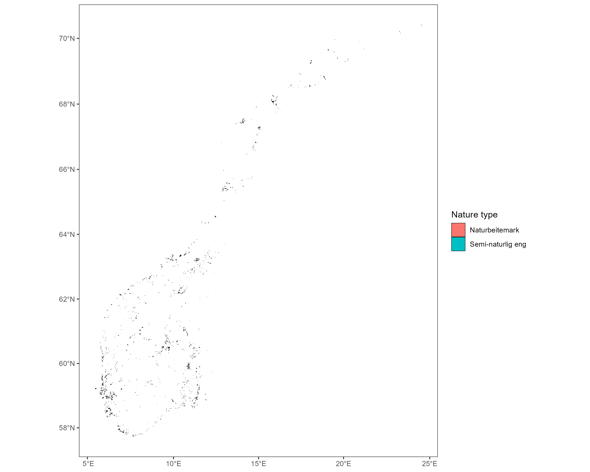
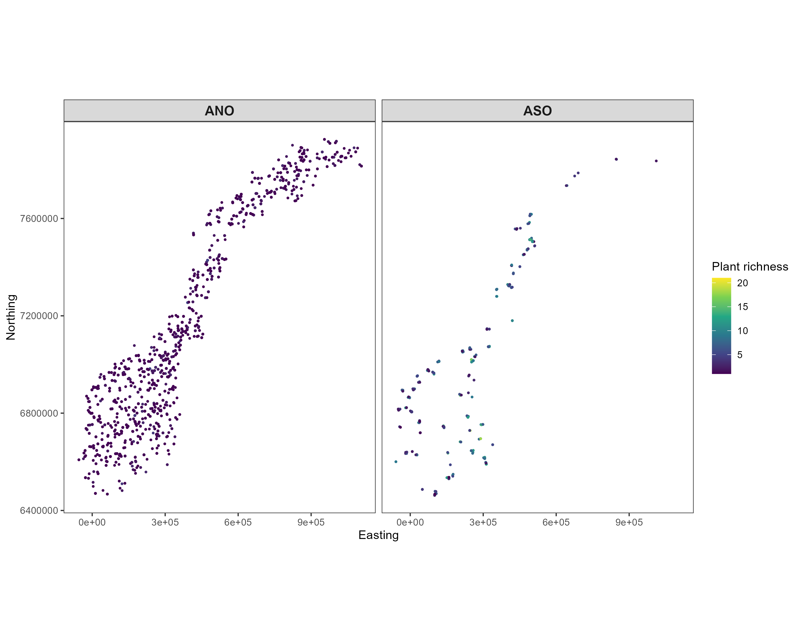
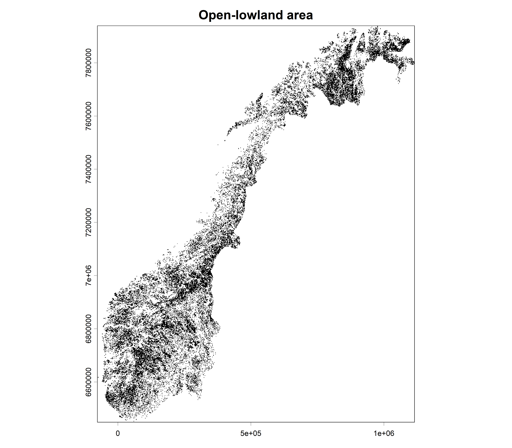
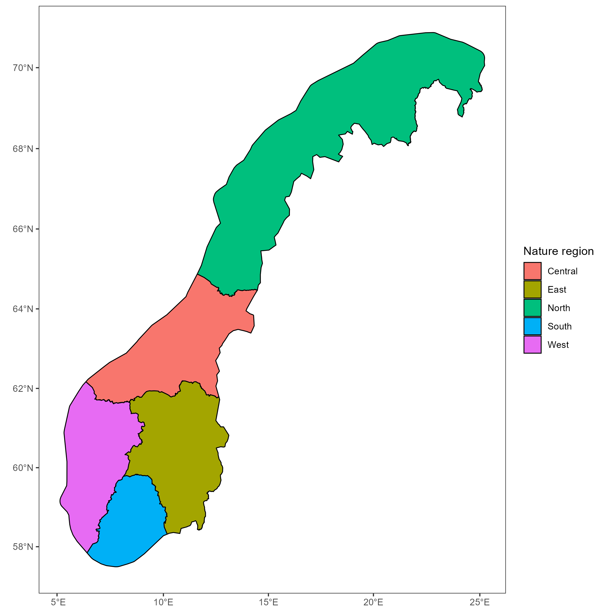
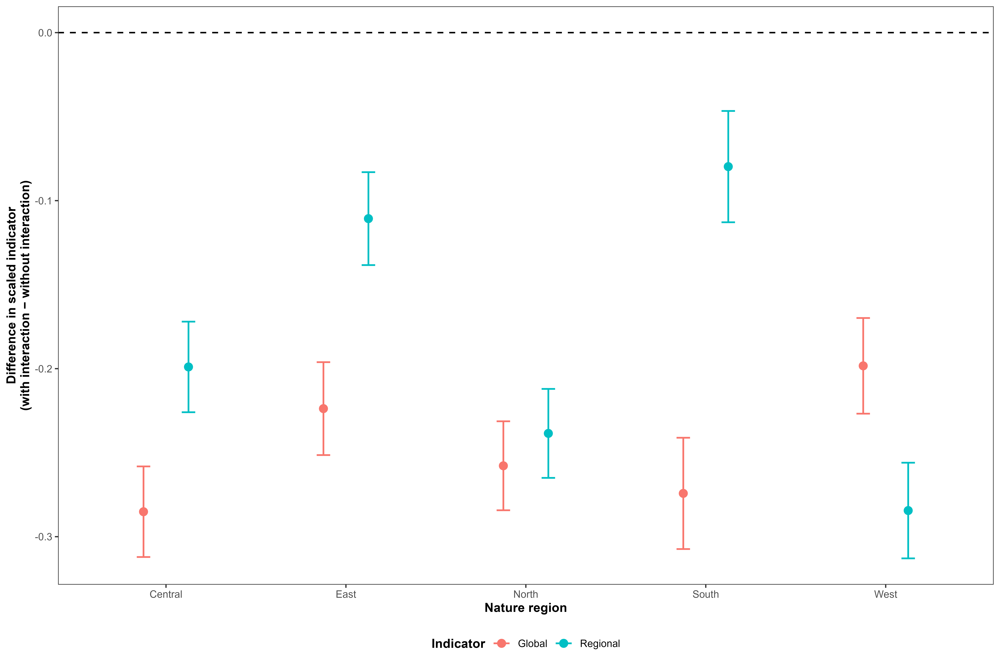
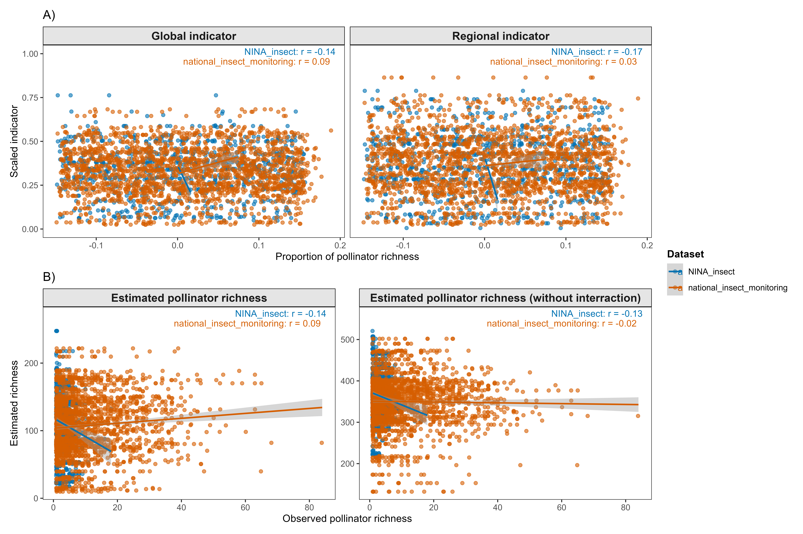

<!--# This is a template for how to document the indicator analyses. Make sure also to not change the order, or modify, the headers, unless you really need to. This is because it easier to read if all the indicators are presented using the same layout. If there is one header where you don't have anything to write, just leave the header as is, and don't write anything below it. If you are providing code, be careful to annotate and comment on every step in the analysis. Before starting it is recommended to fill in as much as you can in the metadata file. This file will populate the initial table in your output.-->

<!--# Load all you dependencies here -->

```{r setup}
#| include: false
#| cache: false
library(knitr)
library(tidyverse)
library(kableExtra)
library(here)
library(anybadger)
library(yaml)
library(tibble)
library(conflicted)
# weird workarounds for cache issues
conflicts_prefer(dplyr::filter)
conflicts_prefer(dplyr::lag)
conflicts_prefer(dplyr::select)
pull<-dplyr::pull

knitr::opts_chunk$set(echo = TRUE)
```

<!--# The following parts are autogenerated. Do not edit. -->


```{r source}
#| echo: false
#| cache: false
source(here::here("_common.R"))
```

```{r reviewers}
#| echo: false
#| results: asis

if (!is.null(yaml_data$codeReviewers)) {
  reviewers <- purrr::map_chr(yaml_data$codeReviewers, "name")
  
  htmltools::HTML(paste0(
    '<div id="title-block-header" class="quarto-title-block default">
       <div class="quarto-title-meta">
         <div>
           <div class="quarto-title-meta-heading">Reviewed by</div>
           <div class="quarto-title-meta-contents">',
    paste(reviewers, collapse = "; "),
    '</div>
         </div>
       </div>
     </div>',
    sep = ""
  ))
}
```

::: {layout-ncol="6"}

```{r statusBadge}
#| echo: false
status_badge(as.character(st))
```

```{r versionBadge}
#| echo: false
version_badge(my_version_number = as.character(version[[1]]))
```

```{r dataBadge}
#| echo: false
data_badge(as.character(badges[[1]]))
```

```{r codeBadge}
#| echo: false
code_badge(as.character(badges[[2]]))
```

```{r openScienceBadge}
#| echo: false
open_science_badge(as.character(badges[[3]]))
```

```{r licenseBadge}
#| echo: false
# The following inserts a badge specifying the GPL GNU version 3 license. ecRxiv recommends using this license, but you can decide to use another. Contact ecRxiv for help in insert a badge for a different license
license_badge()
```


::: 
 

> **Recommended citation**: `r paste(auth, " ", year, ". ", name, " (ID(s): ", folder_name, ") ", "v. ", version, ". ecRxiv: ", url, sep="")`


::: {.callout-tip collapse="true"}
## Metadata
```{r tbl-meta2}
#| tbl-cap: 'Indicator metadata'
#| echo: false
#| warning: false
meta |>
  dplyr::filter(Variable %in% c(
    "Indicator ID",
    "Indicator Name",
    "verbatimName",
    "Continent",
    "Country",
    "Ecosystem Condition Typology Class", 
    "Realm",
    "Biome",
    "Ecosystem",
    "verbatimEcosystem",
    "Year added", 
    "Last update",
    "Version",
    "Version comment",
    "Normalised",
    "Spatial aggregation pathway",
    "Precision")) |>   
  kable()

```
:::

::: {.callout-tip collapse="true"}

## Log

<!--# Update this logg with short messages for each update -->
- 18.08.2026 - Original PR
- 24.08.2026 - First draft of the indicator documentation completed
:::


<hr />

<!--# Document you work below.  -->

## 1. Summary

<!--# 
With a maximum of 300 words, describe the indicator in general terms as you would to a non-expert. Think of this as a kind of common language summary. Follow the four numbers sub-headers below. under point 2, it is possible under  include a bullet point list of the specific steps in the workflow. 
 -->

1. **Background and rationale**:
<!-- What does the metric represent? Why is this relevant for describing ecosystem condition in this ecosystem?
What are the main anthropogenic impact factors? -->

The pollinator potential indicator describes the potential condition of terrestrial pollinator communities in open lowland areas. It combines the predicted occurrence of pollinating insects with the availability of the plant hosts they interact with, thereby capturing an important ecological relationship underlying pollinator communities. The indicator is relevant because pollinators contribute to ecosystem functioning and depend on suitable plant resources [REF]. 

2. **Methods**:
<!-- What kind of data is used? How is the data customized (modified, estimated, integrated) to fit its purpose as an indicator? -->

The indicator integrates spatial predictions of plant hosts ($50$ plant species) and pollinator ($1134$ species) occurrence obtained from from the Global Biodiversity Infrastructure Facility ([GBIF](www.gbif.org) ) with information on plant–pollinator interactions (obtained from @rasmussen2021evaluating and @robinson2023hosts). The workflow consists of:

- Obtaining spatial predictions of plant hosts and pollinating insects (hereafter called "pollinators") occurrence probabilities,
- Linking pollinators to their interacting plant species using a plant–pollinator interaction matrix,
- Weighting pollinator occurrence probabilities by the occurrence probabilities of their interacting plants,
- Summing interaction-supported probabilities across pollinator species to estimate expected pollinator richness ,
- Calibrating the expected pollinator richness with detected/observed richness from survey and monitoring data (referred to as pollination potential), 
- Establishing minimum and maximum reference values from reference locations representing relatively stable ecosystem conditions, and
- Scaling the resulting indicator to a 0–1 range, using either region-specific or common reference values.


3. **Interpretation**:
<!-- Add a very short description of how the indicator values should be interpreted. Here's an example for a bumblebee indicator: An indicator value of 1 signifies an intact bumblebee community. Values decreasing toward zero reflect negative ecological change, specifically the decline of species expected to be present. This metric does not account for potentially positive changes, such as increases in species' abundance or the arrival of new species. Tip: Add text on the line directly following the subheader, and don't introduce blank lines. This way the whole paragraph renders as a block quote. -->

An indicator value of $1$ represents the upper reference level of pollinator potential, whereas values approaching $0$ indicate lower pollinator potential relative to the reference condition. The indicator reflects the potential occurrence of pollinators and their plant resources rather than directly measuring population abundance or demographic performance.

4. **Results and development needs**:
<!-- Briefly, what does the indicator say about the ecosystem condition. What is the current status of  the metric (can it be used or is it still in development), and what immediate tasks remain to improve the indicator or to make the indicator operational -->

The indicator provides a spatial measure of pollinator potential that accounts for plant–pollinator relationships and can be compared among regions. This indicator can be used but further work needs to be done to propagate uncertainty from the underlying species distribution models and interaction data into the final indicator. 

## 2. About the underlying data

<!--# Give a general introduction the datasets you have used, and provide more specific details in the sub-chapters.  -->

The pollinator potential indicator is based on pollinating insects and their plant-host occurrence data integrated from multiple biodiversity datasets and modelled to estimate their occurrence probability across Norway. The modelling framework, as explained by @perrin2026addressing, combines heterogeneous occurrence information with environmental covariates to generate spatially explicit estimates of occurrence probabilities using the integrated species distribution modelling framework. The analyses were restricted to observations from 2012 onwards to provide a consistent contemporary temporal basis for the indicator.

Here, we also access data from biodiversity programs including the Overvåking av semi-naturlig eng (ASO) survey[@asoDataset], Ano [@anoDataOccurrence], Norwegian Insect Monitoring Program [@norwegianInsectMonitoring] from GBIF to validate the indicators. 

### 2.1 Spatial and temporal resolution and extent

<!--# Describe the temporal and spatial resolution and extent of the data used -->

The underlying biodiversity data comprise spatially referenced species occurrence records covering Norway. Records from 2012 onwards were retained for model fitting to ensure temporal consistency with the environmental covariates and the period used for indicator estimation. Because the occurrence data originate from heterogeneous monitoring and observation programmes, sampling frequency and temporal coverage vary among species and locations. Spatial resolution is determined by the geographic precision of individual observations and, at the prediction stage, by the resolution of the environmental covariates. The environmental predictors used in the species distribution models are available at a spatial resolution of 1 km², and predicted occurrence probabilities for plant and pollinator species were therefore initially generated at this resolution. Details of the environmental covariates and their spatial resolution are provided in @perrin2026addressing.

A 1 km² prediction grid may, however, obscure fine-scale habitat heterogeneity within open lowland areas, where suitable vegetation and pollinator habitat can occur as relatively small or spatially fragmented patches. We therefore downscale and calibrate the indicator estimates from @perrin2026addressing by integrating information on vegetation types and elevation available at 50 m resolution. Specifically, the 1 km² model predictions are combined with fine-resolution habitat information to distinguish areas within each prediction cell that are more likely to represent suitable open lowland conditions. This approach reduces the potential bias associated with spatial aggregation and ensures that fine-scale habitat heterogeneity is retained when deriving the final indicator. The resulting indicator is therefore reported at a 50 m spatial resolution, providing a finer representation of the spatial distribution and configuration of open lowland habitats than the original 1 km² model predictions.

The assessment encompasses both natural and culturally influenced semi-natural habitats. Cultural habitats are ecosystems whose structure and ecological characteristics have been shaped and maintained through long-term, traditional human land use and management. In open lowland landscapes, continued management is often required to maintain these habitats and prevent succession towards alternative vegetation states. The spatial extent of open lowland areas is delineated using classes 6 (permantly herbaceous) and 7 (periodically herbaceous) from @eea2025_clcplus_backbone, which define the geographical domain within which the indicator is estimated.

### 2.2 Sampling design

<!-- How was the data sampled? Describe potential sampling biases -->

The underlying occurrence data used for the models by @perrin2026addressing were compiled from several biodiversity programs (including citizen science and structured surveys) rather than from a single standardized sampling design. Consequently, sampling intensity is spatially and taxonomically heterogeneous and may reflect differences in observer effort, accessibility, geographic coverage, and monitoring activity. These characteristics can introduce spatial and temporal sampling biases into the occurrence data. The sampling bias was accounted for in @perrin2026addressing by using a bias-corrected modelling framework that incorporates environmental covariates and spatially explicit sampling effort to generate more reliable occurrence predictions. The resulting modelled occurrence probabilities are therefore less sensitive to the underlying sampling biases than the raw occurrence data.

The validation data were all from structured surveys, including the Overvåking av semi-naturlig eng (ASO) survey [@asoDataset], Ano [@anoDataOccurrence], and the Norwegian Insect Monitoring Program [@norwegianInsectMonitoring]. These surveys were designed to provide representative coverage of open lowland habitats and were conducted using standardized sampling protocols. The validation data are therefore less affected by sampling biases than the underlying occurrence data used for model fitting.


### 2.3 Original units

<!--# What are the original units for the most relevant  variables in the data-->

The primary biological observations are species occurrence records, with geographic coordinates representing the observation locations. For insects, the response variable used to construct the indicator is species richness, expressed as the number of insect species estimated or observed at a location. The modelled richness values are subsequently transformed into a scaled indicator using regional reference levels, including $X_0$ and $X_{100}$, to provide a standardized measure of ecological condition.

### 2.4 Instructions for citing, using and accessing data

<!--# Is the data openly available? If not, how can one access it? What are the key references to the datasets?   -->

The biodiversity occurrence data used in the analysis were obtained through GBIF. The relevant GBIF occurrence downloads should be cited using their download DOIs:

  - Insects: @hotspotInsectOccurrence
  - Plants: @hotspotPlantOccurrence

The data are therefore traceable through the corresponding GBIF download records. The hotspot maps and the modelling framework should additionally be cited according to the relevant underlying scientific publication or report.

### 2.5 Additional comments about the dataset

<!--# Optional. Text here -->

The insect indicator is derived from a modelling framework that relates insect occurrence and richness to environmental conditions. The model uses environmental covariates to generate spatially explicit predictions of insect richness, which are subsequently compared with regional reference conditions. Separate regional and national scaling approaches are used to account for geographic variation in reference richness. The indicator can also be calculated with and without interaction terms among environmental covariates, allowing the contribution of interactions to the resulting indicator to be evaluated.


## 3. Indicator properties

### 3.1 Ecosystem Condition Typology Class (ECT)

<!--# Describe the rationale for assigning the indicator to the ECT class. See https://oneecosystem.pensoft.net/article/58218/
This doesnt need to be very long. Maybe just a single sentence. -->

The indicator is assigned to the biotic composition and interactions component of ecosystem condition because it represents the potential occurrence and interaction-supported richness of pollinators and their plant resources relative to a reference condition.

### 3.1.1 Other condition typologies

<!--# Optional: Add text about other standards or typologies, such as alternative national condition typologies, and how the indicator relates to these -->

The indicator is primarily related to species composition and ecological interactions, and can therefore complement condition typologies that assess biodiversity, species composition, or ecological functioning. No alternative national condition typology has currently been formally assigned.

### 3.2 Ecosystem condition characteristic

<!--# 

A short (one to three word) tag or name for the ecosystem condition characteristic represented in the indicator. See 10.3897/oneeco.6.e58218 for information on what these characteristics might be.

Examples: 'intact hydrology'; 'near-natural species composition'; 'soil stability'; sustainable trophic interactions'. 

The term 'characteristic' is used in a similar way  to the term 'criteria' in Multiple Criteria Decision Making.  

-->

**Need help with this**

### 3.3 Collinearities with other indicators

<!--# Describe known collinearities with other metrics (indicators or variables) that could become problematic if they were also included in the same Ecosystem Condition Assessment as the indicator described here. -->

The pollinator potential indicator is expected to be correlated with indicators based directly on pollinator species richness, plant species richness, habitat suitability, and land-cover or habitat extent, because these variables contribute to the underlying predicted occurrence probabilities. It may also be correlated with indicators based on plant–pollinator community composition. Care should therefore be taken when combining these metrics in a multivariate ecosystem condition assessment to avoid giving disproportionate weight to the same underlying biodiversity signal.

### 3.4 Impact factors

<!--# Describe the main natural and anthropogenic factors that affecst the metric -->

The indicator responds to interacting climatic, land-use, and habitat pressures that influence the condition and availability of open lowland habitats and their plant and pollinator communities.

Key anthropogenic pressures include land-use change, agricultural intensification, habitat loss and fragmentation, urbanisation, infrastructure development, and changes in vegetation management. These pressures can reduce habitat availability and quality, alter plant community composition, and reduce the availability of floral resources and host plants for pollinators. Pesticide exposure and other chemical pressures may additionally affect pollinator survival and reproduction.

Climate change, including changes in temperature, precipitation, seasonality, snow cover, and climatic extremes, can directly affect plant and pollinator phenology, survival, reproduction, and distribution, as well as indirectly modify habitat conditions and resource availability.

Natural gradients in topography, elevation, soil properties, water availability, and vegetation determine baseline habitat suitability and mediate the response of plant and pollinator communities to these pressures. The indicator therefore reflects both the direct effects of environmental change and their indirect effects through altered habitat quality and resource availability.

### 3.5 Spatial aggregation

<!-- Describe in word the same aggregation pathway presented in the top yaml (the metadata). If you have scaled against the reference value, it is especially important to know if you did any avergaing or summations etc. beforehand. An example text for a rather simple case could be: "The variable is scaled at the initial polygon level and the point estimate is a area-weighted arithmetic mean of all polygins. There is no transformation, and truncation is not needed as the indicator becomes naturally bound between 0 and 1".  -->

Pollinator occurrence probabilities are first combined with the predicted occurrence probabilities of their interacting plant species to produce an interaction-supported probability for each pollinator species at each raster cell. These probabilities are then summed across pollinator species to obtain cell-level pollinator potential. We then calibrate these cell-level values using observed pollinator richness from survey and monitoring data. The resulting calibrated pollinator potential are scaled to 0–1 using reference minimum and maximum values. For the regional indicator, scaling is performed using reference levels specific to each of the five nature regions; for the global indicator, common reference levels are applied across all regions. Values less than 0 were truncated to 0, and values greater than 1 were truncated to 1, resulting in a final indicator value bounded between 0 and 1.

## 4. Reference condition and levels

### 4.1 Reference condition

<!--# Define the reference condition (or refer to where it is defined). Note the distinction between reference condition and reference levels 10.3897/oneeco.5.e58216  -->

The reference condition represents the ecological state of relatively well-preserved and stable semi-natural meadows and grasslands used as reference sites. These sites are identified from polygons classified as being in good condition in the [**Natur i Norge** (NIN)](https://artsdatabanken.no/naturtyper/natur-i-norge) mapping system. The spatial distribution of these reference sites is used to characterise the expected plant–pollinator system under relatively favourable conditions.

To account for regional differences in environmental conditions and species composition, reference sites are stratified into five biogeographic regions: Central, East, North, South, and West. The reference condition therefore represents the range of pollinator potential expected under relatively favourable and stable conditions within each region, rather than an assumed historical or pristine baseline.


### 4.2 Reference levels

<!--# 

If relevant (i.e. if you have normalised a variable), describe the reference levels used to normalise the variable. 

Use the terminology where X~0~ refers to the reference level (the variable value) denoting the worst possible condition; X~100~denotes the optimum or best possible condition; and X~*n*~, where in is between 0 and 100, denotes any other anchoring points linking the variable scale to the indicator scale (e.g. the threshold value between good and bad condition X~60^). 

Why was the current option chosen and how were the reference levels quantified? If the reference values are calculated as part of the analyses further down, please repeat the main information here.

 -->

The indicator is normalised using the distribution of pollinator potential at the reference locations. For each nature region, the minimum and maximum observed richness values among the reference locations define the lower and upper reference levels:
$$
I = \frac{X - X_0}{X_{100} - X_0}
$$
where $I$ is the normalised indicator value, $X$ is the cell-level pollinator potential, $X_0$ is the minimum reference level (worst condition), and $X_{100}$ is the maximum reference level (best condition). 

The study region was divided into five nature regions: Central, East, North, South, and West, similar to the classification used by [NaturIndex](https://www.naturindeks.no/Ecosystems/aapent_lavland). We estimate normalised indicator values for each region using the respective reference levels, which we refer to as **regional indicators**. The regional approach accounts for differences in baseline pollinator potential among Norway's biogeographic regions.

Additionally, we also estimate indicator values for the entire country using common reference levels are applied across all regions and we refer to it as the **national indicator**. For the regional indicator, these reference levels are calculated separately for each nature region, while for the national indicator, common reference levels are applied across all regions. This provides a common national scale and allows spatial differences among regions to be retained rather than being normalised away.

#### 4.2.1 Spatial resolution and validity

<!--# 

Describe the spatial resolution of the reference levels. E.g. is it defined as a fixed value for all areas, or does it vary. Also, at what spatial scale are the reference levels valid? For example, if the reference levels have a regional resolution (varies between regions), it might mean that it is only valid and correct to use for normalising local variable values that are first aggregated to regional scale. However, sometimes the reference levels are insensitive to this and can be used to scale variables at the local (e.g. plot) scale. 

 -->

 The reference levels have regional resolution for the regional indicator and are therefore intended to scale cell-level pollinator potential according to the reference range of the corresponding nature region. The regional reference levels are valid for locations within their respective nature regions. The national reference levels provide a common national scaling and can be applied across the entire study area.

Because the reference levels are estimated from a finite set of reference locations, they represent the observed reference range rather than the theoretical minimum and maximum possible pollinator potential. Predicted values can therefore exceed the reference range before truncation; such values are constrained to 0–1 in the final indicator.

## 5. Uncertainties
### 5.1 General uncertainties
<!--# Describe the main reasons why you might not trust 100% the final value to represent the given ecosystem characteristic for the give ecosystem type. What aspects of this condition metric are most sensitive to subjective decitions? Is the spatial sampling sufficient? Does the choice of modeling framework affect the values? Is the metric relevant do describe ecosystem condition for the give ecosystem type?  -->

Several sources of uncertainty affect the indicator. First, uncertainty in the underlying plant and pollinator occurrence models propagates into the interaction-supported pollinator potential. The indicator also depends on the completeness and accuracy of the plant–pollinator interaction matrix. Interactions that are not documented may be incorrectly treated as absent, potentially affecting the estimated support available to pollinators.

The indicator is also sensitive to the selection and spatial distribution of reference locations. The reference sites may not capture the full spatial range of stable ecosystem conditions within each region, meaning that predicted values can exceed the observed reference maximum. Regional differences in the number and spatial distribution of reference locations may further affect the estimated reference ranges.

Finally, the indicator represents potential occurrence and interaction support, rather than directly measured abundance, demographic performance, or realised pollination rates. Consequently, high pollinator potential does not necessarily imply high pollinator population size or pollination service delivery.

### 5.2 Reported uncertainties
<!-- Describe the nature of the errors you (hopefully) provide alongside the point estimate for the condition metric. It is especially important to clarify if the errors are inferential (referring to the uncertainty of the point estimate) or descriptive (referreing to the data itself). Here' an example text: "What we report as uncertainties in @tbl-finalTable are inferential and refer to the uncertainty around the point estimates. It does not directly describe variation in the data itself. 
However, the variation in the mean is defined by the spatial variation only, and quartiles are obtained by bootstrapping the set of localities within a region, and calculating the indicator for each of 9999 such samples".   -->

The current indicator is summarised by the mean pollinator potential and its standard deviation (SD), together with the corresponding scaled indicator value. The mean represents the average pollinator potential across the assessment area, while the SD describes the spatial variability of pollinator potential around this mean. The SD should therefore be interpreted as a measure of spatial heterogeneity, rather than as statistical uncertainty in the indicator estimate.

Uncertainty associated with the plant and pollinator prediction models, the interaction matrix, and the reference levels is not currently propagated into a formal uncertainty interval for the final indicator. Developing a comprehensive uncertainty propagation framework, incorporating uncertainty in the underlying species distribution predictions, interaction strengths, and reference levels, is therefore an important next step for improving the reliability and interpretability of the indicator.


## 6. References

::: {#refs}
:::

<!--# You can add references manually or use a citation manager and add intext citations as with crossreferencing and hyperlinks. See https://quarto.org/docs/authoring/footnotes-and-citations.html -->

## 7. Import and prepare datasets

<!--# All the data import and preparation should be done in this chapter, before the analysis chapter. As a minimum, add code for importing data, and describe or show the data structure. You may also explain certain variables, what they represent, and their distributions -->

### 7.1 Pollinator and plant occurrence predictions

<!--# Import and prepare the first dataset for analysis. Change the header from Dataset A to the name of the actual dataset. -->

We obtained spatial predictions of pollinator and plant host occurrence prbabilities from the Hotspot project [@perrin2026addressing]. The predictions were generated using integrated species distribution models (ISDMs) that combine occurrence records from the Global Biodiversity Information Facility (GBIF) with environmental covariates. The resulting raster layers provide cell-level probabilities of occurrence for each pollinator and plant species across the study area. Refer to the Hotspot project documentation for details on the modeling approach, covariates used, and model validation [@perrin2026addressing].

```{r}
#| eval: false

# resultFolder should be where the output from the Hotspot project is stored. 
#This folder should contain the raster files for pollinator and plant occurrence probabilities.

resultFolder <- "path/to/hotspot/output"
# ==============================================================================
# 7. LOAD SPECIES DISTRIBUTION RASTERS
# ==============================================================================

## ------------------------------------------------------------------
## Insect occurrence probabilities
## ------------------------------------------------------------------

insects <- terra::rast(
  file.path(
    resultFolder,
    "insectProbabilities.tiff"
  )
)


## ------------------------------------------------------------------
## Plant occurrence probabilities
## ------------------------------------------------------------------

plants <- terra::rast(
  file.path(
    resultFolder,
    "plantProbabilities.tiff"
  )
)

## ========================================================
## Expected plant species richness
## ========================================================

plant_expected_richness <- terra::app(
  plants,
  fun = sum,
  na.rm = TRUE,
  cores = 1,
  filename = file.path(
    resultFolder,
    "plant_expected_richness.tif"
  ),
  overwrite = TRUE
)

names(plant_expected_richness) <-
  "plant_expected_richness"

```

### 7.2. Interrraction matrix

<!--# Repeat the process for each dataset -->

We compiled plant–pollinator interaction data for hoverflies [@rasmussen2021evaluating], butterflies and wild bees [@robinson2023hosts]. These data were used to construct plant–pollinator interaction networks with the *frame2webs* function from the *_bipartite_* R package [@dormann2008introducing]. Because the available data contained relatively few pollinator species within individual genera, interactions were aggregated at the pollinator genus level. The resulting interaction matrix records the presence or absence of a documented interaction between each pollinator genus and plant host species, with $1$ indicating a documented interaction and $0$ indicating no documented interaction. For pollinator genera not represented in the available interaction data, interactions with plant host species were assigned a small value, $\epsilon$, rather than zero. This value represents uncertainty about the interaction rather than evidence that the interaction is absent. In the indicator calculation, $\epsilon$ was set to $0.25$, giving undocumented interactions a lower weight than confirmed interactions while retaining a small contribution to pollinator–plant association. The resulting matrix was then used to link predicted pollinator occurrence with the predicted occurrence of their potential plant hosts.

```{r}
#| eval: false

# Interraction web
# Import and format the pollinator datasets
if(!file.exists(paste0(dataFolder, "/interractionsData/interractionMatrix.csv"))){
  FinalSelectionOfLepidopteraAndBeesAndHoverflies <- allPollinatorsDataset(dataFolder, 
                                                                           print = FALSE)
  Bio1Traits <- readr::read_csv("Data/pollinatorDataFolder/bioTraits.csv")%>%
    mutate(
      simpleScientificName = coalesce(
        str_extract(acceptedScientificName, "^[A-Za-z]+\\s+[a-z]+")        # Extract binomial name
      )
    )%>%
    mutate(genus = simpleScientificName)%>%
    separate(genus, into = c("genus", "other"), sep = " ")
  
  rr <- data.frame(scientificName = unique(FinalSelectionOfLepidopteraAndBeesAndHoverflies$ValidSpeciesName),
                   acceptedScientificName = sapply(unique(FinalSelectionOfLepidopteraAndBeesAndHoverflies$ValidSpeciesName), function(x) findGBIFName(x)))
  
  InteractionsInIdealMeadow <-  FinalSelectionOfLepidopteraAndBeesAndHoverflies%>%
    group_by(PlantGenus, ValidSpeciesName)%>%
    dplyr::distinct( )%>%
    ungroup() %>%
    mutate(genus = ValidSpeciesName)%>%
    separate(genus, into = c("genus", "other"), sep = " ")%>%
    select(PlantGenus, Taxon, genus)%>%
    dplyr::mutate(Taxon = ifelse(Taxon == "Butterfly", "Butterflies", Taxon))
  
  otherPollinatorSp <- unique(Bio1Traits$genus[!Bio1Traits$genus %in% InteractionsInIdealMeadow$genus])  
  otherPollinatorSp <- otherPollinatorSp[!is.na(otherPollinatorSp)]

  
  countries <- ne_countries(scale = "medium", returnclass = "sf")
  
  # Filter Europe
  scand <- countries[countries$name %in% c("Norway", "Sweden"), ]
  poly <- st_transform(scand, 4326)
  bbox <- st_bbox(poly)
  
  # Pollinator interactions (example: bees)
interactions <-  lapply(otherPollinatorSp, function(x){
  interactions <- rglobi::get_interactions_by_taxa(
    sourcetaxon = x,
    interactiontype = "pollinates",
    bbox = bbox
  )


 ret <-  interactions %>%
    select(source_taxon_name, target_taxon_name, study_citation, study_source_citation)
 
 return(ret)
  })

# Keep only those with at least one row
interactions1 <- interactions[sapply(interactions, nrow) > 0] %>%
  do.call("rbind", .) %>%
  dplyr::select(source_taxon_name, target_taxon_name) %>%
  separate(source_taxon_name, into = c("genus", "other"), sep = " ") %>%
  separate(target_taxon_name, into = c("PlantGenus", "otherSp"), sep = " ") %>%
  filter(PlantGenus %in% InteractionsInIdealMeadow$PlantGenus) %>%
  dplyr::left_join(., 
                   Bio1Traits %>% select(genus, Taxon),
                   by = "genus",
                   keep = FALSE) %>%
  dplyr::select(colnames(InteractionsInIdealMeadow))
  
allInterractions <- bind_rows(InteractionsInIdealMeadow,
                              interactions1)

  
  # FInd out the species in the aso data that match up to the specific genus
  if(!exists("asoDatasf")) asoDatasf <- readRDS(file = paste0(dataFolder, "/plantDataFolder/formattedData/asoData.RDS"))
  
  # Merge the asoData genus to the species data
  asoDatasf <- asoDatasf %>%
    mutate(
      simpleScientificName = coalesce(
        str_extract(acceptedScientificName, "^[A-Za-z]+\\s+[a-z]+")
      ),
      genus   = str_extract(simpleScientificName, "^[A-Za-z]+"),
      otherSp = str_extract(simpleScientificName, "(?<=\\s)[a-z]+")
    ) %>%
    st_drop_geometry() %>%
    distinct(simpleScientificName, genus)
  
  interractionData <- merge(allInterractions, 
                            as.data.frame(asoDatasf[, c("simpleScientificName", "genus")])[, 1:2],
                            by.x = "PlantGenus",
                            by.y = "genus")%>%
    group_by(genus, Taxon)%>%
    distinct()
  
  # save the interractions in ideal meadow
  write.csv(interractionData, 
            paste0(dataFolder, "/interractionsData/interractionDataAlt.csv"))
  
  # Create the plant pollinator for network
  PlantPollinatorsForNetwork <- interractionData[c("genus","simpleScientificName")]
  names(PlantPollinatorsForNetwork)[1:2] <- c("higher","lower")
  PlantPollinatorsForNetwork$freq <- 1
  PlantPollinatorsForNetwork$webID <- 1
  dfForWeb <- PlantPollinatorsForNetwork[c("lower","higher","webID","freq")]
  
  # Create webs from dataframe
  WebReady <- bipartite::frame2webs(dfForWeb, varnames = c("lower", "higher", "webID", "freq"))
  
  # save for later use
  save(WebReady,
       file = paste0(dataFolder, "/interractionsData/webPlotAlt.RData"))
  
  if(modelPlots){
    plotweb(WebReady[[1]])
  }
  
  
  # Calculte the interraction matrix
  interractionMatrix <- as.data.frame(WebReady[[1]]) 
  interractionMatrix$species <- rownames(interractionMatrix)
  rownames(interractionMatrix) <- NULL
  # save the results
  write.csv(interractionMatrix, 
            paste0(dataFolder, "/interractionsData/interractionMatrixAlt.csv"))
  
} else {
  load(paste0(dataFolder,"/interractionsData/webPlotAlt.RData"))
  interractionMatrix <- readr::read_csv(paste0(dataFolder,"/interractionsData/interractionMatrixAlt.csv"))
  
  if(modelPlots){
    plotweb(WebReady[[1]])
  }
}

interractionProb <- interractionMatrix %>%
  dplyr::mutate(species = interractionMatrix$species)%>%
  mutate(
    simpleScientificName = coalesce(       #redList$species[match(acceptedScientificName, redList$GBIFName)],  # Match redList species
      str_extract(species, "^[A-Za-z]+\\s+[a-z]+")        # Extract binomial name     
    ),
    # Replace space with underscore in simpleScientificName
    species = gsub("-", "", gsub("","", gsub(" ", "_", simpleScientificName)))
  )

```


### 7.3. Reference locations

We extracted reference locations from the [**Natur i Norge** (NiN)](https://artsdatabanken.no/naturtyper/natur-i-norge) polygons with good conditions for semi-natural grasslands. We assume that these semi-natural meadows represent relatively stable ecosystem conditions for pollinator communities and their plant resources. This is because these semi-natural meadows are typically managed or protected areas where ecological processes are less disturbed and thus biodiversity-rich habitats in Norway. The reference locations (diplayed in @fig-referenceLocations) are used to establish the observed minimum and maximum values of interaction-supported pollinator potential, which define the lower and upper reference levels for normalising the indicator.

```{r}
#| eval: false

## ==================================
## Define NiN polygons as reference locations
## ==================================
if(!file.exists(file.path(
  resultFolder, "polygons",
  "good_seminatural_grassland_nin.shp"
))){
nin_gdb <- "path/to/nin.gdb"

nin_polygons <- sf::st_read(
  nin_gdb,
  layer = "naturtyper_nin_omr",
  quiet = FALSE
)

names(nin_polygons)[5] <- "area_name"
names(nin_polygons)[7] <- "main_ecosystem"
names(nin_polygons)[9] <- "mapping_year"

reference_naturtyper <- c(
  "Naturbeitemark",
  "Slåttemark",
  "Semi-naturlig eng"
)

good_seminatural_grassland <- nin_polygons %>%
  dplyr::filter(
    main_ecosystem == "semi-naturligMark",
    tilstand == "god",
    naturtype %in% reference_naturtyper
  ) %>%
  dplyr::select(
    naturtype,
    naturtypeKode
  )


ref_locs <- good_seminatural_grassland
## --------------------------------------------------------
## Save as Shapefile
## --------------------------------------------------------

shapefile_path <- file.path(
  resultFolder, "polygons",
  "good_seminatural_grassland_nin.shp"
)

sf::st_write(
  good_seminatural_grassland,
  shapefile_path,
  delete_layer = TRUE,
  quiet = FALSE
)

p <- ggplot() +
  geom_sf(
    data = good_seminatural_grassland,
    aes(fill = naturtype),
    colour = "black",
    linewidth = 0.2
  ) +
  labs(
    fill = "Nature type"#,
    #title = "Good-condition semi-natural ecosystems"
  ) +
  theme_bw() +
  theme(
    panel.grid = element_blank(),
    legend.position = "right"
  )

## --------------------------------------------------------
## Save plot
## --------------------------------------------------------

plot_file <- file.path(
  resultFolder, "figures",
  "good_seminatural_grassland_nin"
)

## PDF
ggsave(
  filename = paste0(plot_file, ".pdf"),
  plot = p,
  width = 10,
  height = 8,
  units = "in"
)

## PNG
ggsave(
  filename = paste0(plot_file, ".png"),
  plot = p,
  width = 10,
  height = 8,
  units = "in",
  dpi = 300
)
} else {
  ref_locs <- sf::st_read(
    file.path(
      resultFolder, "polygons",
      "good_seminatural_grassland_nin.shp"
    ),
    quiet = TRUE
  )
}

```


```{r fig-referenceLocations}
#| fig-cap: 'The reference polygons of semi-natural grasslands in good condition from the Natur i Norge (NiN) database.'
#| fig-width: 100
#| echo: false
#| warning: false

```


### 7.4. Evaluation of reference locations

We also obtained sampling event datasets from GBIF to evaluate the effect of plant-host availability on pollinator indicator values. Specifically, we try to answer the questions: (i)"Do pollinator indicator values differ between regions with and without plant hosts?" and (ii) "Do predictedplant occurrence probabilities match the observed plant richness in the field?" To address these questions, we used two area representative datasets: the Overvåking av semi-naturlig eng (ASO)survey dataset [@asoDataset], which contains plant and pollinator occurrence records from semi-natural meadows and the Ano dataset [@anoDataOccurrence], which includes plant and pollinator occurrence records from agricultural landscapes. We present the ASO and ANO sampling locations in @fig-plantEvaluationLocs, along with a background map showing the observed plant-host richness across the study area. 

```{r}
#| eval: false

## -----------------------
## ASO and ANO data locations
## -----------------------

source("01_codeForEnvAgency/04_process_ASO_data.R")
source("01_codeForEnvAgency/04_process_ANO_data.R")
```

```{r fig-plantEvaluationLocs}
#| fig-cap: 'The ASO and ANO sampling locations used to evaluate the effect of plant-host availability on pollinator indicator values. The ASO dataset represents semi-natural meadows, while the ANO dataset represents agricultural landscapes that are within the study area. The background map shows the observed plant-host richness.'
#| fig-width: 100
#| echo: false
#| warning: false

```

Additionally, we also obtained pollinator occurrence records from GBIF to evaluate how well the indicator captures the observed distribution of pollinators in relation to plant-host availability. We used the NINA insect database [@ninaInsectDataset] which includes findings of pollinators from research- and monitoring projects conducted by the Norwegian Institute for Nature Research and the Norwegian Insect Monitoring Scheme (NINA) dataset [@norwegianInsectMonitoring] which conducts a general monitoring of terrestrial insects in Norway since 2020, on behalf of the [Norwegian Environmental Agency](https://www.miljodirektoratet.no/). We aim to answer the questions: (i) "Do indicator values differ between with and wothout plant host interractions?" and (ii) "Do predicted pollinator occurrence probabilities match the observed pollinator richness in the field?"

**Put the locations of ninaInsect Dataset and norwegianInsectMonitoring Dataset here.**

These are the downloaded datasets from GBIF: 

- the ANO dataset [@anoDataOccurrence],

- the ASO survey dataset [@asoDataOccurrence], 

- the Norwegian Insect Monitoring Scheme (NINA) dataset [@ninaInsectOccurrence]

- the Nina insect dataset [@ninaInsectOccurrence]


### 7.4. Spatial mask

```{r spatialMask}
#| eval: false

# ==============================================================================
# 8. CREATE OPEN-LOWLAND MASK
# ==============================================================================

openlowland_mask_file <- file.path(
  "C:/terra_tmp",
  paste0(
    "openlowland_mask_",
    openlowland_threshold,
    "pct.tif"
  )
)


if (!file.exists(openlowland_mask_file)) {
  
  ## ----------------------------------------------------------------
  ## Load open-lowland percentage raster
  ## ----------------------------------------------------------------
  
  openlowland_boundary <- terra::rast(
    file.path(
      resultFolder,
      "openlow_pct_NO.tif"
    )
  )
  
  
  ## ----------------------------------------------------------------
  ## Project to the plant/insect prediction grid
  ## ----------------------------------------------------------------
  
  openlowland_projected <- terra::project(
    openlowland_boundary,
    plants,
    method = "bilinear"
  )
  
  
  ## ----------------------------------------------------------------
  ## Apply threshold
  ## ----------------------------------------------------------------
  
  openlowland_mask <-
    openlowland_projected >= openlowland_threshold
  
  
  ## ----------------------------------------------------------------
  ## Save mask
  ## ----------------------------------------------------------------
  
  terra::writeRaster(
    openlowland_mask,
    openlowland_mask_file,
    overwrite = FALSE
  )
  
} else {
  
  ## ----------------------------------------------------------------
  ## Load existing mask
  ## ----------------------------------------------------------------
  
  openlowland_mask <- terra::rast(
    openlowland_mask_file
  )
}

```

We created a spatial mask to delineate the open-lowland ecosystem area in Norway (see @fig-opnlowlandMask), which constitutes the relevant Ecosystem Asset (EA) domain for the indicator. The mask was generated using land-cover data and ecological criteria to identify areas that are representative of open lowland habitats, such as semi-natural grasslands, meadows, and other open habitats. The mask is applied to the raster grid to restrict the analysis to the defined EA domain, ensuring that indicator values are calculated only for locations within the relevant ecosystem type.

```{r fig-opnlowlandMask}
#| fig-cap: 'The open-lowland ecosystem area in Norway.'
#| fig-width: 100
#| echo: false
#| warning: false

```

### 7.5. Regional classification

The reference locations were assigned to five biogeographic (nature) regions based on the spatial distribution of Norwegian county boundaries. County polygons were obtained from the Norwegian administrative-unit dataset and grouped into South, East, West, Central, and North regions according to predefined county classifications. The resulting county groups were dissolved to create five spatially contiguous regional units. Each reference location was then assigned to the corresponding nature region based on its spatial location. These regional classifications were used to derive region-specific reference levels for the indicator, allowing the reference condition to vary among the five biogeographic regions.

```{r regionalClassification}
#| eval: false

)

# ==============================================================================
# 10. DEFINE BIOGEOGRAPHIC CLASSIFICATION REGIONS
# ==============================================================================

## ------------------------------------------------------------------
## Path to Norwegian county geodatabase
## ------------------------------------------------------------------

gdb <- "path/to/norwegian_county_geodatabase.gdb"


## ------------------------------------------------------------------
## Read county polygons
## ------------------------------------------------------------------

counties <- sf::st_read(
  gdb,
  layer = "fylke"
)


## ------------------------------------------------------------------
## Assign counties to nature regions
## ------------------------------------------------------------------

nature_regions <- counties %>%
  
  dplyr::mutate(
    
    fylkesnummer = as.character(
      fylkesnummer
    ),
    
    nature_region = dplyr::case_when(
      
      ## South
      fylkesnummer %in% c(
        "40",
        "42"
      ) ~ "South",
      
      ## East
      fylkesnummer %in% c(
        "31",
        "32",
        "03",
        "39",
        "33",
        "34"
      ) ~ "East",
      
      ## West
      fylkesnummer %in% c(
        "46",
        "11"
      ) ~ "West",
      
      ## Central
      fylkesnummer %in% c(
        "50",
        "15"
      ) ~ "Central",
      
      ## North
      fylkesnummer %in% c(
        "18",
        "55",
        "56"
      ) ~ "North",
      
      TRUE ~ NA_character_
    )
  ) %>%
  
  dplyr::filter(
    !is.na(nature_region)
  ) %>%
  
  dplyr::group_by(
    nature_region
  ) %>%
  
  dplyr::summarise(
    .groups = "drop"
  )


```

The classification was defined as follows:

  - *South*: counties 40 and 42

  - *East*: counties 31, 32, 03, 39, 33, and 34
  
  - *West*: counties 46 and 11

  - *Central*: counties 50 and 15

  - *North*: counties 18, 55, and 56

```{r fig-natureRegions}
#| fig-cap: 'The classification of nature regions in Norway used in this study.'
#| fig-width: 100
#| echo: false
#| warning: false

```

## 8. Spatial units

<!--# Describe the spatial units that you rely on in your analyses. Highlight the spatial units (the resolution) that the indicator values should be interpreted at. Potential spatial delineation data (maksing layers etc.) should be introduced under chapert 7. We recommend using the SEEA EA terminology of Basic Spatial Units (BSU), Ecosystem Asses (EA) and Ecosystem Accounting Area (EAA). -->

The indicator is calculated using a regular $1 \times 1$ km raster grid, with each grid cell representing a Basic Spatial Unit (BSU). Plant and pollinator occurrence probabilities are estimated for each BSU, and interaction-supported pollinator potential is calculated at the same spatial resolution. The BSU is therefore the primary spatial unit at which the indicator values are interpreted.

The Ecosystem Accounting Area (EAA) is Norway, within which the indicator is assessed. The analysis is restricted to the defined open-lowland ecosystem area, which constitutes the relevant Ecosystem Asset (EA) domain for the indicator. The open-lowland area is delineated using the spatial mask described in Chapter 7.

For the regional version of the indicator, each BSU within the Ecosystem Asset domain is assigned to one of five nature regions: Central, East, North, South, and West. These regions are used to establish region-specific reference levels for scaling the indicator. They are therefore reference and scaling units rather than the primary spatial units of indicator calculation.

Thus, the spatial hierarchy is:

  - Ecosystem Accounting Area (EAA): Norway
  - Ecosystem Asset (EA): Open-lowland ecosystems
  - Basic Spatial Units (BSUs): $1 \times 1$ km raster cells

The final indicator should consequently be interpreted primarily at the 1 km × 1 km BSU level, while the nature regions provide the spatial framework for regional reference conditions.

## 9. Analyses

<!--# 

Use this header for documenting the analyses. Put code in separate code chunks, and annotate the code in between using normal text (i.e. between the chunks, and try to avoid too many hashed out comments inside the code chunks). Add subheaders as needed. 

Code folding is activated, meaning the code will be hidden by default in the html (one can click to expand it).

Caching is also activated (from the top YAML), meaning that rendering to html will be quicker the second time you do it. This will create a folder inside you project folder (called INDICATORID_cache). Sometimes caching created problems because some operations are not rerun when they should be rerun. Try deleting the cash folder and try again.

-->

After preparing the datasets and defining the reference levels, we calculated the plant support for each pollinator species based on the interaction matrix using our written function `calculate_interaction_indicator()`. The plant support represents the weighted mean occurrence probability of the associated plant hosts for each pollinator species. We then combined the plant support with the predicted pollinator occurrence probabilities to derive the interaction-supported pollinator potential.

```{r plant-support-calculation}
#| eval: false

calculate_interaction_indicator <- function(
    insects,
    plants,
    interactionMatrix,
    eps = 0.001
) {
  
  ## --------------------------------------------------
  ## 1. Extract insect genus
  ## --------------------------------------------------
  
  insect_genus <- sub("_.*$", "", names(insects))
  
  
  ## --------------------------------------------------
  ## 2. Build interaction matrix
  ##    rows = plants
  ##    columns = insect genera
  ## --------------------------------------------------
  
  M <- as.matrix(
    interactionMatrix[
      ,
      !names(interactionMatrix) %in% c("...1", "species"),
      drop = FALSE
    ]
  )
  
  rownames(M) <- interactionMatrix$species
  
  
  ## --------------------------------------------------
  ## 3. Match plant raster names to interaction matrix
  ## --------------------------------------------------
  
  plant_names <- gsub("_", " ", names(plants))
  
  M_plant <- M[
    plant_names,
    ,
    drop = FALSE
  ]
  
  
  ## --------------------------------------------------
  ## 4. Match insect species to interaction genera
  ## --------------------------------------------------
  
  M_index <- match(
    insect_genus,
    colnames(M_plant)
  )
  
  matched <- !is.na(M_index)
  
  
  ## --------------------------------------------------
  ## 5. Build expanded interaction matrix
  ##
  ## rows    = 50 plant species
  ## columns = insect species
  ##
  ## Known genera:
  ##     retain 0/1 interaction values
  ##
  ## Unknown genera:
  ##     assign eps to all plant interactions
  ## --------------------------------------------------
  
  M_insects <- matrix(
    eps,
    nrow = nrow(M_plant),
    ncol = nlyr(insects),
    dimnames = list(
      rownames(M_plant),
      names(insects)
    )
  )
  
  if (any(matched)) {
    
    M_insects[, matched] <-
      M_plant[, M_index[matched], drop = FALSE]
    
  }
  
  
  ## --------------------------------------------------
  ## 6. Calculate interaction-supported plant
  ##    occurrence for each insect
  ##
  ##    For each cell:
  ##
  ##    numerator =
  ##       sum(
  ##         plant_probability *
  ##         interaction_coefficient
  ##       )
  ##
  ##    denominator =
  ##       sum(interaction_coefficient)
  ##
  ##    plant_support =
  ##       numerator / denominator
  ##
  ##    This gives the weighted mean occurrence
  ##    probability of the insect's associated plants.
  ## --------------------------------------------------
  
  interaction_weights <- colSums(M_insects)
  
  plant_support_insects <- terra::lapp(
    plants,
    fun = function(...) {
      
      plant_values <- cbind(...)
      
      weighted_sum <-
        plant_values %*% M_insects
      
      weighted_mean <-
        sweep(
          weighted_sum,
          2,
          interaction_weights,
          "/"
        )
      
      weighted_mean
      
    },
    cores = 1,
    filename = "C:/terra_tmp/plant_support_insects.tif",
    overwrite = TRUE
  )
  
  names(plant_support_insects) <- names(insects)
  
  
  ## --------------------------------------------------
  ## 7. Interaction-supported insect probability
  ##
  ##    insect occurrence probability *
  ##    mean occurrence probability of
  ##    associated plants
  ## --------------------------------------------------
  
  insect_values <-
    insects * plant_support_insects
  
  
  ## --------------------------------------------------
  ## 8. Return results
  ## --------------------------------------------------
  
  list(
    insect_values = insect_values,
    plant_support = plant_support_insects,
    insect_genus = insect_genus,
    matched = matched,
    n_matched = sum(matched),
    n_unmatched = sum(!matched),
    eps = eps,
    interaction_matrix = M_insects
  )
}

weighted_insects_probability <- calculate_interaction_indicator(
  insects = insects,
  plants = plants,
  interactionMatrix = interractionMatrix,
  eps = 0.25
)
```

Next, we calculated the interaction-supported pollinator potential for each BSU by summing the interaction-supported occurrence probabilities across all pollinator species using our written function `calculate_scaled_indicator()`. This sum represents the total potential for pollinator occurrence in each BSU, taking into account both the predicted presence of pollinators and the availability of their plant hosts.

```{r calculate-scaled-indicator}
#| eval: false

calculate_scaled_indicator <- function(
    richness,
    insects,
    study_region,
    classificationRegions,
    referencePolygons,
    crs,
    resultFolder,
    cores = 1,
    overwrite = TRUE
) {
  
  ## ========================================================
  ## 0. Basic checks
  ## ========================================================
  
  if (!dir.exists(resultFolder)) {
    dir.create(
      resultFolder,
      recursive = TRUE
    )
  }
  
  if (!inherits(richness, "SpatRaster")) {
    stop("richness must be a terra SpatRaster.")
  }
  
  if (!inherits(insects, "SpatRaster")) {
    stop("insects must be a terra SpatRaster.")
  }
  
  if (!inherits(study_region, "SpatRaster")) {
    stop("study_region must be a terra SpatRaster.")
  }
  
  if (!inherits(referencePolygons, "sf")) {
    stop("referencePolygons must be an sf object.")
  }
  
  if (!inherits(classificationRegions, "sf")) {
    stop("classificationRegions must be an sf object.")
  }
  
  
  ## ========================================================
  ## 1. Transform spatial objects
  ## ========================================================
  
  classificationRegions <- sf::st_transform(
    classificationRegions,
    crs
  )
  
  referencePolygons <- sf::st_transform(
    referencePolygons,
    crs
  )
  
  
  ## ========================================================
  ## 2. Calculate interaction-supported richness
  ## ========================================================
  
  richness_sum <- terra::app(
    richness,
    fun = sum,
    na.rm = TRUE,
    cores = cores,
    filename = file.path(
      resultFolder,
      "insect_richness_sum.tif"
    ),
    overwrite = overwrite
  )
  
  names(richness_sum) <- "insect_richness"
  
  
  ## ========================================================
  ## 3. Calculate richness without interactions
  ## ========================================================
  
  richness_sum_without_interaction <- terra::app(
    insects,
    fun = sum,
    na.rm = TRUE,
    cores = cores,
    filename = file.path(
      resultFolder,
      "insect_richness_without_interaction_sum.tif"
    ),
    overwrite = overwrite
  )
  
  names(
    richness_sum_without_interaction
  ) <- "insect_richness_without_interaction"
  
  
  ## ========================================================
  ## 4. Prepare reference polygons
  ## ========================================================
  
  referencePolygons_vect <- terra::vect(
    referencePolygons
  )
  
  referencePolygons_vect <- terra::project(
    referencePolygons_vect,
    terra::crs(richness_sum)
  )
  
  
  ## ========================================================
  ## 5. Extract both richness measures
  ## ========================================================
  
  reference_rasters <- c(
    richness_sum,
    richness_sum_without_interaction
  )
  
  reference_polygon_values <- terra::extract(
    reference_rasters,
    referencePolygons_vect,
    fun = mean,
    na.rm = TRUE,
    exact = TRUE
  )
  
  
  ## ========================================================
  ## 6. Classify reference polygons by nature region
  ## ========================================================
  
  referencePolygons_classified <- sf::st_join(
    referencePolygons,
    classificationRegions["nature_region"],
    join = sf::st_within,
    left = TRUE
  )
  
  
  ## ========================================================
  ## 7. Check for unclassified reference polygons
  ## ========================================================
  
  n_unclassified <- sum(
    is.na(
      referencePolygons_classified$nature_region
    )
  )
  
  if (n_unclassified > 0) {
    
    warning(
      n_unclassified,
      " reference polygons were not assigned ",
      "to a nature region."
    )
  }
  
  
  ## ========================================================
  ## 8. Identify available reference attributes
  ## ========================================================
  
  reference_cols <- intersect(
    c(
      "naturtype",
      "naturtypeKode",
      "natrtyp",
      "ntrtypK"
    ),
    names(referencePolygons_classified)
  )
  
  
  ## ========================================================
  ## 9. Build reference-level data
  ## ========================================================
  
  reference_values_raw <- referencePolygons_classified %>%
    sf::st_drop_geometry() %>%
    dplyr::select(
      dplyr::any_of(
        reference_cols
      )
    ) %>%
    dplyr::mutate(
      
      reference_id =
        dplyr::row_number(),
      
      nature_region =
        referencePolygons_classified$nature_region,
      
      insect_richness =
        reference_polygon_values$insect_richness,
      
      insect_richness_without_interaction =
        reference_polygon_values$
        insect_richness_without_interaction
    )
  
  
  ## ========================================================
  ## 10. Remove invalid reference values
  ## ========================================================
  
  reference_values_raw <- reference_values_raw %>%
    dplyr::filter(
      !is.na(nature_region),
      !is.na(insect_richness),
      !is.na(
        insect_richness_without_interaction
      )
    )
  
  
  ## ========================================================
  ## 11. Calculate regional reference statistics
  ## ========================================================
  
  reference_regional_richness <- reference_values_raw %>%
    dplyr::group_by(
      nature_region
    ) %>%
    dplyr::summarise(
      
      ## --------------------------------------------
      ## Interaction-supported richness
      ## --------------------------------------------
      
      richness = mean(
        insect_richness,
        na.rm = TRUE
      ),
      
      min_richness = min(
        insect_richness,
        na.rm = TRUE
      ),
      
      max_richness = max(
        insect_richness,
        na.rm = TRUE
      ),
      
      ## --------------------------------------------
      ## Richness without interaction
      ## --------------------------------------------
      
      richness_without_interaction =
        mean(
          insect_richness_without_interaction,
          na.rm = TRUE
        ),
      
      min_richness_without_interaction =
        min(
          insect_richness_without_interaction,
          na.rm = TRUE
        ),
      
      max_richness_without_interaction =
        max(
          insect_richness_without_interaction,
          na.rm = TRUE
        ),
      
      ## --------------------------------------------
      ## Number of reference polygons
      ## --------------------------------------------
      
      n_reference = dplyr::n(),
      
      .groups = "drop"
    )
  
  
  ## ========================================================
  ## 12. Calculate GLOBAL reference ranges
  ## ========================================================
  
  ## Interaction-supported
  
  global_ref_min <- min(
    reference_values_raw$insect_richness,
    na.rm = TRUE
  )
  
  global_ref_max <- max(
    reference_values_raw$insect_richness,
    na.rm = TRUE
  )
  
  
  ## Without interaction
  
  global_ref_min_without_interaction <- min(
    reference_values_raw$
      insect_richness_without_interaction,
    na.rm = TRUE
  )
  
  global_ref_max_without_interaction <- max(
    reference_values_raw$
      insect_richness_without_interaction,
    na.rm = TRUE
  )
  
  
  ## ========================================================
  ## 13. Validate global reference ranges
  ## ========================================================
  
  if (
    global_ref_max <=
    global_ref_min
  ) {
    
    stop(
      "Global interaction-supported ",
      "reference maximum must be greater ",
      "than the reference minimum."
    )
  }
  
  
  if (
    global_ref_max_without_interaction <=
    global_ref_min_without_interaction
  ) {
    
    stop(
      "Global non-interaction ",
      "reference maximum must be greater ",
      "than the reference minimum."
    )
  }
  
  
  ## ========================================================
  ## 14. Convert classification regions to terra
  ## ========================================================
  
  classificationRegions_vect <- terra::vect(
    classificationRegions
  )
  
  classificationRegions_vect <- terra::project(
    classificationRegions_vect,
    terra::crs(richness_sum)
  )
  
  
  ## ========================================================
  ## 15. Assign numeric region IDs
  ## ========================================================
  
  classificationRegions_vect$region_id <-
    seq_len(
      nrow(
        classificationRegions_vect
      )
    )
  
  
  ## ========================================================
  ## 16. Rasterize nature regions
  ## ========================================================
  
  region_raster <- terra::rasterize(
    classificationRegions_vect,
    richness_sum,
    field = "region_id"
  )
  
  names(region_raster) <- "region_id"
  
  
  ## ========================================================
  ## 17. Create regional reference lookup
  ## ========================================================
  
  region_lookup <- data.frame(
    
    region_id =
      classificationRegions_vect$region_id,
    
    nature_region =
      classificationRegions_vect$nature_region
    
  ) %>%
    
    dplyr::left_join(
      reference_regional_richness %>%
        dplyr::select(
          
          nature_region,
          
          ## Interaction-supported
          min_richness,
          max_richness,
          
          ## Without interaction
          min_richness_without_interaction,
          max_richness_without_interaction
        ),
      by = "nature_region"
    )
  
  
  ## ========================================================
  ## 18. Check regional reference values
  ## ========================================================
  
  missing_regions <- region_lookup %>%
    
    dplyr::filter(
      
      is.na(min_richness) |
        is.na(max_richness) |
        
        is.na(
          min_richness_without_interaction
        ) |
        
        is.na(
          max_richness_without_interaction
        )
      
    ) %>%
    
    dplyr::pull(
      nature_region
    )
  
  
  if (
    length(missing_regions) > 0
  ) {
    
    stop(
      "No reference min/max values found for: ",
      paste(
        unique(missing_regions),
        collapse = ", "
      )
    )
  }
  
  
  ## ========================================================
  ## 19. Check regional reference ranges
  ## ========================================================
  
  invalid_regions <- region_lookup %>%
    
    dplyr::filter(
      
      max_richness <=
        min_richness |
        
        max_richness_without_interaction <=
        min_richness_without_interaction
      
    ) %>%
    
    dplyr::pull(
      nature_region
    )
  
  
  if (
    length(invalid_regions) > 0
  ) {
    
    stop(
      "Reference maximum must be greater ",
      "than reference minimum for: ",
      paste(
        unique(invalid_regions),
        collapse = ", "
      )
    )
  }
  
  
  ## ========================================================
  ## 20. Combine richness layers and region ID
  ## ========================================================
  
  richness_sum_region <- c(
    
    richness_sum,
    
    richness_sum_without_interaction,
    
    region_raster
    
  )
  
  names(richness_sum_region) <- c(
    
    "insect_richness",
    
    "insect_richness_without_interaction",
    
    "region_id"
    
  )
  
  
  ## ========================================================
  ## 21. Reference lookup vectors
  ## ========================================================
  
  ## Interaction-supported
  
  ref_min <- region_lookup$min_richness
  
  ref_max <- region_lookup$max_richness
  
  
  ## Without interaction
  
  ref_min_without_interaction <-
    region_lookup$
    min_richness_without_interaction
  
  ref_max_without_interaction <-
    region_lookup$
    max_richness_without_interaction
  
  
  ## ========================================================
  ## 22. Regional scaling
  ## ========================================================
  
  regional_scaled <- terra::lapp(
    
    richness_sum_region,
    
    fun = function(
    richness,
    richness_without_interaction,
    region_id
    ) {
      
      ## --------------------------------------------
      ## Interaction-supported indicator
      ## --------------------------------------------
      
      min_value <-
        ref_min[region_id]
      
      max_value <-
        ref_max[region_id]
      
      regional_indicator <-
        (
          richness - min_value
        ) /
        (
          max_value - min_value
        )
      
      
      ## --------------------------------------------
      ## Without-interaction indicator
      ## --------------------------------------------
      
      min_value_no_interaction <-
        ref_min_without_interaction[
          region_id
        ]
      
      max_value_no_interaction <-
        ref_max_without_interaction[
          region_id
        ]
      
      regional_indicator_no_interaction <-
        (
          richness_without_interaction -
            min_value_no_interaction
        ) /
        (
          max_value_no_interaction -
            min_value_no_interaction
        )
      
      
      ## --------------------------------------------
      ## Return both layers
      ## --------------------------------------------
      
      c(
        regional_indicator,
        regional_indicator_no_interaction
      )
    },
    
    cores = cores,
    
    filename = file.path(
      resultFolder,
      "scaled_insect_indicators_regional.tif"
    ),
    
    overwrite = overwrite
  )
  
  
  names(regional_scaled) <- c(
    
    "regional_scaled",
    
    "regional_scaled_without_interaction"
    
  )
  
  
  ## ========================================================
  ## 23. Mask regional indicators
  ## ========================================================
  
  regional_masked <- terra::mask(
    regional_scaled,
    study_region,
    maskvalues = 0
  )
  
  
  names(regional_masked) <- c(
    
    "regional_masked",
    
    "regional_masked_without_interaction"
    
  )
  
  
  ## ========================================================
  ## 24. Clamp regional indicators
  ## ========================================================
  
  regional_clamped <- terra::clamp(
    regional_masked,
    lower = 0,
    upper = 1,
    values = TRUE
  )
  
  
  names(regional_clamped) <- c(
    
    "regional_clamped",
    
    "regional_clamped_without_interaction"
    
  )
  
  
  ## ========================================================
  ## 25. Global scaling
  ## ========================================================
  
  global_scaled <- terra::lapp(
    
    c(
      richness_sum,
      richness_sum_without_interaction
    ),
    
    fun = function(
    richness,
    richness_without_interaction
    ) {
      
      ## --------------------------------------------
      ## Interaction-supported
      ## --------------------------------------------
      
      global_indicator <-
        (
          richness -
            global_ref_min
        ) /
        (
          global_ref_max -
            global_ref_min
        )
      
      
      ## --------------------------------------------
      ## Without interaction
      ## --------------------------------------------
      
      global_indicator_no_interaction <-
        (
          richness_without_interaction -
            global_ref_min_without_interaction
        ) /
        (
          global_ref_max_without_interaction -
            global_ref_min_without_interaction
        )
      
      
      ## --------------------------------------------
      ## Return both
      ## --------------------------------------------
      
      c(
        global_indicator,
        global_indicator_no_interaction
      )
    },
    
    cores = cores,
    
    filename = file.path(
      resultFolder,
      "scaled_insect_indicators_global.tif"
    ),
    
    overwrite = overwrite
  )
  
  
  names(global_scaled) <- c(
    
    "global_scaled",
    
    "global_scaled_without_interaction"
    
  )
  
  
  ## ========================================================
  ## 26. Mask global indicators
  ## ========================================================
  
  global_masked <- terra::mask(
    global_scaled,
    study_region,
    maskvalues = 0
  )
  
  
  names(global_masked) <- c(
    
    "global_masked",
    
    "global_masked_without_interaction"
    
  )
  
  
  ## ========================================================
  ## 27. Clamp global indicators
  ## ========================================================
  
  global_clamped <- terra::clamp(
    global_masked,
    lower = 0,
    upper = 1,
    values = TRUE
  )
  
  
  names(global_clamped) <- c(
    
    "global_clamped",
    
    "global_clamped_without_interaction"
    
  )
  
  
  ## ========================================================
  ## 28. Combine all raster outputs
  ## ========================================================
  
  allRasts <- c(
    
    ## --------------------------------------------
    ## Raw richness
    ## --------------------------------------------
    
    richness_sum,
    
    richness_sum_without_interaction,
    
    
    ## --------------------------------------------
    ## Region ID
    ## --------------------------------------------
    
    region_raster,
    
    
    ## --------------------------------------------
    ## Regional indicators
    ## --------------------------------------------
    
    regional_clamped,
    
    regional_masked,
    
    regional_scaled,
    
    
    ## --------------------------------------------
    ## Global indicators
    ## --------------------------------------------
    
    global_clamped,
    
    global_masked,
    
    global_scaled
    
  )
  
  
  names(allRasts) <- c(
    
    ## Raw richness
    
    "richness",
    
    "richness_without_interaction",
    
    
    ## Region
    
    "region_id",
    
    
    ## Regional
    
    "regional_clamped",
    
    "regional_clamped_without_interaction",
    
    "regional_masked",
    
    "regional_masked_without_interaction",
    
    "regional_scaled",
    
    "regional_scaled_without_interaction",
    
    
    ## Global
    
    "global_clamped",
    
    "global_clamped_without_interaction",
    
    "global_masked",
    
    "global_masked_without_interaction",
    
    "global_scaled",
    
    "global_scaled_without_interaction"
    
  )
  
  
  ## ========================================================
  ## 29. Return results
  ## ========================================================
  
  list(
    
    ## ------------------------------------------------------
    ## All rasters
    ## ------------------------------------------------------
    
    allRasts =
      allRasts,
    
    
    ## ------------------------------------------------------
    ## Raw richness
    ## ------------------------------------------------------
    
    richness_sum =
      richness_sum,
    
    richness_sum_without_interaction =
      richness_sum_without_interaction,
    
    
    ## ------------------------------------------------------
    ## Region raster
    ## ------------------------------------------------------
    
    region_raster =
      region_raster,
    
    richness_sum_region =
      richness_sum_region,
    
    
    ## ------------------------------------------------------
    ## Regional indicators
    ## ------------------------------------------------------
    
    scaled_richness =
      regional_scaled,
    
    scaled_richness_masked =
      regional_masked,
    
    scaled_richness_clamped =
      regional_clamped,
    
    
    ## ------------------------------------------------------
    ## Global indicators
    ## ------------------------------------------------------
    
    scaled_richness_global =
      global_scaled,
    
    scaled_richness_global_masked =
      global_masked,
    
    scaled_richness_global_clamped =
      global_clamped,
    
    
    ## ------------------------------------------------------
    ## Reference information
    ## ------------------------------------------------------
    
    reference_values =
      reference_regional_richness,
    
    reference_values_raw =
      reference_values_raw,
    
    reference_polygons =
      referencePolygons_classified,
    
    region_lookup =
      region_lookup,
    
    
    ## ------------------------------------------------------
    ## Global reference levels
    ## ------------------------------------------------------
    
    global_ref_min =
      global_ref_min,
    
    global_ref_max =
      global_ref_max,
    
    global_ref_min_without_interaction =
      global_ref_min_without_interaction,
    
    global_ref_max_without_interaction =
      global_ref_max_without_interaction
    
  )
}

indicator_results <- calculate_scaled_indicator(
  richness = weighted_insects_probability$insect_values %>% tidyterra::select(all_of(species_names)),
  insects = insects %>% tidyterra::select(all_of(species_names)),
  study_region = openlowland_mask,
  classificationRegions = nature_regions,
  referencePolygons = ref_locs,
  crs = crs,
  resultFolder = plotFolder,
  cores = 1
)

saveRDS(
  indicator_results$reference_values,
  file = file.path(
    plotFolder ,
    "insect_indicator_reference_values.rds"
  )
)
```

The final output of the analysis includes both the interaction-supported and non-interaction-supported pollinator potential indicators, scaled to regional and global reference levels. The results are stored in raster format, with each raster layer representing a different aspect of the indicator calculation. The reference values used for scaling are also saved for transparency and reproducibility.

We then evaluate the indicator values against the evaluation locations to assess how well the calculated indicators align with observed pollinator richness in the field. This evaluation provides insight into the accuracy and reliability of the indicator across different nature regions.

To evaluate the performance of the indicator using sampling insect data from the NINA insect dataset and the national insect monitoring dataset, we extracted the indicator values at the evaluation locations and calculated correlation coefficients between the observed pollinator richness and the scaled indicator values. The results of this evaluation are visualized in scatter plots, with separate panels for the global and regional indicators.

```{r evaluate-insect_indicator}
#| eval: false

dataset_colours <- c(
  "NINA_insect" = "#0072B2",
  "national_insect_monitoring" = "#D55E00"
)

# --------------------------------
# Load the observed richness data
# --------------------------------
source("01_codeForEnvAgency/04_process_NINA_insect_data.R")
source("01_codeForEnvAgency/04_process_national_insect_monitoring_data.R")

observed_richness <- bind_rows(nina_insect_richness,
                                national_monitoring_insect_richness)


## ========================================================
## 1. Extract indicator values
## ========================================================

## Extract all indicator rasters
indicator_values <- terra::extract(
  indicator_results$allRasts,
  terra::vect(observed_richness)
)


## Combine with evaluation-location information
rt <- indicator_values  %>%
  bind_cols(
    observed_richness %>%
      sf::st_drop_geometry()
  ) %>%
  select(
    richness,
    richness_without_interaction,
    region_id,
    regional_clamped,
    regional_clamped_without_interaction,
    global_clamped,
    global_clamped_without_interaction,
    insct_r,
    dataset
  )


## ========================================================
## 2. Reshape to long format
## ========================================================

rt_long <- rt %>%
  pivot_longer(
    cols = c(
      richness,
      regional_clamped,
      global_clamped,
      richness_without_interaction
    ),
    names_to = "indicator_type",
    values_to = "indicator"
  ) %>%
  mutate(
    indicator_type = recode(
      indicator_type,
      
      global_clamped =
        "Global indicator",
      
      regional_clamped =
        "Regional indicator",
      
      richness =
        "Estimated pollinator richness",
      
      richness_without_interaction =
        "Estimated pollinator richness (without interraction)"
    )
  ) %>%
na.omit()


## ========================================================
## 3. Define indicator order
## ========================================================

indicator_levels <- c(
  "Global indicator",
  "Regional indicator",
  "Estimated pollinator richness",
  "Estimated pollinator richness (without interraction)"
)

rt_long <- rt_long %>%
  mutate(
    indicator_type = factor(
      indicator_type,
      levels = indicator_levels
    )
  )


## ========================================================
## 4. Calculate correlation coefficients
## ========================================================

cor_labels <- rt_long %>%
  group_by(
    indicator_type,
    dataset
  ) %>%
  summarise(
    r = cor(
      insct_r,
      indicator,
      method = "pearson",
      use = "complete.obs"
    ),
    .groups = "drop"
  ) %>%
  mutate(
    label = paste0(
      dataset,
      ": r = ",
      sprintf(
        "%.2f",
        r
      )
    )
  )


## ========================================================
## 5. Common plotting theme
## ========================================================

common_theme <- theme_bw() +
  
  theme(
    
    ## Remove grid
    panel.grid = element_blank(),
    
    ## Facet strips
    strip.text = element_text(
      face = "bold",
      size = 12
    ),
    
    strip.background = element_rect(
      fill = "grey90",
      colour = "black"
    ),
    
    ## Consistent axes
    axis.title = element_text(
      size = 11
    ),
    
    axis.text = element_text(
      size = 9
    ),
    
    ## Consistent legend
    legend.position = "right",
    
    legend.title = element_text(
      face = "bold"
    ),
    
    legend.text = element_text(
      size = 9
    )
  )


## ========================================================
## 6. Scaled indicator plot
## ========================================================

indicator_cor_labels <- cor_labels %>%
  filter(
    indicator_type %in% c(
      "Global indicator",
      "Regional indicator"
    )
  ) %>%
  group_by(
    indicator_type
  ) %>%
  arrange(
    dataset
  ) %>%
  mutate(
    vjust_position = seq(
      1.5,
      by = 1.5,
      length.out = n()
    )
  ) %>%
  ungroup()


indicator_plot <- rt_long %>%
  filter(
    indicator_type %in% c(
      "Global indicator",
      "Regional indicator"
    )
  ) %>%
  dplyr::mutate(insct_r = insct_r/length(species_names)) %>%
  ggplot(
    aes(
      x = insct_r,
      y = indicator,
      colour = dataset
    )
  ) +
  
  ## Points
  geom_point(
    position = position_jitter(
      width = 0.15,
      height = 0
    ),
    alpha = 0.6,
    size = 1.5
  ) +
  
  ## Linear relationship
  geom_smooth(
    method = "lm",
    se = TRUE,
    linewidth = 0.8
  ) +
  
  ## Correlations
  geom_text(
    data = indicator_cor_labels,
    aes(
      x = Inf,
      y = Inf,
      label = label,
      colour = dataset,
      vjust = vjust_position
    ),
    hjust = 1.1,
    inherit.aes = FALSE,
    size = 3.5
  ) +
  
  ## Facets
  facet_wrap(
    ~ indicator_type,
    nrow = 1
  ) +
  
  ## Common 0–1 scale
  scale_y_continuous(
    limits = c(0, 1),
    breaks = seq(
      0,
      1,
      0.25
    )
  ) +
  scale_colour_manual(
    values = dataset_colours,
    name = "Dataset"
  ) +
  labs(
    x = "Proportion of pollinator richness",
    y = "Scaled indicator",
    colour = "Dataset",
    title = "A)"
  ) +
  
  common_theme


## ========================================================
## 7. Modelled richness correlation labels
## ========================================================

richness_cor_labels <- cor_labels %>%
  filter(
    indicator_type %in% c(
      "Estimated pollinator richness",
      "Estimated pollinator richness (without interraction)"
    )
  ) %>%
  group_by(
    indicator_type
  ) %>%
  arrange(
    dataset
  ) %>%
  mutate(
    vjust_position = seq(
      1.5,
      by = 1.5,
      length.out = n()
    )
  ) %>%
  ungroup()


## ========================================================
## 8. Modelled richness plot
## ========================================================

richness_plot <- rt_long %>%
  filter(
    indicator_type %in% c(
      "Estimated pollinator richness",
      "Estimated pollinator richness (without interraction)"
    )
  ) %>%
  
  ggplot(
    aes(
      x = insct_r,
      y = indicator,
      colour = dataset
    )
  ) +
  
  ## Points
  geom_point(
    position = position_jitter(
      width = 0.15,
      height = 0
    ),
    alpha = 0.6,
    size = 1.5
  )+
  
  ## Linear relationship
  geom_smooth(
    method = "lm",
    se = TRUE,
    linewidth = 0.8
  ) +
  
  ## Correlations
  geom_text(
    data = richness_cor_labels,
    aes(
      x = Inf,
      y = Inf,
      label = label,
      colour = dataset,
      vjust = vjust_position
    ),
    hjust = 1.1,
    inherit.aes = FALSE,
    size = 3.5
  ) +
  
  ## Facets
  facet_wrap(
    ~ indicator_type,
    nrow = 1,
    scales = "free_y"
  ) +
  
  ## Same visual scale across richness facets
  scale_y_continuous(
    expand = expansion(
      mult = c(
        0.05,
        0.15
      )
    )
  ) +
  scale_colour_manual(
    values = dataset_colours,
    name = "Dataset"
  ) +
  
  labs(
    x = "Observed pollinator richness",
    y = "Estimated richness",
    colour = "Dataset",
    title = "B)"
  ) +
  
  common_theme


## ========================================================
## 9. Combine plots
## ========================================================
library(patchwork)
p <- indicator_plot /
  richness_plot +
  
  plot_layout(
    heights = c(
      1,
      1
    ),
    guides = "collect"
  ) &
  
  theme(
    legend.position = "right"
  )


## ========================================================
## 10. Display
## ========================================================

p


## ========================================================
## 11. Save PDF
## ========================================================

ggsave(
  filename = file.path(
    plotFolder,
    "insect_indicator_evaluation.pdf"
  ),
  plot = p,
  width = 12,
  height = 8,
  units = "in",
  device = "pdf"
)


## ========================================================
## 12. Save PNG
## ========================================================

ggsave(
  filename = file.path(
    plotFolder,
    "insect_indicator_evaluation.png"
  ),
  plot = p,
  width = 12,
  height = 8,
  units = "in",
  dpi = 600,
  device = "png"
)

```

We did the same evaluation for the plant richness indicator, comparing the expected plant richness with the scaled pollinator richness indicator. The correlation between these two measures provides insight into how well the pollinator indicator reflects the availability of plant resources in different nature regions.
```{r}
#| eval: false

dataset_colours <- c(
  "ASO" = "#0072B2",
  "ANO" = "#D55E00"
)

## ========================================================
## 1. Extract indicator values
## ========================================================

## Extract all indicator rasters
indicator_values <- terra::extract(
  indicator_results$allRasts,
  terra::vect(evaluation_locs)
)

## Extract expected plant richness
plant_richness_values <- terra::extract(
  plant_expected_richness,
  terra::vect(evaluation_locs)
)

## Combine with evaluation-location information
rt <- indicator_values %>%
  bind_cols(
    plant_richness_values %>%
      select(-ID)
  ) %>%
  bind_cols(
    evaluation_locs %>%
      sf::st_drop_geometry()
  ) %>%
  select(
    richness,
    richness_without_interaction,
    region_id,
    regional_clamped,
    regional_clamped_without_interaction,
    global_clamped,
    global_clamped_without_interaction,
    plnt_rc,
    plant_expected_richness,
    dataset
  )


## ========================================================
## 2. Reshape to long format
## ========================================================

rt_long <- rt %>%
  pivot_longer(
    cols = c(
      richness,
      regional_clamped,
      global_clamped,
      plant_expected_richness
    ),
    names_to = "indicator_type",
    values_to = "indicator"
  ) %>%
  mutate(
    indicator_type = recode(
      indicator_type,
      
      global_clamped =
        "Global indicator",
      
      regional_clamped =
        "Regional indicator",
      
      richness =
        "Estimated pollinator richness",
      
      plant_expected_richness =
        "Expected plant richness"
    )
  ) %>%
  filter(
    !is.na(plnt_rc),
    !is.na(indicator)
  )


## ========================================================
## 3. Define indicator order
## ========================================================

indicator_levels <- c(
  "Global indicator",
  "Regional indicator",
  "Estimated pollinator richness",
  "Expected plant richness"
)

rt_long <- rt_long %>%
  mutate(
    indicator_type = factor(
      indicator_type,
      levels = indicator_levels
    )
  )


## ========================================================
## 4. Calculate correlation coefficients
## ========================================================

cor_labels <- rt_long %>%
  group_by(
    indicator_type,
    dataset
  ) %>%
  summarise(
    r = cor(
      plnt_rc,
      indicator,
      method = "pearson",
      use = "complete.obs"
    ),
    .groups = "drop"
  ) %>%
  mutate(
    label = paste0(
      dataset,
      ": r = ",
      sprintf(
        "%.2f",
        r
      )
    )
  )


## ========================================================
## 5. Common plotting theme
## ========================================================

common_theme <- theme_bw() +
  
  theme(
    
    ## Remove grid
    panel.grid = element_blank(),
    
    ## Facet strips
    strip.text = element_text(
      face = "bold",
      size = 12
    ),
    
    strip.background = element_rect(
      fill = "grey90",
      colour = "black"
    ),
    
    ## Consistent axes
    axis.title = element_text(
      size = 11
    ),
    
    axis.text = element_text(
      size = 9
    ),
    
    ## Consistent legend
    legend.position = "right",
    
    legend.title = element_text(
      face = "bold"
    ),
    
    legend.text = element_text(
      size = 9
    )
  )


## ========================================================
## 6. Scaled indicator plot
## ========================================================

indicator_cor_labels <- cor_labels %>%
  filter(
    indicator_type %in% c(
      "Global indicator",
      "Regional indicator"
    )
  ) %>%
  group_by(
    indicator_type
  ) %>%
  arrange(
    dataset
  ) %>%
  mutate(
    vjust_position = seq(
      1.5,
      by = 1.5,
      length.out = n()
    )
  ) %>%
  ungroup()


indicator_plot <- rt_long %>%
  filter(
    indicator_type %in% c(
      "Global indicator",
      "Regional indicator"
    )
  ) %>%
  dplyr::mutate(plnt_rc = plnt_rc/length(names(plants))) %>%
  
  ggplot(
    aes(
      x = plnt_rc,
      y = indicator,
      colour = dataset
    )
  ) +
  
  ## Points
  geom_point(
    position = position_jitter(
      width = 0.15,
      height = 0
    ),
    alpha = 0.6,
    size = 1.5
  ) +
  
  ## Linear relationship
  geom_smooth(
    method = "lm",
    se = TRUE,
    linewidth = 0.8
  ) +
  
  ## Correlations
  geom_text(
    data = indicator_cor_labels,
    aes(
      x = Inf,
      y = Inf,
      label = label,
      colour = dataset,
      vjust = vjust_position
    ),
    hjust = 1.1,
    inherit.aes = FALSE,
    size = 3.5
  ) +
  
  ## Facets
  facet_wrap(
    ~ indicator_type,
    nrow = 1
  ) +
  
  ## Common 0–1 scale
  scale_y_continuous(
    limits = c(0, 1),
    breaks = seq(
      0,
      1,
      0.25
    )
  ) +
  scale_colour_manual(
    values = dataset_colours,
    name = "Dataset"
  ) +
  labs(
    x = "Observed proportion of plant hosts detected",
    y = "Scaled indicator",
    colour = "Dataset",
    title = "A)"
  ) +
  
  common_theme


## ========================================================
## 7. Modelled richness correlation labels
## ========================================================

richness_cor_labels <- cor_labels %>%
  filter(
    indicator_type %in% c(
      "Estimated pollinator richness",
      "Expected plant richness"
    )
  ) %>%
  group_by(
    indicator_type
  ) %>%
  arrange(
    dataset
  ) %>%
  mutate(
    vjust_position = seq(
      1.5,
      by = 1.5,
      length.out = n()
    )
  ) %>%
  ungroup()


## ========================================================
## 8. Modelled richness plot
## ========================================================

richness_plot <- rt_long %>%
  filter(
    indicator_type %in% c(
      "Estimated pollinator richness",
      "Expected plant richness"
    )
  ) %>%
  
  ggplot(
    aes(
      x = plnt_rc,
      y = indicator,
      colour = dataset
    )
  ) +
  
  ## Points
  geom_point(
    position = position_jitter(
      width = 0.15,
      height = 0
    ),
    alpha = 0.6,
    size = 1.5
  )+
  
  ## Linear relationship
  geom_smooth(
    method = "lm",
    se = TRUE,
    linewidth = 0.8
  ) +
  
  ## Correlations
  geom_text(
    data = richness_cor_labels,
    aes(
      x = Inf,
      y = Inf,
      label = label,
      colour = dataset,
      vjust = vjust_position
    ),
    hjust = 1.1,
    inherit.aes = FALSE,
    size = 3.5
  ) +
  
  ## Facets
  facet_wrap(
    ~ indicator_type,
    nrow = 1,
    scales = "free_y"
  ) +
  
  ## Same visual scale across richness facets
  scale_y_continuous(
    expand = expansion(
      mult = c(
        0.05,
        0.15
      )
    )
  ) +
  scale_colour_manual(
    values = dataset_colours,
    name = "Dataset"
  ) +
  
  labs(
    x = "Observed plant host richness",
    y = "Estimated richness",
    colour = "Dataset",
    title = "B)"
  ) +
  
  common_theme


## ========================================================
## 9. Combine plots
## ========================================================
library(patchwork)

p <- indicator_plot /
  richness_plot +
  
  plot_layout(
    heights = c(
      1,
      1
    ),
    guides = "collect"
  ) &
  
  theme(
    legend.position = "right"
  )


## ========================================================
## 10. Display
## ========================================================

p


## ========================================================
## 11. Save PDF
## ========================================================

ggsave(
  filename = file.path(
    plotFolder,
    "plant_indicator_evaluation.pdf"
  ),
  plot = p,
  width = 12,
  height = 8,
  units = "in",
  device = "pdf"
)


## ========================================================
## 12. Save PNG
## ========================================================

ggsave(
  filename = file.path(
    plotFolder,
    "plant_indicator_evaluation.png"
  ),
  plot = p,
  width = 12,
  height = 8,
  units = "in",
  dpi = 600,
  device = "png"
)


indicator_difference <- rt %>%
  left_join(
    indicator_results$region_lookup %>%
      select(
        region_id,
        nature_region
      ),
    by = "region_id"
  ) %>%
  transmute(
    nature_region,
    dataset,
    
    regional_difference =
      regional_clamped -
      regional_clamped_without_interaction,
    
    global_difference =
      global_clamped -
      global_clamped_without_interaction
  ) %>%
  pivot_longer(
    cols = c(
      regional_difference,
      global_difference
    ),
    names_to = "indicator_type",
    values_to = "difference"
  ) %>%
  mutate(
    indicator_type = recode(
      indicator_type,
      regional_difference = "Regional",
      global_difference = "Global"
    )
  )

regional_tests <- indicator_difference %>%
  group_by(
    indicator_type,
    nature_region
  ) %>%
  summarise(
    n = sum(!is.na(difference)),
    mean_difference = mean(
      difference,
      na.rm = TRUE
    ),
    sd_difference = sd(
      difference,
      na.rm = TRUE
    ),
    p_value = t.test(
      difference,
      mu = 0
    )$p.value,
    .groups = "drop"
  ) %>%
  mutate(
    p_adjusted = p.adjust(
      p_value,
      method = "BH"
    ),
    significant = p_adjusted < 0.05
  )

write_csv(regional_tests,
          file.path(
            plotFolder,
            "significant_interraction_effect.csv"
          ))


difference_model <- lmer(
  difference ~ indicator_type * factor(nature_region) +
    (1 | dataset),
  data = indicator_difference,
  REML = TRUE
)


## Estimated effects for each indicator × region combination
emm <- emmeans(
  difference_model,
  ~ indicator_type | nature_region#,
  #pbkrtest.limit = 5190
)

emm_df <- as.data.frame(emm) %>%
  mutate(
    significant = asymp.LCL > 0 | asymp.UCL < 0,
    effect_label = if_else(
      significant,
      "Significant",
      "Not significant"
    )
  )

p_effects <- ggplot(
  emm_df,
  aes(
    x = factor(nature_region),
    y = emmean,
    colour = indicator_type
  )
) +
  
  geom_hline(
    yintercept = 0,
    linetype = "dashed",
    linewidth = 0.6
  ) +
  
  geom_errorbar(
    aes(
      ymin = asymp.LCL,
      ymax = asymp.UCL
    ),
    position = position_dodge(width = 0.5),
    width = 0.15,
    linewidth = 0.7
  ) +
  
  geom_point(
    position = position_dodge(width = 0.5),
    size = 3
  ) +
  
  labs(
    x = "Nature region",
    y = "Difference in scaled indicator\n(with interaction − without interaction)",
    colour = "Indicator"
  ) +
  
  theme_bw() +
  theme(
    panel.grid = element_blank(),
    legend.position = "bottom",
    axis.title = element_text(face = "bold"),
    legend.title = element_text(face = "bold")
  )

p_effects

## ========================================================
## 11. Save PDF
## ========================================================

ggsave(
  filename = file.path(
    plotFolder,
    "interraction_difference_effect.pdf"
  ),
  plot = p_effects,
  width = 12,
  height = 8,
  units = "in",
  device = "pdf"
)


## ========================================================
## 12. Save PNG
## ========================================================

ggsave(
  filename = file.path(
    plotFolder,
    "interraction_difference_effect.png"
  ),
  plot = p_effects,
  width = 12,
  height = 8,
  units = "in",
  dpi = 600,
  device = "png"
)


```


## 10. Results

<!--# 

Repeat the final results here. Typically this is a map or table of indicator values.

This is typically where people will harvest data from, so make sure to include all relevant output here, but don't clutter this section with too much output either.

-->

### 10.1 Spatial patterns and regional reference conditions

The pollinator potential indicator provides two complementary measures of biodiversity condition. The regional indicator evaluates predicted insect richness relative to the reference condition of each nature region, whereas the global indicator evaluates richness against a common national reference scale. Both are scaled from 0 to 1, with values approaching 0 and 1 representing the lower ($X_0$) and upper ($X_{100}$) reference conditions, respectively. 

```{r}
#| echo: false
#| label: tbl-insect-indicator-reference-levels

tbl_refs <- readRDS(
  "../data/insect_indicator_reference_values.rds"
)

names(tbl_refs) <- c(
  "Nature region",
  "Mean richness",
  "$X_0$",
  "$X_{100}$",
  "Mean richness (no interaction)",
  "$X_0$ (no interaction)",
  "$X_{100}$ (no interaction)",
  "Reference locations"
)

knitr::kable(
  tbl_refs %>% dplyr::select(-c("Mean richness (no interaction)", "Mean richness")),
  format = "markdown",
  digits = 2,
    caption = paste(
    "Regional reference levels used to scale the insect indicator.",
    "Mean richness and the lower ($X_0$) and upper ($X_{100}$)",
    "reference levels are shown for each nature region, together",
    "with the corresponding values calculated without interaction effects.",
    "Reference locations indicate the number of locations used to",
    "derive the regional reference levels."
  )
)
```

Under the interaction-supported model, regional reference levels varied substantially: $X_0$ ranged from 1.79 species in West to 29.05 in East, while $X_{100}$ ranged from 212.04 in North to 323.97 in West [@tbl-insect-indicator-reference-levels]. This variation means that the same absolute richness value can represent different ecological conditions among regions, supporting the use of region-specific reference levels for regional assessment.

Accounting for plant–pollinator interactions substantially altered the reference levels. Without interactions, $X_0$ and $X_{100}$ were increased to 75.35–252.82 species and $X_{100}$ to 464.83–639.75 species across regions, compared with 1.79–29.05 and 212.04–323.97 species, respectively, when interactions were included [@tbl-insect-indicator-reference-levels]. Thus, excluding plant–pollinator interactions produces considerably higher reference richness and consequently a more optimistic assessment of insect condition. The results demonstrate that plant–pollinator relationships influence not only predicted insect richness but also the reference conditions against which ecological condition is evaluated.

### 10.2 Effect of plant-pollinator interractions

The reference levels [@tbl-insect-indicator-reference-levels] also help explain the strong differences between the interaction and no-interaction indicators. Including plant–pollinator interactions resulted in substantially lower indicator values across all five nature regions. The estimated difference between the interaction and no-interaction formulations was negative in every region, with $95\%$ confidence intervals excluding zero [@fig-interraction_effects].

```{r fig-interraction_effects}
#| fig-cap: 'Difference in scaled pollinator richness indicators with and without interaction effects at the ANO and ASO survey locations.'
#| fig-width: 100
#| echo: false
#| warning: false

```

For the regional indicator, the estimated reductions were approximately $−0.20$ in Central, $−0.11$ in East, $−0.24$ in North, $−0.26$ in South, and $−0.28$ in West. For the global indicator, the corresponding reductions were approximately $−0.29$, $−0.22$, $−0.26$, $−0.27$, and $−0.20$, respectively. Thus, incorporating plant–pollinator relationships has a substantial effect relative to the $0–1$ indicator scale.

The reference levels show why this difference is ecologically meaningful. When interactions are excluded, the upper reference level increases from $240.07$ to $518.22$ in Central, from $306.18$ to $639.75$ in East, from $212.04$ to $464.83$ in North, from $252.36$ to $592.80$ in South, and from $323.97$ to $530.80$ in West. In other words, the no-interaction model defines a considerably richer ecosystem as representing the upper reference condition. The interaction-supported model therefore provides a more constrained estimate of the richness that can be expected when pollinator distributions are evaluated in relation to their plant hosts.

```{r fig-scaledIndicator}
#| fig-cap: 'Regional and global scaled pollinator richness indicators, with and without interaction effects. The left panel shows the regional scaled indicator, while the right panel shows the global scaled indicator. The top row includes interaction effects, while the bottom row excludes them.'
#| fig-width: 100
#| echo: false
#| warning: false
knitr::include_graphics("../img/scaled_insect_indicators_with_without_interaction.png")
```


This also explains why the no-interaction maps show substantially more areas with moderate-to-high indicator values [@fig-scaledIndicator]. Without plant–pollinator interactions, environmental conditions can support relatively high predicted pollinator richness even where the associated plant resources provide less support for the pollinator community. Including plant–pollinator relationships reduces these predictions and produces a more spatially heterogeneous representation of pollinator condition.


### 10.3 Evaluation against independent observations

The independent evaluation provides an important qualification to these results. The modelled indicators showed weak relationships with observed pollinator richness [@fig-insectEvaluation]. For the NINA insect dataset [@ninaInsectDataset], correlations between proportion of observed/detected pollinator species (calculated as the observed detected pollinators divided by the total pollinators under study) and the global and regional indicators were $r=−0.14$ and $r=−0.17$, respectively, while the national insect monitoring dataset [@norwegianInsectMonitoring] produced correlations of $r=0.09$ and $r=0.03$ [@fig-insectEvaluation A)]. The underlying modelled pollinator richness showed similarly weak relationships with observed richness ($r=−0.14$ for NINA insect and $r=0.09$ for national insect monitoring; @fig-insectEvaluation B)).

```{r fig-insectEvaluation}
#| fig-cap: 'Evaluation of the scaled pollinator richness indicators against observed pollinator richness from the NINA insect dataset and the national insect monitoring dataset. The left panel shows the regional scaled indicator, while the right panel shows the global scaled indicator. The top row includes interaction effects, while the bottom row excludes them.'
#| fig-width: 100
#| echo: false
#| warning: false

```

Excluding plant–insect interactions did not substantially improve these relationships: correlations between observed and modelled pollinator richness were $r=−0.13$ and $r=−0.02$, respectively [@fig-insectEvaluation B)]. Thus, the interaction component should not be justified on the basis of improved point-level correlation with observed insect richness alone.

The plant-based evaluation provides somewhat stronger ecological support [@fig-plantEvaluation]. Observed plant-host occurrence was positively related to the pollinator-potential indicators, with correlations of $r=0.12–0.16$ for ANO and $r=0.10–0.14$ for ASO [@fig-plantEvaluation A)]. Observed plant-host richness was also positively related to modelled pollinator richness ($r=0.17$ for ANO and $r=0.14$ for ASO; @fig-plantEvaluation B)). The strongest relationships were between observed plant-host richness and expected plant richness, with $r=0.20$ for ANO and $r=0.21$ for ASO [@fig-plantEvaluation B) second column].

```{r fig-plantEvaluation}
#| fig-cap: 'Evaluation of the scaled pollinator richness indicators against observed pollinator richness from the plant-based dataset. The left panel shows the regional scaled indicator, while the right panel shows the global scaled indicator. The top row includes interaction effects, while the bottom row excludes them.'
#| fig-width: 100
#| echo: false
#| warning: false
knitr::include_graphics("../img/plant_indicator_evaluation.png")
```

These relationships are modest but ecologically consistent with the expected role of plant resources in structuring pollinator communities. They provide supporting evidence that the plant component captures meaningful spatial variation in plant diversity and that this information is relevant to the modelled insect community.

### 10.4 Implications for ecologists and managers

The results demonstrate that the pollinator potentialindicator should be interpreted as a measure of biodiversity condition relative to a defined reference state, rather than as a direct estimate of the number of insect species that would be recorded at a particular site. The regional reference levels make the ecological meaning of the indicator explicit: a value of $0$ represents the lower reference condition ($X_0$)​, while a value of 1 represents the upper reference condition ($X_{100}$)​ for the relevant reference framework.

For ecologists, the regional reference ranges highlight substantial geographic differences in the expected richness of pollinator communities. These differences justify using region-specific reference levels rather than applying a single national richness threshold to all locations. At the same time, the global indicator provides a complementary measure that retains the national richness gradient.

For managers, the regional indicator can be interpreted as a measure of how far pollinator biodiversity has departed from the condition expected within its own region. This makes it particularly useful for identifying areas where management or restoration may be required relative to regional expectations. The global indicator can then be used to identify areas that are relatively rich or poor in pollinators on a national scale.

The plant–insect interaction results add an important ecological dimension. The substantially higher $X_{100}$ values under the no-interaction formulation — for example, $518$ versus $240$ species in Central and $640$ versus $306$ species in East — show that excluding plant–insect relationships changes the definition of what constitutes high pollinator richness. Combined with the lower interaction-supported indicator values, this suggests that models without host-plant relationships can provide a substantially more optimistic assessment of pollinator condition.

Consequently, the interaction-supported regional indicator is arguably the most directly relevant measure for regional ecological condition assessment, because it combines regionally appropriate reference conditions with the ecological constraint imposed by plant–insect relationships. The interaction-supported global indicator provides a complementary national-scale measure for comparing biodiversity patterns across Norway. Both should be interpreted alongside direct biodiversity monitoring, particularly because the independent validation datasets showed only weak point-level correlations with observed pollinator richness.

Overall, the results support a framework in which pollinator biodiversity is assessed not simply by asking how many species are present, but by asking how predicted pollinator richness compares with an ecologically appropriate reference condition and whether the predicted richness is supported by the plant community on which pollinators depend. This provides a more informative basis for ecological assessment, conservation prioritisation and management than a single national richness threshold or a pollinator model that ignores plant–insect dependencies.


## 11. Export file

<!--# 

Optional: Display the code (don't execute it) or the workflow for exporting the indicator values to file. Ideally the indicator values are exported as a georeferenced shape or raster file with indicators values, reference values and errors. You can also chose to export the raw (un-normalised or unscaled variable) as a separate product. You should not save large sptaial output data on GitHub. You can use eval=FALSE to avoid code from being executed (example below - delete if not relevant) 

-->

```{r export}
#| eval: false
```


## 12. Author contributions

<!-- Fill in CReDIT and MeRIT statments to clarify the contributions from individual authors. For MeRIT, see https://www.nature.com/articles/s41467-023-37039-1. For CRedit, see https://credit.niso.org/. You can start with the template structur below, and just delete the rows you dont use.  -->

**CRediT statement**

* Conceptualization: [KPA, MS, AK]
* Methodology: [KPA, MS]
* Data curation: [KPA, MS]
* Formal analysis: [KPA]
* Validation: [KPA]
* Visualization: [KPA]
* Writing – original draft: [KPA]
* Writing – review & editing: [KPA, MS]


**MeRIT attribution**

This part supplements the CRediT statement with more granularity for method section.

**Study design**
The study was designed by [AB, CD].

**Data collection / fieldwork**
Field data were collected by [AB, EF] between [years]. Sampling protocol was developed by [CD].

**Laboratory procedures**
DNA extraction was performed by [GH]. Sequencing was conducted by [IJ].

**Data processing**
Raw data were curated and cleaned by [EF]. Code for preprocessing was written by [KL].

**Statistical analysis**
All analyses were conducted by [CD] using [software], with verification by [AB].

**Visualization**
Figures were produced by [KL], with input from [CD].

**Reproducibility**
All code was reviewed and validated by [AB, CD].


::: {.callout-tip collapse="true"}
## Session Info
<!-- You can leave this last part as it is, unless you have a good reason to alter it. -->

This information is mainly aimed at developers that need to recreate the R environment that produced the html.
Important note: this information is about the R session that was running when the html was rendered, and if some of the code chunks were not evaluated when the html was rendered, they may have been executed in a different environment.  

```{r sessionInfo}
#| echo: false
sessionInfo()
```

:::
