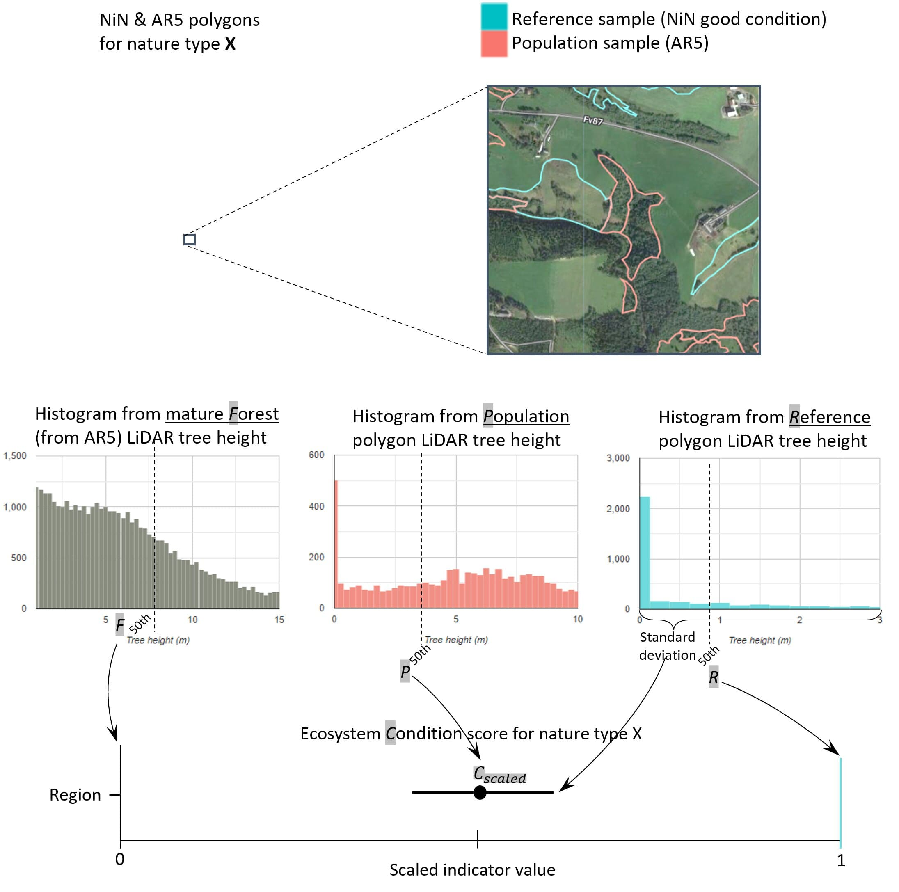
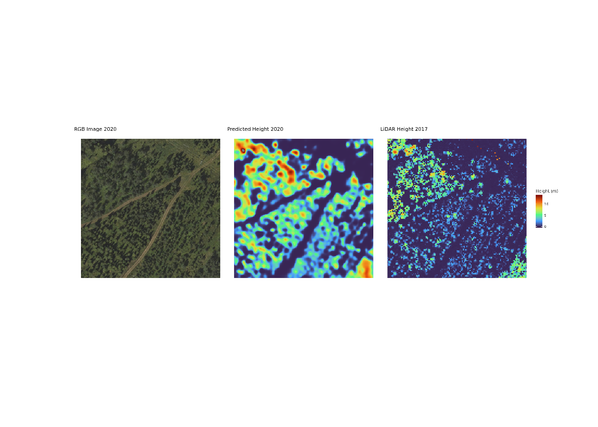
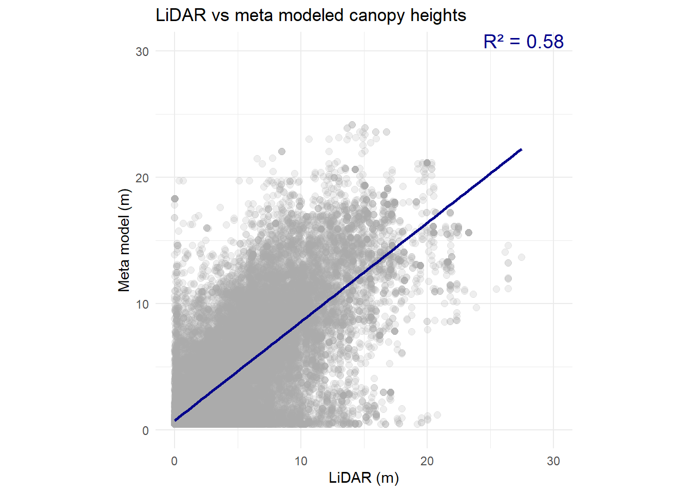
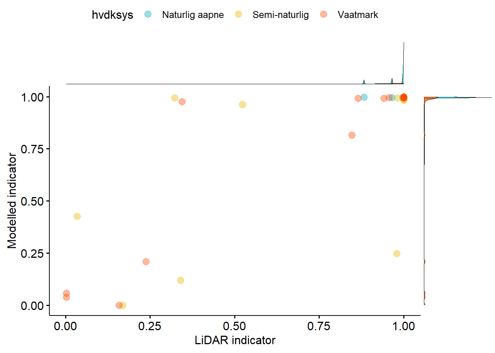
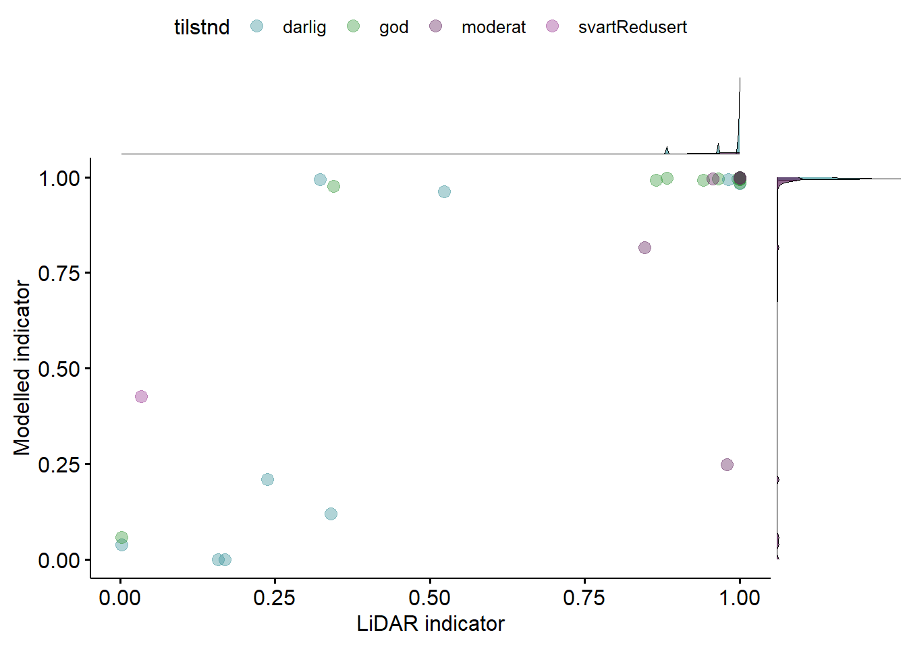
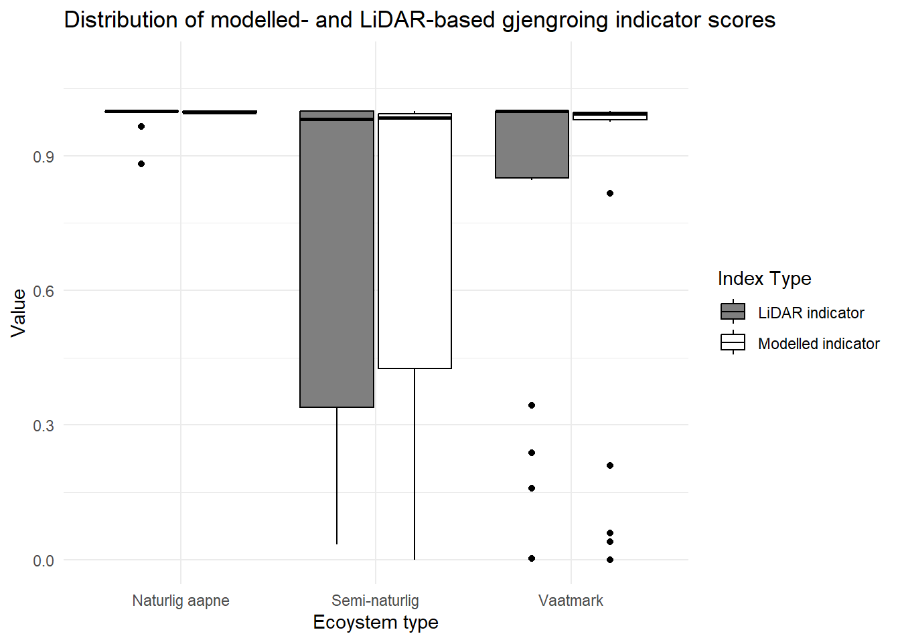
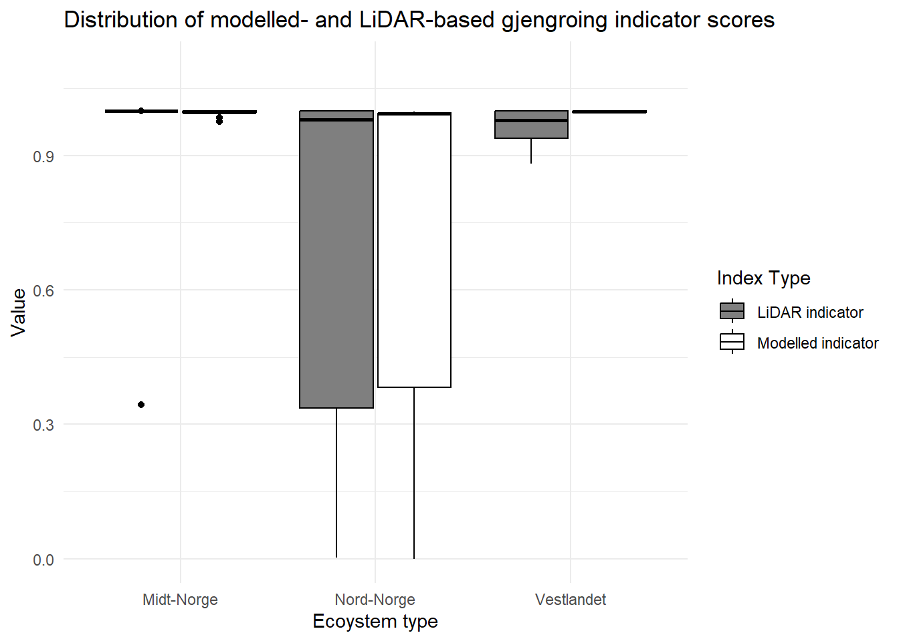

```{r setup}
#| include: false
library(knitr)
library(kableExtra)
library(here)
library(sf)
library(tidyverse)
library(gridExtra)
library(RColorBrewer)
library(dplyr)
library(ggpubr)
library(flextable)
library(parallel)
library(httr)
library(jsonlite)
library(viridisLite)
library(patchwork)
library(magick)
knitr::opts_chunk$set(echo = TRUE, message = FALSE, warning = FALSE)

# Repository-local paths. External NINA roots can be overridden with
# NINA_P_PROJECTS_ROOT and NINA_R_DATA_ROOT.
indicator_dir <- here::here("indicators", "NO_GJEN_002")
data_dir <- file.path(indicator_dir, "data")
image_dir <- file.path(indicator_dir, "img")
output_dir <- file.path(data_dir, "tiles")

p_root <- Sys.getenv(
  "NINA_P_PROJECTS_ROOT",
  unset = if (dir.exists("/data/P-Prosjekter2")) "/data/P-Prosjekter2" else "P:/"
)
r_root <- Sys.getenv(
  "NINA_R_DATA_ROOT",
  unset = if (dir.exists("/data/R")) "/data/R" else "R:/"
)

```

```{r source}
#| echo: false
# Legacy status callout helper kept locally so this document does not depend on
# a missing repository-root `_common.R` file.
status <- function(type) {
  descriptions <- c(
    complete = "complete, and indicator values can be calculated as described below.",
    incomplete = "incomplete and needs further development before indicator values can be calculated.",
    deprecated = "describing an indicator that is deprecated."
  )
  classes <- c(complete = "note", incomplete = "warning", deprecated = "important")
  colors <- c(complete = "lightgreen", incomplete = "orange", deprecated = "salmon")

  if (!type %in% names(descriptions)) {
    stop("Invalid indicator status: ", type, call. = FALSE)
  }

  cat(sprintf(
    "\n::: {.callout-%s style=\"background: %s;\"}\nThis indicator is %s\n:::\n",
    classes[[type]], colors[[type]], descriptions[[type]]
  ))
}
```

```{r}
#| echo: false
meta <- readxl::read_xlsx("../metadata.xlsx")
st <- meta |>
  filter(Variable == "status") |>
  pull(Value)
version <- meta |>
  filter(Variable == "Version") |>
  pull(Value)
auth <- meta |>
  filter(Variable == "authors") |>
  pull(Value)
year <- meta |>
  filter(Variable == "yearAdded") |>
  pull(Value)
id <- meta |>
  filter(Variable == "indicatorID") |>
  pull(Value)
name <- meta |>
  filter(Variable == "indicatorName") |>
  pull(Value)
url <- meta |>
  filter(Variable == "url") |>
  pull(Value)

meta <- meta |>
  mutate(Variable = case_match(Variable,
    "indicatorID" ~ "Indicator ID" ,
    "indicatorName" ~ "Indicator Name",
    "country" ~ "Country",
    "continent" ~ "Continent",
    "ECT" ~ "Ecosystem Condition Typology Class",
    "yearAdded" ~ "Year added",
    "yearLastUpdate" ~ "Last update",
    .default = Variable
   )
  ) |>
  filter(Variable != "authors")

```


<!--# The following parts are autogenertaed. Do not edit. -->

```{r}
#| echo: false
#| results: asis
status(st)
```

::::: {layout-ncol="2"}

::: {.callout-note style="background: cornsilk;"}
## Recomended citation

`r paste(auth, " ", year, ". ", name, " (ID: ", id, ") ", "v. ", version, ". ecRxiv: ", url, sep="")`
:::

::: {.callout-note style="background: khaki;"}
## Version

`r version`
:::
:::::

::: callout-note
## Logg
- 15 Sep. 2026 - Prepared v0.3.0-rc1 for internal NINA code review. Added
  the reproducible national production workflow and results from 58,871
  polygons, corrected regional aggregation and eligibility accounting, and
  documented the experimental nationwide 2 m orthophoto result. The 2 m
  result is not independently calibrated; validation with 1 m orthophotos
  is pending.
- 10 Sep. 2026 - Prepared v0.2.2 after auditing inference against Meta's
  published implementation; restored p5/p95 normalization and 10x output scale,
  and added checkpoint/run provenance.
- 10 Sep. 2026 - Prepared v0.2.1 with an isolated synthetic end-to-end test
  and bounded discovery/schema inspection for NINA input candidates.
- 10 Sep. 2026 - Prepared v0.2.0 for the nationwide 2 m NIB archive; added
  recursive JPEG indexing, AOI filtering and overlap-blended 256 px inference.
  The 2 m result remains experimental pending validation.
- 08 Sep. 2026 - Prepared v0.1.0 for internal NINA code review; fixed paths,
  spatial joins, inference tensor handling and scaling safeguards; added
  Vegar Bakkestuen as author
- 11 Oct. 2024 - Original PR
- 21 Oct. 2024 - Reviewed by Anders Kolstad
- 22 Oct. 2024 - Slightly revised version
:::


<details>
<summary>Show metadata</summary>

```{r tbl-meta}
#| tbl-cap: 'Indicator metadata'
#| echo: false
#| warning: false

meta |>
  select(Variable, Value) |>
  kbl(col.names = NULL)

```

</details>


# Gjengroing / Woody encroachment

::: callout-warning
## In review

This indicator is in review and is subject to change
:::

::: callout-note
This indicator (NO_GJEN_002) is very similar to NO_GJEN_001 in what it is trying to do. The difference is that NO_GJEN_001 is based on LiDAR and NO_GJEN_002 uses aerial images. The developers of NO_GJEN_001 are also involved in NO_GJEN_002, and hence we decided to reuse some of the text directly, without quotations.
:::

<hr />

## 1. Introduction

The Norwegian word "gjengroing" is directly translated to "regrowing" in English. The two gjengroing indicators (NO_GJEN_001 and \*\_002) describes the regrowth of woody vegetation (trees and bushes) in open ecosystems (wetland, semi- and naturally open areas) across Norway. We will use a spatial reference approach where reference areas define good or optimal vegetation their vegetation heights. We have previously produced an indicator to assess regrowth using LiDAR-based canopy height data (indicator ID: NO_GJEN_001). A primary limitation of that indicator, however, is its reliance on Norway's national LiDAR survey, which is a static dataset with no planned resurvey (as of 2024). Here, we present a workflow to utilise airborne images to derive canopy height metrics using Meta's [High Resolution Canopy Height](https://github.com/facebookresearch/HighResCanopyHeight/tree/main) backbone model [@tolan2024very]. Airborne imagery is scheduled for national resurvey every 5 to 10 years and so this implementation of the gjengroing indicator may be used to monitor future changes in ecosystem condition. It is worth noting that the yet-to-be-launched P-Band radar satellite, Biomass, may provide an more precise method for future monitoring once data is available.

This workbook presents the necessary steps to download image tiles, run the model, validate the data against LiDAR canopy heights, compare LiDAR and modeled index scores and discusses the limitations of this approach.

**Summary and conclusion**

Version 0.3.0-rc1 includes a reproducible national production workflow and an
experimental calculation for 58,871 mapped ecosystem polygons. Of these,
58,382 polygons met the coverage and reference-data requirements. The
area-weighted national indicator value was 0.999339.

This result must not be interpreted as a final operational estimate. The
canopy-height model was evaluated for aerial imagery at 0.5 and 1 m resolution,
whereas the national calculation presented here used a 2 m orthophoto archive.
The resulting canopy-height distribution is strongly compressed towards zero:
the median modelled canopy height was 0.013 m, and 56,131 polygon indicator
values were exactly 1. This saturation shows that reference levels derived from
the LiDAR-based NO_GJEN_001 workflow cannot be transferred directly to the
current 2 m model output.

The 2 m calculation is therefore supplied for technical review of the
production pipeline, spatial aggregation, provenance and quality controls.
Reference levels must be recalibrated using aerial-image model output, and the
workflow will be tested with national 1 m orthophotos before an operational
indicator value is proposed.

::: callout-note
## Reporting year and image acquisition year

The production configuration uses 2024 as the indicator reporting label.
It does not impose 31 December 2024 as an imagery cut-off. The available
national archive contains a spatial mosaic of acquisition years, including
imagery from 1972 to 2025. Consequently, this experimental result does not
represent one simultaneous national survey or a temporally uniform 2024
observation. The tile manifest and coverage report retain the acquisition dates
so their distribution can be reviewed alongside the indicator values.
:::

Canopy heights estimated with the Meta model show reasonably good agreement with LiDAR canopy heights (R^2^ = 0.58), with a possible bias towards taller canopies.
Although indicator values may be imprecise for individual points and polygons,
the results suggest that the approach may be suitable for estimates at larger spatial scales, from municipalities to regions.
The reference levels must, however, be recalculated using the Meta model. The current version borrows reference levels from the LiDAR approach, which may be systematically lower.


## 2. About the underlying data

We rely on the following datasets:

-   [Nature type polygons](https://kartkatalog.miljodirektoratet.no/Dataset/Details/2031) are used to identify reference areas with good ecological condition.
-   Reference levels (X~0~ and X~100~) were taken from our LiDAR based index approach (NO_GJEN_001). Future implementations of this code will derive these values using Meta's model.
-   Moen's [bioclimatic zones](https://artsdatabanken.no/Pages/181901/Bioklimatiske_soner). We use this to stratify reference (good condition) and forest (poor condition) heights by bioclimatic (also referred to as vegetation/climatic) zones.
-   [FKB building footprints](https://kartkatalog.geonorge.no/metadata/fkb-bygning/8b4304ea-4fb0-479c-a24d-fa225e2c6e97) are used to isolate vegetation in the canopy height comparison.
-   The [SSB 10km grid](https://kartkatalog.geonorge.no/metadata/statistisk-rutenett-5000m/32ac0653-d95c-446c-8558-bf9b79f4934e) is used for visualization purposes.
-   The regional delineation for Norway (five regions) are used for aggregating and reporting indicator values.
-   Norwegian Public Roads Administration, the Norwegian Institute for Bioeconomics (NIBIO) and the National Mapping Authority's Norway in [Images aerial imagery](https://www.norgeibilder.no/).

### 2.1 Spatial and temporal resolution

The production workflow processes orthophoto tiles intersecting the mapped
ecosystem polygons and uses the latest available eligible image represented in
the indexed archive. The experimental national archive contains acquisition
years from 1972 to 2025, although most observations are substantially more
recent. A future operational run should define and enforce an explicit imagery
date interval.

### 2.2 Original units

The original units for are meters, i.e. the height of the vegetation within reference areas, population samples (polygons) and forest areas is measured in meters.

### 2.3 Additional comments about the dataset

We also tested a model based on Sentinel 1 and 2 data, trained using the national LiDAR dataset, for deriving canopy height information. However, we found the performance of the Meta-based model to outperform these efforts.

## 3. Indicator properties

### 3.1. ECT

Functional state characteristic (B3)

### 3.2. Ecosystem condition characteristic

In good condition, the three target ecosystems are characterised as being open, with little trees.

### 3.3. Other standards

The indicator is related to the *Funksjonell sammensetning innen trofiske nivåer* in the Norwegian standard for ecosystem condition assessments.

### 3.4. Collinearities with other indicators

There is possibly a collinearity with a [preliminary indicator](https://ninanor.github.io/ecosystemCondition/NDVI-indicator-natopen.html) called based on the normalized difference vegetation index (NDVI) as a proxy for vegetation production. NDVI can be correlated with vegetation height and consequently yield similar results to the gjengroing indicator.

For wetlands especially, woody encroachment is associated with trenching, which is the topic of an indicator based on [field-recorded mire trenching](https://ecoevorxiv.org/repository/view/7221/), and another indicator based on the [amount of trenching](https://ninanor.github.io/mire-trenching/) as inferred from LiDAR.

## 4. Reference condition and values

::: callout-note
Chapter 4 is a direct quote from the documentation of NO_GJEN_001. In the future it is possible to calculate reference levels also with the meta model.
:::

::: callout-warning
The current beta version uses LiDAR-derived reference levels from NO_GJEN_001.
These must be recalibrated with aerial-image model output before NO_GJEN_002 can
be considered an operational, independently calibrated indicator.
:::

### 4. 1. Reference condition

The reference condition is defined as a minimally disturbed state, with a climate similar to the 1961-1990 period, and with a native species assemblage similar as today. See @nybo_fagsystem_2017. This reference condition translates to one where open ecosystems are indeed open, with little to no woody encroachment. For natural ecosystems this reflects a state where climate warming, wetland drainage, and alien species etc have not led to any net loss of these nature types and their internal functioning. For semi natural ecosystems it reflects a state where traditional husbandry is keeping the ecosystems open due to grazing and hay making.

### 4. 2. Reference values

#### 4.2.1 Minimum and maximum values

The methodology used to calculate the *gjengroing* indicator is outlined in @fig-enc-workflow. The workflow in the schematic is conducted for all reference and population polygons in Norway and repeated for each ecosystem type (våtmark, naturlig åpne og semi-naturlig), respectively. The indicator values are aggregated to a 50km grid (for visualisation purposes) and regional level (the ecosystem assests) at the end. The individual steps are discussed in turn in the following subsections.

```{r fig-enc-workflow}
#| fig.cap: |
#|   "Schematic illustration of how the encroachment indicator is calculated.
#|   The lower bound for poor condition is set by LiDAR heights from mature forest
#|   surrounding the population polygon. The upper bound for good condition is set
#|   by regional median LiDAR heights within NiN polygons in the same
#|   bioclimatic-elevation zone as the population polygon."
#| echo: false
#| out-width: '70%'

```

::: callout-note
Obs, there is an error in the figure. X~0~ is defined as the 90th percentile of mature forest height, not the 50th.
:::

[NiN polygons](https://kartkatalog.miljodirektoratet.no/Dataset/Details/2031) of "Våtmark", "Naturlig åpne områder under skoggrensa" and "Semi-naturlig mark" with good ecological condition (we use the aggregated "Tilstand" variable assigned to each NiN polygon) are used as spatial references to define the optimal reference level (X~100~).

::: callout-warning
This part is subject to change. One reviewer suggested using the field-recorded variable *rask suksesjon* instead. This variable is essentially the same as woody encroachment.
:::

The 50th percentile of LiDAR-derived vegetation heights within these polygons is used as X~100~. We cannot define local reference values based on proximity, because the NiN polygons are spatially biased and not close to all population polygons. Therefore we calculate regional reference values using regions and bioclimatic zones as stratification layers. These strata exuates to homogeneous ecosystem areas sensu @vallecillo_eu-wide_2022. We calculate the mean reference value for each unique combination of region-bioclimatic zone. When calculating the indicator for each population polygon, the X~100~ reference level is inherited from the region-bioclimatic zone it falls within.

Once we have the reference vegetation height for a given ecosystem type and region-bioclimatic zone, we need to define the minimum (or worst/bad) condition (X~0~). We use the 90th percentile of LiDAR-derived vegetation heights within "nasjonalt grunnkart skog" polygons to define a climax vegetation successional stage where gjengroing is at its most extreme, representing a completely deteriorated state for naturally open areas. In order not to include forest patches that have recently been harvested, we mask out any forest which has been clear-cut since 1986 [@senf2021mapping]. Here, 1986 is a hard limit defined by the clear-cut dataset which was based on Landsat imagery. Therefore we can be assured that we are measuring forest that is at least 35 years old. For the naturally open areas, however, we set a manual, expert derived threshold (0.8 m) for the X~0~ value (explained below).

The vegetation height percentiles are then scaled to between 0 and 1 using a sigmoid transformation @oliver2021new.

#### 4.2.2. Threshold value for defining *good ecological condition (if relevant)*

There are currently no other reference levels than X~0~ and X~100~ defined.

#### 4.2.3. Spatial resolution and validity

The reference levels are unique to homogeneous ecosystem areas defined as cross sections of region (five regions in Norway) and biomclimatic zone. Note that som biomclimatic zones may have been merged.

Indicators are normalised at the polygon level with reference levels that are defined for much bigger regions. This means that indicator values are not precise at the polygon level, and probably should not be presented at that scale.

## 5. Uncertainties

-   The Meta model performs generally worse than LiDAR on very low lying vegetation (grasses ect) and tends to overestimate their height.
-   In some instances, mismatch was due to temporal differences between LiDAR data and image capture, where trees had been removed or planted, natural growth had occurred or datasets were from different periods within the phenological cycle.
-   The models poor performance over shaded areas has the potential to create large uncertainty when calculating median vegetation height over an area of interest. Shade would introduce significant error when comparing images from different years based on the time of year and time of day.
-   The LiDAR based canopy height model was better able to resolve canopy structure and small gaps within vegetation canopy. This explains the majority of points where LiDAR canopy heights were very low but modeled canopy height was high.
-   Georectification errors in the two datasets was sometimes resulting in mismatch at forest/vegetation edges
-   The Meta model has visible edge effects on the output tiles. We have tried to minimise the influence of these by downloading tiles with overlapping regions, but these were also responsible for some mismatches.
-   There may be different camera specifications for different airborne surveys which could affect inference. The normalisation steps within the model should mitigate these effects but we have not tested the impact of different sensor/lens combinations.

## 6. References

::: {#refs}
:::

## 7. Datasets

There are several datasets which are used in GEE which will not be imported into the R session here. These datasets have been obtained from the source and ingested into GEE by Zander Venter or Vegar Bakkestuen with the help of Miljødata section at NINA. They include

-   [Nasjonalt grunnkart](https://nibio.brage.unit.no/nibio-xmlui/handle/11250/3120510)
-   [LiDAR-derived digital elevation model from høydedata](https://hoydedata.no/LaserInnsyn/).
-   [FKB building footprints](https://kartkatalog.geonorge.no/metadata/fkb-bygning/8b4304ea-4fb0-479c-a24d-fa225e2c6e97)
-   [European forest clear-cut map](https://www.nature.com/articles/s41893-020-00609-y)
-   Population polygons for naturlig åpen areas (GRUK).

The remaining datasets will be imported into the R session.

### 7.1 Orthophoto source

::: callout-warning
The code blocks in this section document the original proof-of-concept and are
not the production downloader. Version 0.2.2 reads the separate nationwide NIB
archive made by `host_norge_master.ps1`. `R/index_ortho_archive.R` recursively
indexes the 2 m, 1000 × 1000 JPEG/JGW tiles, imports block metadata and selects
only tiles intersecting the AOIs. The inference script uses overlapping 256 ×
256 windows and blends their predictions. The Meta workflow has been evaluated
at 0.5 and 1 m, so the 2 m result is experimental pending validation.
:::

#### 7.1.1 Setting directories

Here we define the directories to download images and image metadata (date) from and set the output folder for downloading tiles into.

```{r}
#| eval: false
wms_base_url <- 'https://wms.geonorge.no/skwms1/wms.nib?SERVICE=WMS&VERSION=1.1.1&REQUEST=GetMap&SRS=EPSG:25833'
metadata_url <- 'https://tjenester.norgeibilder.no/rest/projectMetadata.ashx'
if (!dir.exists(output_dir)) {
  dir.create(output_dir, recursive = TRUE)
}
```

#### 7.1.2 Querying the airborne imagery metadata

This code enables us to determine the date of the orthophoto tiles we will later download from the geonorge webserver.

```{r}
#| eval: false
 query_metadata <- function(xmin, ymin, xmax, ymax, crs_code) {
  bbox_coords <- sprintf("%f,%f;%f,%f;%f,%f;%f,%f", xmin, ymin, xmin, ymax, xmax, ymax, xmax, ymin)

  param <- list(
    Filter = "ortofototype in (1,2,3,4,5,7,8,9,10,11,12)",
    Coordinates = bbox_coords,
    InputWKID = as.character(crs_code),
    ReturnMetadata = TRUE,
    StopOnCover = FALSE
  )

  response <- httr::GET(
    url = metadata_url,
    query = list(request = jsonlite::toJSON(param, auto_unbox = TRUE))
  )

  response_content <- httr::content(response, "text", encoding = "UTF-8")

  if (httr::http_status(response)$category != "Success") {
    return(NULL)
  }

  if (response_content == "" || is.null(response_content)) {
    return(NULL)
  }

  parsed_metadata <- tryCatch({
    fromJSON(response_content, flatten = TRUE)
  }, error = function(e) {
    return(NULL)
  })

  return(parsed_metadata)
}
```

The WMS provides the most recent image over each search area so we can pull the date from the metadata service to add to the tile filename.

```{r}
#| eval: false
get_most_recent_metadata <- function(metadata) {
  filtered_metadata <- metadata$ProjectMetadata %>%
    filter(!is.na(properties.fotodato_date)) %>%
    mutate(fotodato_date = as.Date(properties.fotodato_date)) %>%
    arrange(desc(fotodato_date)) %>%
    slice(1)  # Get the most recent one

  if (nrow(filtered_metadata) == 0) {
    return(NULL)
  }

  return(filtered_metadata)
}
```

#### 7.1.3 Defining the area of interest

Here we include a shapefile of our areas of interest (AOIs), a random selection of 300 wetland, 300 semi-natural and 300 naturally open NiN polygons that includes all ecosystem condition classes. The script loops through all features, calculates their extents and queries the WMS to download orthophotos in 256 × 256 pixel tiles. The AOI shapefile must use EPSG:25833. Tile size is kept at 256 × 256 pixels to support the model's image-normalisation step. Model performance has been tested at 1 m and 0.5 m resolution, with significantly better results at 0.5 m resolution. Imagery is available at finer resolutions, which may improve performance but may also require further tuning of the model hyperparameters.

```{r}
#| eval: false

AOIs <- sf::st_read(file.path(data_dir, "AOIs.shp"),
  quiet = T
)

tile_size <- 256
resolution <- 0.5 # 0.5 meter resolution
```

#### 7.1.4 Downloading image tiles

This function downloads the orthophoto image tiles over our areas of interest.

```{r}
#| eval: false
fn.getOrtoImages <- function(geometry, id_field, output_dir) {
  tryCatch({
    if (!st_is_valid(geometry)) {
      geometry <- st_make_valid(geometry)
    }

    geom_extent <- st_bbox(geometry)

    # Query metadata to get the most recent layer and date
    metadata <- query_metadata(geom_extent$xmin, geom_extent$ymin, geom_extent$xmax, geom_extent$ymax, 25833)

    if (is.null(metadata) || is.null(metadata$ProjectMetadata)) {
      return(NULL)
    }

    recent_project <- get_most_recent_metadata(metadata)

    if (is.null(recent_project)) {
      return(NULL)
    }

    recent_layer <- recent_project$properties.prosjektnavn
    image_date <- recent_project$properties.fotodato_date

    tile_width_meters <- tile_size * resolution
    tile_height_meters <- tile_size * resolution

    # Ensure tile size remains 256x256
    x_min <- floor(geom_extent$xmin / tile_width_meters) * tile_width_meters
    y_min <- floor(geom_extent$ymin / tile_height_meters) * tile_height_meters
    x_max <- ceiling(geom_extent$xmax / tile_width_meters) * tile_width_meters
    y_max <- ceiling(geom_extent$ymax / tile_height_meters) * tile_height_meters

    # Calculate number of tiles in x and y directions
    x_tiles <- ceiling((x_max - x_min) / tile_width_meters)
    y_tiles <- ceiling((y_max - y_min) / tile_height_meters)

    tile_index <- 1

    for (i in 0:(x_tiles - 1)) {
      for (j in 0:(y_tiles - 1)) {
        xmin <- x_min + i * tile_width_meters
        xmax <- xmin + tile_width_meters
        ymin <- y_min + j * tile_height_meters
        ymax <- ymin + tile_height_meters

        # Ensure the tiles have consistent size
        bbox_polygon <- st_polygon(list(matrix(c(
          xmin, ymin,
          xmin, ymax,
          xmax, ymax,
          xmax, ymin,
          xmin, ymin
        ), ncol = 2, byrow = TRUE)))
        bbox_polygon <- st_sfc(bbox_polygon, crs = st_crs(geometry))

        bbx <- st_bbox(bbox_polygon)

        # Construct WMS URL
        wms_url <- paste0(
          'https://wms.geonorge.no/skwms1/wms.nib?',
          'SERVICE=WMS&VERSION=1.1.1&REQUEST=GetMap',
          '&LAYERS=', URLencode(recent_layer),
          '&SRS=EPSG:25833',
          '&BBOX=', paste(bbx[c("xmin", "ymin", "xmax", "ymax")], collapse = ","),
          '&WIDTH=', tile_size,
          '&HEIGHT=', tile_size,
          '&FORMAT=image/tiff',
          '&TRANSPARENT=TRUE'
        )

        # Output file path using the "id" field, tile index, and image date in the file name
        t <- file.path(output_dir, paste0(image_date,"_", id_field, "_", tile_index, ".tif"))

        # GDAL translate options
        reso <- c('-tr', as.character(resolution), as.character(resolution), '-co', 'COMPRESS=NONE')

        # Try downloading the tile
        result <- try({
          sf::gdal_utils('translate', source = wms_url, destination = t, options = reso)
        }, silent = TRUE)

        # Retry mechanism
        for (k in 1:5) {
          if (!file.exists(t)) {
            Sys.sleep(1)
            result <- try({
              sf::gdal_utils('translate', source = wms_url, destination = t, options = reso)
            }, silent = TRUE)
          }
        }

        tile_index <- tile_index + 1
      }
    }

  }, error = function(e) {
    return(NULL)
  })
}
```

We can run the functions in parallel to speed up processing time adjust the number of cores to suit your setup.

```{r}
#| eval: false
numCores <- 30

# Use mclapply for parallel processing
mclapply(1:nrow(AOIs), function(i) {
  geometry <- AOIs[i, ]
  id_field <- AOIs$id[i]  # Adjust field name if necessary
  fn.getOrtoImages(geometry, id_field, output_dir)
}, mc.cores = numCores)
```

### 7.3 Regions {#reg-enc}

To use our model output as an indicator, we need to bring in some datasets to stratify our inferred canopy height statistics. The regional delineation for Norway (five regions) are used for aggregating and reporting gjengroing condition values.

```{r}
#| eval: false
regions <- sf::st_read(file.path(data_dir, "regions.shp"),
  options = "ENCODING=UTF8",
  quiet = T
) %>%
  mutate(region = factor(region))
```

### 7.4 Bioclimatic regions

The [Moen's bioclimatic regions](https://data.artsdatabanken.no//Natur_i_Norge/Natursystem/Beskrivelsessystem/Regional_naturvariasjon/Bioklimatisk_sone) are imported from NINA R/GeoSpatialData/ server.

```{r}
#| eval: false
bioclim <- st_read(file.path(r_root, "GeoSpatialData", "BiogeographicalRegions",
                            "Norway_VegetationZones_Moen", "Original", "Vector", "soner.shp"),
  quiet = T
) %>%
  mutate(NAVN = ifelse(NAVN == "S°rboreal", "Sørboreal", NAVN))
bioclim <- st_transform(bioclim, st_crs(regions))
```

## 8. Spatial units

Image tiles must be 256 x 256 pixels to pass into the model for inference. We have tested the model using the compressed_SSLhuge_aerial.pth checkpoint on 1 m and 0.5 m pixel resolution and found 0.5 m to perform better.

## 9. Analyses

The methodology used to calculate the *gjengroing* indicator is outlined in the NO_GJEN_001 indicator, which is based on LiDAR data. NO_GJEN_002 is a proof of concept for using airborne imagery as an alternative to LiDAR data for producing canopy height maps and producing an ecosystem condition index. A full spatial analysis of the gjengroing condition is available in our original script.

### 9.0 Production workflow

The production implementation is separated from this narrative document so the
same code can be tested, resumed and run without rendering Quarto. Input paths,
field mappings, reporting year and model settings are declared in `config.yml`.
The required schemas are documented in `data/INPUTS.md`.

```{bash}
#| eval: false
Rscript R/run_pipeline.R --config config.yml --stage validate
Rscript R/run_pipeline.R --config config.yml --stage all
```

The stages `manifest`, `inference`, `zonal` and `indicator` may also
be run separately. The workflow produces polygon values, a six-row table for
Norway and the five reporting regions, a coverage table by actual acquisition
year, and a GeoPackage. National and regional means are area-weighted. If the
AOI layer is a probability sample rather than a census of the target
population, design weights must be implemented and documented before the
aggregated values are used.

### 9.1 Modeling canopy height

Now that we have our tiles, we can pass them to the canopy height model. Please see [Meta's High Resolution Canopy Height Model](https://github.com/facebookresearch/HighResCanopyHeight/tree/main) and Tolan et al. (2024) for more details on the model. Install the model according to the instructions on the facebookresearch github page.

The following is python code to run on the downloaded image tiles. After installing the model, save this code as a .py file within the main folder of the model and run.

```{python}
#| eval: false

#Import dependencies

import argparse
import os
import torch
import torchvision.transforms as T
import matplotlib.pyplot as plt
from pathlib import Path
import torch.nn as nn
from tqdm import tqdm
from PIL import Image
from torchvision.utils import save_image

from models.backbone import SSLVisionTransformer
from models.dpt_head import DPTHead
import pytorch_lightning as pl
import rasterio
from rasterio.transform import from_origin

import numpy as np
from models.regressor import RNet
import torch.nn.functional as F

# New function to blend overlapping regions between adjacent tiles
def blend_overlap(region1, region2, weight=0.5):
    return (weight * region1 + (1 - weight) * region2)

# Perform histogram normalization using the pretrained model with overlap adjustment
def normalize_image(image, model_norm, device, overlap=None, weight=0.5):
    print(f"Original image shape: {image.shape}")

    if image.shape[0] != 3:
        raise ValueError(f"Expected 3-channel image, but got {image.shape[0]} channels.")

    x = torch.unsqueeze(image, dim=0).to(device)

    # Use model to predict p5 and p95 values
    norm_img = model_norm(x).detach()

    p5I = [norm_img[0][0].item(), norm_img[0][1].item(), norm_img[0][2].item()]
    p95I = [norm_img[0][3].item(), norm_img[0][4].item(), norm_img[0][5].item()]

    # Match Meta's published aerial-image inference: input p5 and p95.
    input_low = [np.percentile(image[i, :, :].cpu().numpy(), 5) for i in range(3)]
    input_high = [np.percentile(image[i, :, :].cpu().numpy(), 95) for i in range(3)]

    normIn = image.clone()

    for i in range(3):
        input_range = max(input_high[i] - input_low[i], np.finfo(np.float32).eps)
        normIn[i, :, :] = (image[i, :, :] - input_low[i]) * ((p95I[i] - p5I[i]) / input_range) + p5I[i]

    # If overlap region is provided, blend the overlap
    if overlap is not None:
        for i in range(3):
            overlap_region = overlap[i, :, :]
            normIn[i, :, :] = blend_overlap(normIn[i, :, :], overlap_region, weight=weight)

    return normIn


# Apply final normalization using the general image normalization values
def final_normalize(image, norm_values):
    norm = T.Normalize(*norm_values)
    return norm(image)

# Model Definitions
class SSLAE(nn.Module):
    def __init__(self, pretrained=None, classify=True, n_bins=256, huge=False):
        super().__init__()
        if huge:
            self.backbone = SSLVisionTransformer(
                embed_dim=1280,
                num_heads=20,
                out_indices=(9, 16, 22, 29),
                depth=32,
                pretrained=pretrained
            )
            self.decode_head = DPTHead(
                classify=classify,
                in_channels=(1280, 1280, 1280, 1280),
                embed_dims=1280,
                post_process_channels=[160, 320, 640, 1280],
            )
        else:
            self.backbone = SSLVisionTransformer(pretrained=pretrained)
            self.decode_head = DPTHead(classify=classify, n_bins=256)

    def forward(self, x):
        x = self.backbone(x)
        x = self.decode_head(x)
        return x

class SSLModule(pl.LightningModule):
    def __init__(self, ssl_path="compressed_SSLbaseline.pth"):
        super().__init__()

        if 'huge' in ssl_path:
            self.chm_module_ = SSLAE(classify=True, huge=True).eval()
        else:
            self.chm_module_ = SSLAE(classify=True, huge=False).eval()

        if 'compressed' in ssl_path:
            ckpt = torch.load(ssl_path, map_location='cpu')
            self.chm_module_ = torch.quantization.quantize_dynamic(
                self.chm_module_,
                {torch.nn.Linear, torch.nn.Conv2d, torch.nn.ConvTranspose2d},
                dtype=torch.qint8)
            self.chm_module_.load_state_dict(ckpt, strict=False)
        else:
            ckpt = torch.load(ssl_path)
            state_dict = ckpt['state_dict']
            self.chm_module_.load_state_dict(state_dict)

        # Match Meta's published inference. Any later calibration must be
        # documented, validated and versioned separately.
        self.chm_module = lambda x: 10*self.chm_module_(x)

    def forward(self, x):
        x = self.chm_module(x)
        return x


def evaluate(model, model_norm, norm_values, name, bs=32, device='cuda:0', display=False):
    print("Starting evaluation...")

    ds = NorwayDataset(src_img_dir='data/tiles') # Set to the directory with the tiles in it


    print(f"Number of images found: {len(ds)}")

    dataloader = torch.utils.data.DataLoader(ds, batch_size=bs, shuffle=False, num_workers=8, collate_fn=lambda x: tuple(zip(*x)))

    for batch in tqdm(dataloader):
        images, img_paths = batch

        # Dataset returns channels-first tensors: batch, channel, height, width.
        images = torch.stack(images)

        # Step 1: Apply histogram normalization (matching satellite images)
        images = torch.stack([normalize_image(img, model_norm, device) for img in images])

        # Step 2: Apply final normalization (standard image normalization)
        images = torch.stack([final_normalize(img, norm_values) for img in images]).to(device)

        pred = model(images)
        pred = pred.cpu().detach().relu()

        for ind in range(pred.shape[0]):
            img_path = img_paths[ind]
            print(f"Processing {img_path}")

            with rasterio.open(img_path) as src:
                meta = src.meta.copy()
                transform = src.transform
                crs = src.crs

            meta.update(dtype=rasterio.float32, count=1)

            # Save the prediction as GeoTIFF
            output_path = Path(name) / f'{img_path.stem}_pred.tif'
            with rasterio.open(output_path, 'w', **meta) as dst:
                dst.write(pred[ind].numpy()[0], 1)  # Writing the single prediction band
                dst.transform = transform  # Ensure the correct geotransform is used
                dst.crs = crs  # Ensure the correct CRS is used

            if display:
                plt.imshow(pred[ind][0].numpy())
                plt.title(f'Prediction for {img_path.name}')
                plt.show()


# Dataset Definition
class NorwayDataset(torch.utils.data.Dataset):
    def __init__(self, src_img_dir='data/tiles'): #make sure the correct tile directory is used
        self.src_img_dir = Path(src_img_dir)
        self.img_files = list(self.src_img_dir.glob('*.tif'))

    def __len__(self):
        return len(self.img_files)

    def __getitem__(self, i):
        img_path = self.img_files[i]
        print(f"Loading image: {img_path}")

        # Use rasterio to read the GeoTIFF
        with rasterio.open(img_path) as src:
            img = torch.from_numpy(src.read([1, 2, 3]).astype(np.float32) / 255.0)

        # Check if the image is all zeros
        if torch.all(img == 0):
            print(f"Skipping all-zero tile: {img_path}")
            raise ValueError(f"All-zero image tile cannot be processed: {img_path}")

        return img, img_path

# Argument Parsing and Main
def parse_args():
    parser = argparse.ArgumentParser(description='test a model')
    parser.add_argument('--checkpoint', type=str, help='CHM pred checkpoint file', default='saved_checkpoints/compressed_SSLhuge_aerial.pth') # this should be set to the location where the model was installed
    parser.add_argument('--name', type=str, help='run name', default='data/output_inference')
    parser.add_argument('--display', action='store_true', help='display predictions')
    args = parser.parse_args()
    return args

def main():
    args = parse_args()
    # Dynamically quantized checkpoints run on CPU. Other checkpoints may use CUDA.
    device = 'cpu' if 'compressed' in args.checkpoint else (
        'cuda:0' if torch.cuda.is_available() else 'cpu'
    )

    os.makedirs(args.name, exist_ok=True)

    # Load SSL model
    model = SSLModule(ssl_path=args.checkpoint)
    model.to(device)
    model = model.eval()

    # Load normalization model (RNet for histogram matching)
    norm_path = 'saved_checkpoints/aerial_normalization_quantiles_predictor.ckpt'
    ckpt = torch.load(norm_path, map_location=device)
    model_norm = RNet(n_classes=6).to(device).eval()
    state_dict = ckpt['state_dict']
    for k in list(state_dict.keys()):
        if 'backbone.' in k:
            new_k = k.replace('backbone.', '')
            state_dict[new_k] = state_dict.pop(k)
    model_norm.load_state_dict(state_dict)

    # Image normalization values
    norm_values = ((0.420, 0.411, 0.296), (0.213, 0.156, 0.143))

    evaluate(model=model, model_norm=model_norm, norm_values=norm_values, name=args.name, bs=16, device=device, display=args.display)

if __name__ == '__main__':
    main()

```

### 9.2 Calculating the gjengroing index

#### 9.2.1 Importing the data

The following imports the proof-of-concept polygon statistics. In the production
pipeline, `R/calculate_zonal_stats.R` calculates median canopy height and valid
raster coverage directly from the prediction tiles; QGIS is not required.

```{r}
#| eval: false
metaChm <- st_read(file.path(data_dir, "NiN_metaTest.shp"),
                   quiet = T)
```

#### 9.2.1 Adding reference information

Here we add the region and bioclimate zone information to stratifiy the dataset

```{r}
#| eval: false
library(dplyr)

# Assign the zone and region with the largest overlapping area. Counting
# intersecting features can select the wrong class for polygons at boundaries.
metaChm <- st_join(
  metaChm,
  bioclim %>% dplyr::select(vegClimZone = KLASSE),
  left = TRUE,
  largest = TRUE
)

metaChm <- st_join(
  metaChm,
  regions %>% dplyr::select(regions = id),
  left = TRUE,
  largest = TRUE
)

# Add the region and vegClimZone labels
vegLookup <- tibble(
  vegClimZone = c(1, 2, 3, 4, 5),
  vegClimZoneLab = c('Boreonemoral sone (BN)', 'Lavalpin sone (LA)', 'Mellomboreal sone (MB)', 'Nordboreal sone (NB)', 'Sørboreal sone (SB)')
)

regionLookup <- tibble(
  regions = c(1, 2, 3, 4, 5),
  region_id = c('Nord-Norge', 'Midt-Norge', 'Østlandet', 'Vestlandet', 'Sørlandet')
)

# Ensure compatibility of column types for the join
metaChm <- metaChm %>%
  mutate(regions = as.numeric(regions),  # Convert 'regions' to numeric for the join
         vegClimZone = as.numeric(vegClimZone))  # Convert 'vegClimZone' to numeric for the join

# Add the region and vegClimZoneLab columns to metaChm
metaChm <- metaChm %>%
  left_join(regionLookup, by = 'regions') %>%
  left_join(vegLookup, by = 'vegClimZone')

# View the updated metaChm
#head(metaChm)


```

Import forest heights per region-bioclimatic zone strata.

```{r}
#| eval: false
#| message: false
cleanRegClim <- function(data){

  dataOut <- data %>%
    mutate(region=ifelse(region_id == 1, 'Nord-Norge',
                         ifelse(region_id == 2, 'Midt-Norge',
                                ifelse(region_id == 3, 'Østlandet',
                                       ifelse(region_id == 4, 'Vestlandet', 'Sørlandet'))))) %>%

    mutate(vegClimZone = round(vegClimZone)) %>%
    left_join(vegLookup, by = 'vegClimZone') %>%
    dplyr::select(-region_id, -vegClimZone) %>%
    drop_na(vegClimZoneLab, region)

  return (dataOut)

}


skog_region_bioclim <- read_csv(file.path(
  p_root, "412421_okologisk_tilstand_2024", "Ida", "From_GEE",
  "vegHeights_skog_climZoneRegion.csv"
))


names(skog_region_bioclim)[2:4] <- c("vegClimZone","skog","region_id")


```

Add the forest height metric to each NiN polygon based on bioclimatic and region zones.

```{r}
#| eval: false

skog_region_bioclim <- as_tibble(skog_region_bioclim)

# Select the necessary columns from skog_region_bioclim before the join
#skog_region_bioclim_selected <- skog_region_bioclim %>%
 # dplyr::select(climZone, region, p90_height)

# Add "skog" column to metaChm by joining with skog_region_bioclim
metaChm <- metaChm %>%
  left_join(
    skog_region_bioclim,
    by = c("vegClimZone", "regions" = "region_id")
  )

# View the updated metaChm
#head(metaChm)
```

Import the reference height data to be used as "good" condition reference values

```{r}
#| eval: false
refvaatmark <- read.csv(file.path(data_dir, "refvaatmark.csv"), sep = ",")
refaapne <- read.csv(file.path(data_dir, "refaapne.csv"), sep = ";")
refsemi <- read.csv(file.path(data_dir, "refsemi.csv"), sep = ",")

```

Split our canopy height dataframe into ecosystem types

```{r}
#| eval: false
metaAapne <- metaChm %>%
  filter(hvdksys == "Naturlig aapne")

# 2. Extract "Semi-naturlig"
metaNaturlig <- metaChm %>%
  filter(hvdksys == "Semi-naturlig")

# 3. Extract "Vaatmark"
metaVaatmark <- metaChm %>%
  filter(hvdksys == "Vaatmark")
```

Add the "good" reference values to the separate ecosystem types

```{r}
#| eval: false

metaAapne <- metaAapne %>%
  left_join(
    refaapne,
    by = c("vegClimZoneLab", "region_id" = "region")
  )

metaVaatmark <- metaVaatmark %>%
  left_join(
    refvaatmark,
    by = c("vegClimZoneLab", "region_id" = "region")
  )

metaNaturlig <- metaNaturlig %>%
  left_join(
    refsemi,
    by = c("vegClimZoneLab", "region_id" = "region")
  )
```

Filter out NA values and join back together in a dataframe

```{r}
#| eval: false
metaNaturlig <- metaNaturlig %>%
  filter(!is.na(ref) & !is.na(skog))
metaAapne <- metaAapne %>%
  filter(!is.na(ref) & !is.na(skog))
metaVaatmark <- metaVaatmark %>%
  filter(!is.na(ref) & !is.na(skog))

metaCHM <- bind_rows(metaAapne, metaNaturlig, metaVaatmark)
```

#### 9.2.2 Calculating the indicator

We will calculate the gjengroing indicator for each population polygon using a Sigmoid scaling function.

```{r}
#| eval: false
# Define Sigmoid scaling function
scaleSigmoid <- function(pop, ref, skog) {
  if (length(pop) != length(ref) || length(pop) != length(skog)) {
    stop("pop, ref and skog must have equal lengths")
  }

  # Scale the population height between the reference (good condition) and forest height (poor condition)
  denominator <- skog - ref
  invalid <- !is.finite(pop) | !is.finite(ref) | !is.finite(skog) |
    denominator <= 0
  indicator_LowHigh <- (pop - ref) / denominator
  indicator_LowHigh <- pmin(pmax(indicator_LowHigh, 0), 1)
  indicator_sigmoid <- 100.68 * (1 - exp(-5 * (indicator_LowHigh)^2.5)) / 100
  indicator_sigmoid[invalid] <- NA_real_
  return(round(indicator_sigmoid, 4))
}
```

Now calculate the indicator using the median canopy height value from the meta model output

```{r}
#| eval: false
metaCHM <- metaCHM %>%
  # Apply the scaling function to calculate the index for each polygon
  mutate(
    indexMeta = scaleSigmoid(meta_media, ref, skog),
    # Invert the index because shorter vegetation is considered better condition
    indexMeta = 1 - indexMeta
  )

# View the updated metaChm
#head(metaCHM)
```

And now calculate it from the LiDAR based canopy height model

```{r}
#| eval: false
metaCHM <- metaCHM %>%
  # Apply the scaling function to calculate the index for each polygon
  mutate(
    indexLiD = scaleSigmoid(DSM_median, ref, skog),
    # Invert the index because shorter vegetation is considered better condition
    indexLiD = 1 - indexLiD
  )

# View the updated metaChm
#head(metaCHM)
```

## 10. Results

### 10.1 Validation of canopy height inference

After running inference on the meta model, we have raster tiles of canopy height estimate corresponding to our downloaded image tiles. These were mosaiced into a virtual raster for validation.
@fig-threeImages shows an example of the output from the meta model compared to LiDAR canopy height and the image tile used to model the canopy height. Interestingly this shows encroachment in action as the vegetation heights are visibly higher in the 2020 image tile than in the 2017 LiDAR data. This is an area where new trees were planted in c. 2015.


```{r}
#| eval: false

rgb_img <- raster::stack(file.path(image_dir, "TileID_4.tif"))
pred_img <- raster::raster(file.path(image_dir, "TileID_4_pred.tif"))
lidar_img <- raster::raster(file.path(image_dir, "TileID_4_LiDAR_2017.tif"))

rgb_df <- as.data.frame(rgb_img, xy = TRUE)
pred_df <- as.data.frame(pred_img, xy = TRUE)
lidar_df <- as.data.frame(lidar_img, xy = TRUE)

names(rgb_df) <- c("x", "y", "red", "green", "blue")
names(pred_df) <- c("x", "y", "pred_height")
names(lidar_df) <- c("x", "y", "lidar_height")

p1 <- ggplot() +
  geom_raster(data = rgb_df, aes(x = x, y = y, fill = rgb(red, green, blue, maxColorValue = 255))) +
  scale_fill_identity() +
  coord_fixed() +
  theme_void() +
  ggtitle("RGB Image 2020")

p2 <- ggplot() +
  geom_raster(data = pred_df, aes(x = x, y = y, fill = pred_height)) +
  scale_fill_viridis_c(option = "turbo", limits = c(0, 14), name = "Height (m)") +
  coord_fixed() +
  theme_void() +theme(legend.position = "none")+
  ggtitle("Predicted Height 2020")


p3 <- ggplot() +
  geom_raster(data = lidar_df, aes(x = x, y = y, fill = lidar_height)) +
  scale_fill_viridis_c(option = "turbo", limits = c(-0.5, 14), name = "Height (m)") +
  coord_fixed() +
  theme_void() +
  ggtitle("LiDAR Height 2017")

combined_plot <- (p1 + p2 + p3) + plot_layout(ncol = 3)

print(combined_plot)

```

{#fig-threeImages}

```{r fig-threeImages}
#| eval: false
#| fig-cap: "Three images of the same area showing the aerial (RGB) image (left), the canopy height model based on the meta model (centre) and the LiDAR approach (right). Click to enlarge."
#| lightbox: true
img <- image_read(file.path(image_dir, "tileComparison.png"))

plot(img)
```

We sampled 1000 random points within each NiN polygon (those used as AOI's for the tile download).
This was done in QGIS.
These points were used to sample the modeled canopy height as well as the canopy height based on LiDAR data.
Initial validation attempts showed poor performance relating to airborne images taken outside of the months of June, July and August.
This was expected, since the model was trained on vegetation at peak foliation. For this reason, imagery collected outside of this month range was excluded from validation. We also filtered out points that intersected with the FKB building footprints layer, points that were in shadow (calculated by sampling the blue channel of the input RGB images and filtering out based on a threshold value). The resulting csv file after filtering contains c. 40000 points with LiDAR and Meta model based canopy heights. Future iterations of this script will automate these validation steps.
The validation based on these values gave a reasonable agreement between canopy height estimated using LiDAR and the meta model (@fig-scatter). The Meta model tends to overestimate the height of low-lying vegetation, struggles with shaded areas, and shows edge effects on image tiles, resulting in more errors compared to LiDAR. Temporal differences, georectification errors, and potential variations in camera specifications also contribute to inconsistencies between datasets. Ultimately, field validation concurrent with airborne image data collection would be necessary to establish a true error estimate for the dataset. The mean absolute error reported by Meta (also based on airborne LiDAR data) was 2.8m (Tolan et al., 2024).

{#fig-scatter}

```{r fig-scatter}
#| eval: false
#| message: false
#| fig-cap: "Comparison of canopy height estimated by either LiDAR or the meta model. n = 39877. "
val <- read.csv(file.path(data_dir, "NiNpointSamples.csv"))
ggplot(val, aes(x = lidmax, y = metamax)) +
  geom_point(size=2.5, alpha=0.2, stroke=0, color = 'darkgray') +  # Scatter plot
  geom_smooth(method = "lm", se = FALSE, color = "darkblue") +  # Line of best fit
  theme_minimal() +  # Clean theme
  coord_fixed(ratio = 1) +  # Square aspect ratio
  labs(title = "LiDAR vs meta modeled canopy heights", x = "LiDAR (m)", y = "Meta model (m)") +  # Labels
  # Add R-squared value to the plot
  annotate("text", x = Inf, y = Inf, label = paste("R² =", round(summary(lm(metamax ~ lidmax, data = val))$r.squared, 2)),
           hjust = 1.1, vjust = 1.1, size = 5, color = "darkblue")+ xlim(0,30) + ylim(0,30)
```

### 10.2 Comparison of modelled vs LiDAR gjengroing indicator

@fig-scatterEco and @fig-scatterReg compare indicator values between the LiDAR and the meta model approach where one point equals a polygon (and not a point as in @fig-scatter)
Note that in the subsample of NiN areas used here, most of them have good indicator values.
Future work to scale this over a greater number of sites should give a better spread of data for a more robust comparison.

{#fig-scatterEco}

```{r fig-scatterEco}
#| eval: false
#| fig-cap: "Comparing indicator values between the LiDAR and the meta model based approach at the polygon level. Note thet the sample of polygons used here are biased towards high indicator values and may not give a very good spread of data for comparison."

ggscatterhist(
  metaCHM, x = "indexLiD", y = "indexMeta",
  color = "hvdksys", size = 3, alpha = 0.4,
  palette = c("#00AFBB", "#E7B800", "#FC4E07"),
  margin.params = list(fill = "hvdksys", color = "black", size = 0.2),
  xlab = "LiDAR indicator",
  ylab = "Modelled indicator")


```

{#fig-scatterReg}

```{r fig-scatterReg}
#| eval: false
#| fig-cap: "Comparing indicator values between the LiDAR and the meta model based approach at the polygon level. Note that the sample of polygons used here are biased towards high indicator values and may not give a very good spread of data for comparison."
ggscatterhist(
  metaCHM, x = "indexLiD", y = "indexMeta",
  color = "tilstnd", size = 3, alpha = 0.4,
  palette = c("#3b949a", "#3b9a41", "#63265f", "#9a3b94"),
  margin.params = list(fill = "hvdksys", color = "black", size = 0.2),
  xlab =  "LiDAR indicator",
  ylab = "Modelled indicator")

```


They are mostly in agreement, but for this subsample of NiN areas, most have a score close to 1 (looking at the data distribution on the subplots). Visual inspection of the outliers indicates that shade within the image tiles used for inference contributed to median canopy height mismatches between the two datasets.

We can also compare this data with a box plot (@fig-scatterBox, @fig-scatterBox2).

{#fig-scatterBox}

```{r fig-scatterBox}
#| eval: false
#| fig-cap: "Comparing indicator values between the LiDAR and the meta model based approach at the polygon level. Note that the sample of polygons used here are biased towards high indicator values and may not give a very good data spread for comparison."

chm_long <- metaCHM %>%
  dplyr::select(hvdksys, indexMeta, indexLiD) %>%
  pivot_longer(cols = c(indexMeta, indexLiD),
               names_to = "index_type",
               values_to = "value")

# Create the bar plot with dodged bars
ggplot(chm_long, aes(x = hvdksys, y = value, fill = index_type)) +
  geom_boxplot(position = position_dodge(width = 0.8), color = "black") +
  scale_fill_manual(values = c("indexLiD" = "grey50", "indexMeta" = "white"),
                    labels = c("indexLiD" = "LiDAR indicator", "indexMeta" = "Modelled indicator")) +
  labs(
    title = "Distribution of modelled- and LiDAR-based gjengroing indicator scores",
    x = "Ecoystem type",
    y = "Value",
    fill = "Index Type"
  ) +
  theme_minimal() +
   ylim(0, 1.1)
```

{#fig-scatterBox2}

```{r fig-scatterBox2}
#| eval: false
#| fig-cap: "Comparing indicator avlues between the LiDAR and the meta model based approach at the polygon level. Note thet the sample of polygons used here are biased towards high indicator values and may not give a very good data spread for comparison."

chm_long_region <- metaCHM %>%
  dplyr::select(region_id, indexMeta, indexLiD) %>%
  pivot_longer(cols = c(indexMeta, indexLiD),
               names_to = "index_type",
               values_to = "value")

# Create the bar plot with dodged bars
ggplot(chm_long_region, aes(x = region_id, y = value, fill = index_type)) +
  geom_boxplot(position = position_dodge(width = 0.8), color = "black") +
  scale_fill_manual(values = c("indexLiD" = "grey50", "indexMeta" = "white"),
                    labels =  c("indexLiD" = "LiDAR indicator", "indexMeta" = "Modelled indicator")) +
  labs(
    title = "Distribution of modelled- and LiDAR-based gjengroing indicator scores",
    x = "Ecoystem type",
    y = "Value",
    fill = "Index Type"
  ) +
  theme_minimal() +
   ylim(0, 1.1)
```

## 11. Export file

<!--# Display the code (don't execute it) or the workflow for exporting the indicator values to file. Ideally the indicator values are exported as a georeferenced shape or raster file with indicators values, reference values and errors. You can also chose to export the raw (un-normalised or unscaled variable) as a seperate product. You should not save large sptaial output data on GitHub. You can use eval=FALSE to avoid code from being executed (example below - delete if not relevant) -->

```{r export}
#| eval: false
result_dir <- file.path(indicator_dir, "outputs")
national_regions <- read.csv(file.path(result_dir, "NO_GJEN_002_national_regions.csv"))
coverage_by_year <- read.csv(file.path(result_dir, "NO_GJEN_002_coverage_by_image_year.csv"))
knitr::kable(national_regions)
knitr::kable(coverage_by_year)
```
